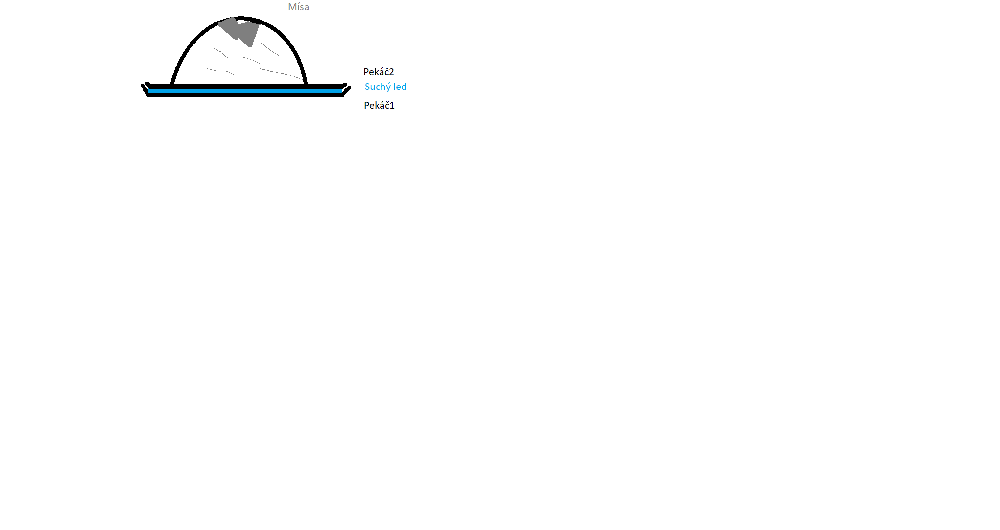

# Struktura a vlastnosti informačních biopolymerů
Radovan Fišer

Přednáška 8.10-10.25
Cvičení 13.10-14.40 ... není povinné, ale pomůže s úlohami, co budeme mít zadané
# 01 Úvodní přednáška: Materiály, informace o vedení předmětu + atomy a molekuly
[přednáška](InformatickeBiopolymery_Prednasky/01-uvod-atom-molekula_atomy.pdf)
## O předmětu

### Úkoly
- Na každý týden je zadáno několik úkolů...
- je potřeba je splnit do týdne

### Testy
- přidávají až 7% každý
- jen pokud "projdu" zkouškou

### Zkouška
1. Vzorce, názvy a zkratky podjednotek a prekurzorů NA odvozených od majoritních bází (+ pseudouridin, dideoxyNTP). Prostorové uspořádání a vlastnosti ze vzorců, koto-enol, amino-imino tautomery, číslování atomů a značení torzních úhlů, analogy bází, mutabilita, hydratace, H-můstky, WC páry bází, způsoby záznamu oligonukleotidů.
2. Kódované aminokyseliny-názvy, třípísmenové zkratky, vzorce disociace a asociace, přibližné hodnoty pKa skupin a jejich názvy, kyselé, bazické, neutrální AA, polární a nepolární, aromatické, obsahující S, -OH a různé další skupiny, chiralita, vodíkové můstky a hydratace, peptidická a isopeptidická vazba, mesomerie.
3. Základní pojmy, vzorce a drobné úlohy k řešení okolo struktury a vlastností biopolymerů.
4. Drobné úlohy okolo využití a aplikace metod pro analýzu a separaci biopolymerů.

### Příprava
+ [ ] Jsou tu témata přednášek a odkazy - projít si a udělat overview

### Literatura
Voet P. a Voet J.G. Biochemie

### Nástroje
PyMOL - je potřeba to mít nainstalovené

### Další materiály
Foldit

### Zdroje přednášky
Přejaté od Dr. Marxe z Howard University

## Od atomů k molekulám
### Duální vlnově-korpuskulární charakter hmoty
- hmota má dvě formy
  - pole
  - látky
- všechno má duální vlnově-korpuskulární charakter
- Hertz, Einstein ... fotoelektrický jev
- Young ... Dvouštěrbinový experiment

### Prvkové složení
- biogenní prvky H, C, N, O, P, S

- 1838 ... Mulder ... Prvkové složení proteinů
- 1869 ... Miescher ... Prvkové složení NK
- 1929 ... Summer ... Funkce proteinů (ureasa)
- 1944 ... Avery ... Funkce NK (DNA)
- 1951 ... Sanger ... Sekvence insulinu
- 1977 ... Sanger ... Sekvence DNA
- 1953 ... Perutz, Kendrev ... Struktura proteinu
- 1953 ... Watson, Crieg ... Struktura DNA

### Periodická tabulka
- bez poznámek, tomu rozumím až moc dobře :)

### Stavba atomu
- základní stavební častice látek ... skoro
- kladné jádro obklopené elektrony

#### Základní vlastnosti atomů
- náboj elektronu ... -1,602e-19 C (elementární náboj)
- elektroneutralita ... náboje jádra a elektronového obalu se kompenzují
- vlastnosti částic: (hezká tabulka!!)
- protonové číslo ... Z
- neutronové číslo ... N
- nukleonové číslo ... A

| ***Částice*** | Symbol | Hmotnost | Náboj |
|:---:|:---:|:---:|:---:|
| ***elektron*** | e | 9.109e-31 | -1.602e-19 |
| ***proton*** | p | 1.673e-27 | 1.602e-19 |
| ***neutron*** | n | 1.675e-27 | 0 |

#### Složení atomového jádra
- to umim

#### Izotopy
- také docela umím
- O ... má izotopy 16, 17, 18
- Al a F ... mají jen jeden nuklid
- detekce pomocí hmotnostního spektrometru
  - měří poměr náboje a hmotnosti

### Radioaktivita
- alpha, beta, gama ... znám :)
- ***rozpadový zákon*** ... N = N0*e^(-l*t); N ... počet jader, l ... přeměnová konstanta
- ***poločas přeměny*** ... *t* = ln(2)/l
- aktivita vzorku (jednotka) ... 1Bq = 1/s ... Bequerel

- měření pomocí látky, která se snadno excituje. Např. ***scintilace***

##### Mlžná komora ... návod
- tekutý led
- 2x pekáč různých velikostí
- líh
- kapesníky
- izolepa
- skleněná mísa

#### Rychlosti rozpadů...
- docela znám...

### Modely atomů
- 1803 Daltonův model - nedělitelná částice
- 1903 Thomsonův model - amorfní směs elektronů a protonů
- 1911 Rutherfordův model - jádro a amorfní obal
- 1913 Bohrův model - elektrony jsou na orbitalech (obíhají jádro po drahách)

### Fotografie atomů
- elektronový mikroskop

### Výstavba el. orbitalu
- umíííím
- huíhuíííí

### Angstrom
1A = 1e-10m

# 02 Prvky a jejich vlastnosti, úvod do biopolymerů
[přednáška](InformatickeBiopolymery_Prednasky/01-uvod-atom-molekula_molekuly.pdf)  
Hezky vysvětlené sigma a pí vazby a vazebné/antivazebné orbitaly: https://is.muni.cz/do/rect/el/estud/pedf/js18/obecna_chemie/web/pages/10-teorie-molekulovych-orbitalu.html
## Prvkové složení
 - značení prvků periodické tabulky

## Obsazování orbitalů
 - valenční vrstvy etc.

## Periodické vlastnosti prvků
 - vlastnosti prvků se periodicky opakují...

## Struktura a vlastnosti informačních biopolymerů
 - struktura planární struktury molekul je známá
 - máme i přímé snímky!

## Složení molekul
- samostatné částice
- homonukleární (H2) a heteronukleární (H2O)
- makromolekuly, krystaly

## Znázornění vazebných elektronů
 - tečky a čárky...

## Molekulové orbitaly
 - lineární kombinace dvou atomových vlnových funkcí
 - ukázané na principu anilinu

## Hybridizace orbitalů
 - sp, sp2, sp3
 - kombinace s a p orbitalů
 - sp ... s + p
 - sp2 ... s + p + p
 - sp3 ... s + p + p + p
 - Methan
   - 4 stěn
   - 109.5° &copy AT&T
 - rotamery ... molekula může rotovat kolem jednoduchých vazeb

## Cis/trans izomerie

# 03 Tvary molekul
[přednáška](InformatickeBiopolymery_Prednasky/02-aminokyseliny.pdf) 
Voet: 61-78  
### Konformace cyklických hexamerů
 - vaničková / židličková konformace
 - aromatické sloučeniny jsou planární

### Pi orbitaly
 -  but-1,3 dien ... 2 dvojné vazbě, dobře pohlcuje UV záření
 -  u aromatických molekul jsou delokalizované
 -  počet pi-elektronů musí odpovídat Hucklovu pravidlu 4n+2, kde *n* = 0,1,2,...  
 -  imidazol ... také planární strukturas

  

Benzen ... 3 vazebné a 3 antivazebné orbitaly

### Struktura krystalů solí
 - anionty a kationty v pravidelné ~~krychlové~~ **tetrální bipyramidické** *mřížce*
 - každý kationt je obklopen 6 anionty a každý aniont 6 kationty

## Struktura polymerů
 - hierarchický popis
   - primární struktura ... sekvence,
   - sekundární struktura ... popis úseku s charakteristickými typovými znaky,
   - terciární struktura ... prostorové uspořádání proteinu,
   - kvartérní struktura ... skupiny molekul dohromady
 - u nedefinovaných terciárních struktur je důležitá topologie molekul

### Slabé vazby
 - vodíkové můstky mohou spojovat části struktur proteinu dohromady (Van der Waalsovy interakce)
   - Londonovské interakce ... interakce mezi dipóly
 - H-můstky mezi elektronegativními atomy
 - vrstvové interakce
 - interakce s vodou v roztocích
 - iontové interakce s ionty v roztocích a uvnitř molekul v místech nedostupných pro vodu

### Rotace, vibrace
 - znesnadňují definitivní popis struktury molekul

### Vlastnosti aminokyselin
 - amfoterní charakter, dobře rozpustné...
 - tvoří obojetný iont ... amfion/zwitterion
 - v makromolekule závisí jejich náboj především na jejich postranní skupině

#### Nepolární AK
 - Glycin, G, Gly
 - Alanin, A, Ala
 - Valin, V, Val
 - Leucin, L, Leu
 - Isoleucin, I, Ile
 - Methionin, M, Met
 - Prolin, P, Pro
 - Fenylalanin, F, Phe
 - Tryptofan, W, Trp

#### Nenabité polární AK
 - Serin, S, Ser
 - Threonin, T, Thr
 - Asparagin, N, Asn
 - Glutamin, Q, Gln
 - Tyrosin, Y, Tyr
 - Cystein, C, Cys

#### Nabité, bazické AK
 - Lysin, K, Lys
 - Arginin, R, Arg
 - Histidin, H, His

#### Nabité, acidické AK
 - Asparagová kyselina, D, Asp
 - Glutamová kyselina, E, Glu

|Název              |Značka|Zkratka|
|-------------------|:----:|:-----:|
|Glycin             |   G  |  Gly  |
|Alanin             |   A  |  Ala  |
|Valin              |   V  |  Val  |
|Leucin             |   L  |  Leu  |
|Isoleucin          |   I  |  Ile  |
|Methionin          |   M  |  Met  |
|Prolin             |   P  |  Pro  |
|Fenylalanin        |   F  |  Phe  |
|Tryptofan          |   W  |  Trp  |
|Serin              |   S  |  Ser  |
|Threonin           |   T  |  Thr  |
|Asparagin          |   N  |  Asn  |
|Glutamin           |   Q  |  Gln  |
|Tyrosin            |   Y  |  Tyr  |
|Cystein            |   C  |  Cys  |
|Lysin              |   K  |  Lys  |
|Arginin            |   R  |  Arg  |
|Histidin           |   H  |  His  |
|Asparagová kyselina|   D  |  Asp  |
|Glutamová kyselina |   E  |  Glu  |
|Stop codon         |   X  |   X   |
|Glutamin/acid      |   Z  |  Glx  |

### Izoelektrický bod 
Přednáška 28-31  
 - v jakém pH AK odštěpí proton?

  

pI bude v TESTUUUUUU!!!
Podívat se na kyselé a zásadité AK v proteinu a odhadnutí izoelektrického bodu.

### Hydrofobicita
Přednáška 32  
Polární AK jsou hydrofilní, nepolární AK jsou hydrofobní.

### Chiralita
Přednáška 33  
Chireální sloučenina je schopná vytvářet optické izomery.  
Měří se polarimetrem - zdroj, polarizátor, trubice polarimetru, otočný analyzátor.

# V testu 1!  
Lambert - Beerův zákon  
Absorbční spektra aminokyselin  
pI bude v TESTUUUUUU!!!
Podívat se na kyselé a zásadité AK v proteinu a odhadnutí izoelektrického bodu.

