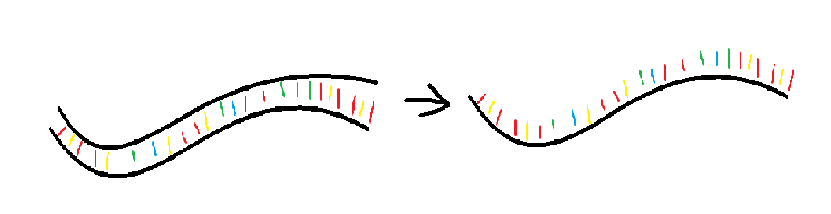
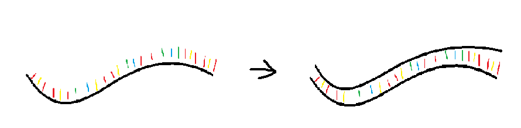
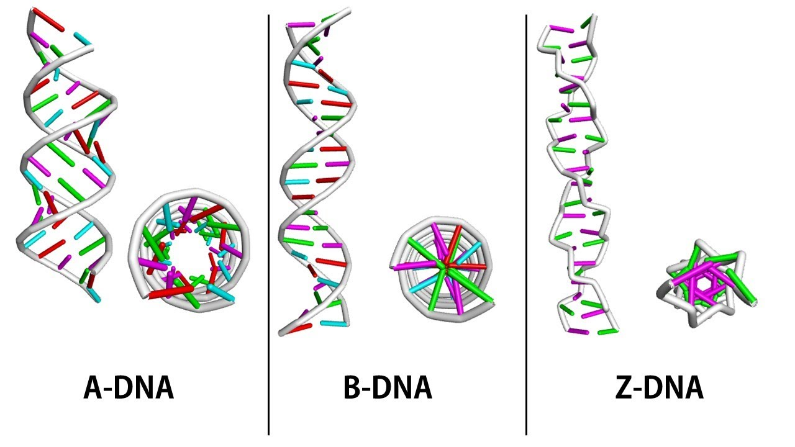

# Základy molekulární biologie
Martin Pospíšek

## Přehled
1. Základy
 - Historické milníky v genetice a molekulární biologii, vysvětlení základních experimentů.
 - Rozdíly mezi doménami Bacteria, Eukarya a Archaea. Modelové organismy, jejich krátký popis a srovnání.
 - Úvod do genomiky, transkriptomiky, proteomiky a metabolomiky.
 - Genomy a jejich analýza, hlavní veřejné mol. biol. databáze a orientace v nich.
2. Složení živých buněk
 - Malé molekuly a makromolekuly, chemické vazby a interakce.
 - Primární, sekundární, terciární a vyšší struktury nukleových kyselin a proteinů.
3. Uchovávání a replikace genetické informace
 - Definice genu.
 - Centrální dogma molekulární biologie a jeho dnešní podoba.
 - Bakteriální, archaealní a eukaryontní chromosom; plasmidová, mitochondriální a chloroplastová DNA.
 - Transposabilní elementy.
 - Replikace DNA a regulace iniciace replikace - srovnání bakterií, archae, eukaryont.
4. Projev (exprese) genů:
 - bakteriální, archaealni a eukaryontní transkripce a translace, genetický kód.
 - Postranskripční a posttranslační modifikace.
 - Lokalizace, stabilita a degradace proteinů a mRNA.
 - Modelové příklady regulace projevu genů u všech tří domén organismů.
 - RNA interference.
5. Mutace
 - Mutace, mutageneze a opravy DNA. Genetické základy kancerogeneze
6. Základní techniky genového inženýrství: PCR, Real-time PCR, sekvenování, analytická elektroforetická separace proteinů a nukleových kyselin, DNA vektory, základy tvorby rekombinantních molekul, genomové a cDNA knihovny. Metody sledování transkriptomu a mapování protein-proteinových interakcí in vivo. Základní mol. biol. databáze - práce s NCBI-NIH atd.

Více informací, texty a presentace přednášek včetně aktualizovaných seznamů doporučené literatury jsou pro studenty zapsané do kurzu k dispozici na http://web.natur.cuni.cz/~pospisek/

# 01
Str. 2-7

### Zdroje
#### Kniha
T.D.Pollard: Cell Biology

#### Internetové zdroje
Encyclopedia of Life Sciences: https://www.els.net
Databáze NCBI: https://www.ncbi.nlm.nih.gov
MIT Open Courses: https://ocw.mit.edu/index.htm

#### Zkouška
https://www.biologicals.cz/tostvou

### Molekulární genetika jako součást molekulární biologie
 - William T. Astbury: ~ Molekulární biologie je spíš způsob nahlížení na život než soubor technik pro biologický výzkum.

 - centrální dogma mol. biologie ... základní pravidlo genetického toku
   - DNA -> RNA -> Proteiny
   - DNA -> DNA
   - ...

#### Historické milníky
 - 1676 ... Anthony van Leeuwenhock ... Objev prvoků a mikroorganismů
 -  ... Gregor Mendel ... 3 zákony genetiky

#### Zkreslení u výzkumu genetiky
 - zvláštní, že studovány byly především modelové organizmy a to většinou ***eucaryota***
 - archea zcela opomíjena
 - rostliny mají často výrazně odlišné mechanismy

 - první DNA
   - 1928 ... Griffit ... Griffitův experiment
     - ***Griffitův experiment***
       - Streptococcus pneumoniae
         - S-kmeny (Smooth)
         - R-kmeny (Rough)
   - 1938 ... W. T. Astbury zjišťuje difrakční obrazce DNA, návrh struktury
   - Koch ... Kochovy postuláty
     - ***Kochovy postuláty*** ... infekční agens v čistém stavu -> infekce -> izolace toho stejného infekčního agens (potvrzení)
     - 1957 ... Francis Crick, George Gamov ... Formulace Centrálního dogmatu molekulární biologie
     - 1953 ... Francis Crick, James Walton
     - ***Hershey-Chase experiment*** . 
 - ***Genentech*** ... zajímavá společnost, která se zabývá genovým inženýrstvím.

#### Obecné vlastnosti ideálního modelu:
 - vhodný pro řešení námi položené otázky, tedy pro typ experimentu (výzkumu), který hodláme provádět
 - krátká generační doba
 - lehce kultivovatelný a množitelný
 - s dobrým (známým) genetickým pozadím
 - maximálně probádaný (nabídka experimentálních technik, mutantů, kmenů, fyzikální a genetické mapy atd.)
 - s možností kontroly párování
 - s možností využití genetického inženýrství
 - ve středu zájmu společnosti - tj. umožňující získání finančního prostředků

### Genom
 - velikosti genomu:

| Skupina | Druh | Česky | Velikost genomu |
| ---- | ---- | ---- | ---- |
| Řasy | Pyrenomonas salina | ~ Rhodomonas salina | 6,6 x 10e5 |
| Mykoplasmata | Mycoplasma pneumoniae | dělá třeba bronchytidu | 1,0 x 10e6 |
| Baktérie | Escherichia coli | střevní bakterie | 4,6 x 10e6 |
| Kvasinky | Saccharomyces cerevisiae | kvasinka pekařská | 1,3 x 10e7 |
| Hlenky | Dictyostelium discoideum | prostě druh hlenky, žije v půdě | 5,4 x 10e7 |
| Nematoda | Caenorhabditis elegans | haďátko octové | 8,7 x 10e7 |
| Hmyz | Drosophila melanogaster | octomilka obecná | 1,4 x 10e8 |
| Ptáci | Gallus domesticus | kur domácí | 1,2 x 10e9 |
| Obojživelníci | Xenopus laevis | drápatka vodní | 3,1 x 10e9 |
| Savci | Homo sapiens | člověk lidský :D | 3,3 x 10e9 |

 - sekvenovaný genom =! popsaný genom
   - sekvenovaný ... spousta písmenek
   - popsaný ... víme kde co je a jak to funguje

 - známe asi 68e3 genomů, ale jen sekvenace, ne popis!

# 02 Složení buňky
Str. 7-19
 Docela umím, nedělám si zápisky...
### DNA
Pravotočivá dvoušroubovice.

#### Malý a velký žlábek
 - definice je:
   - velký žlábek jde vrchem a malý žlábek spodem
   - hrot AK - purinu - směřuje do velkého žlábku
 - velký žlábek ... častější interakce (často se navazuje a modifikuje, oproti malému žlábku)

#### Keto a enol konformace NK
 - 10^4 případů, nicméně může se to stát
 - občas ty NK prostě vypadají jinak

# 03
### Denaturace/renaturace
 - denaturace pomocí změny pH  

 - DNA je poměrně stabilní v alkalickém pH
 - RNA je naopak stabilnější v kyselém pH

Absorbance u DNA  
okolo 260 nm -> puriny,  
denaturace -> zvýšení absorbance, protože každý řetězec absorbuje samostatně  

Renaturace - 3 kroky  
1) Volná ssDNA
2) Najde se správné místo (nejdelší fáze, hodně možností interakce)
3) Spojení ssDNA do dsDNA  

Tento proces popisuje ***kinetika reasociace***  

### Jak vypadá DNA?
***Konformace***  
 - B DNA ... páry bazí jdou přes osu helixu ... 10 párů bazí na otočku ... 3.4 párů bazí na otočku
 - A DNA ... páry bazí jdou mimo osu helixu ... 11 párů na otočku ... 2.6 párů bazí na otočku
 - Z DNA ... levotočivá DNA ... 12 párů na otočku ... 3.7 párů bazí na otočku
 - Triple-Helical DNA  

  

Z DNA má guanosiny v syn-konformaci  
Jsou bílkoviny, které mají afinitu k Z DNA.  

***Nadšroubovice u cyklické dsDNA***  
Lk ... počet obrátek podél osy helixu  
Tw ... počet obrátek celkem  
Wr ... počet obrátek osy kolem osy helixu (nadobrátky)  

pokud nadobrátky jsou negativní, uvolňují šroubovici  

#### Model výzkumu topologie
***SV40 virion*** ... velmi supercoiled nadšroubovice  
na elektroforéze vidíme po přidání topoizomerázy mezistavy při relaxaci  
můžeme spočítat, kolik otáček nadšroubovice má.  

#### Další informace
Pozitivní topoizomeráza umožňuje vytvářet velmi stabilní DNA u termofilních bakterií.  

*Camptoteca acuminata*
topotecan, irinotecan ... sloučenina, která zabíjí jen bakterie, protože brání superspiralizaci DNA  
coumarin ... v trávě, inhibitor bakteriální gyrázy, antibiotikum

# 04
## Přístupy k odhalení struktury DNA  
Franklinová & Gosling ... x-ray crystalografie  

Watson & Crick
+ teoretická stavba modelu a porovnávání s realitou  
+ přemýšleli nad funkcí molekuly v organismu

Antibiotika  
+ často nezabírají, protože pro danou bakterii třeba nemusí ten princip fungovat!

## Vyšší struktura DNA
Chromozomy jsou tvořeny chromatinem ... DNA + proteiny (hlavně histony)  

Struktura
### bakterie
cirkulární DNA, 1 místo počátku replikace
### archea 
+ chybí jaderná membrána,
+ cirkulární DNA,
+ někdy DNA ve více kopiích
+ histone core -- tyčka z histonů v centru nadšroubovice
+ histony ALBA1 a ALBA2

### mitochondrie
+ u člověka (obratlovců) velmi malý genom

### chloroplasty
+ lineární? cirkulární? Dynamická struktura DNA

### eukaryota

### Polymerace DNA
Pomocí nukleosid trifosfátů, od 5' k 3' konci.
Zrychlení reakce -> odebírání produktů (pyrofosfát) -> ***pyrofosfatázy***  

# 06
replikace

bakterie ... 1 replikační počátek  
eukaryota ... více počátků  
prokaryota ... je to různé  

T = 18-180 min  
C = 40 min (42min, 4639221, bp = 1840)  

eukaryota ... G1,S,G2,M,  
celkem proběhne za cca 22-24 hodin, ale není na to pravidlo.  
Hepatocyty se dělí 1x za půl roku.    

Cdc - -- cyclin dependent complex, cdk ... cyclin dependent kinase  

### DnaA
- u bakterií - je potřeba hodně DnaA na zahájení replikace,  
- po startu je všechno znehodnoceno.
- takže se hned nemůže zahájit dělení znovu...

### Telomery
 ... obrana proti ničení konců DNA na 3' konci

### Chyby v RNA
 ... životnost RNA je v řádu vteřin u bakterií ... nevadí tolik
 ... u eukaryot je to v řádu hodin/dní

# 07
### Deaminace Thyminu

### Tyjo asi končim s poznámkama!!! Půjdu si asi kreslit nebo nevim, stejně si to přečtu ve skriptech!

### Opravy
Helikázy a nukleázy ... opravy chybného párování.  
Řetězce rozbité jsou dlouhé až 2000 nk, buňce se to vyplatí!!  
MutS, MutS + MutL + DNA komplex -> aktivace MutH  
MutH se váže na GATC a řeší to.  

### Testy mutagenity
***Amesův test***:  
*Salmonella typhimurium his-* - když se nedodává histidin, neroste.  
Když proběhne reverzní mutace, bakterie si opraví tvorbu histidin a roste.
Existuje spousta dalších testů :)

# 09

## Transkripce
### Pol I
### Pol II
Mediátorová struktura na okraji (přes 20 transkripčních faktorů) zprostředkují dotyk core proteinu.  
Celá struktura polymerázy se při každém použití skládá znova.  
### Pol III
### Transkripce u organel
Podobně jako u bakterií, malá RNA Pol.  

### Transkripce u bakterií
### Transkripce u archeí

### Princip konce transkripce
1. Iniciace - Polymeráza nasedne
2. Polymeráza pokračuje
3. Polymeráza najede na AAUAAA sekvenci a okopíruje jí, ale pokračuje dál
4. Na místě AAUAAA se RNA odstřihne, ale polymeráza pořád kopíruje
5. Pol I je zastavena proteinem, který se naváže na Pol I a ta se rozpadne
6. Pol II je zastavena až při posttranskripční modifikaci RNA
7. Pol III je zastavena podobným principem, jako rhó zastavení bakteriální Pol

# 10
## Posttranslační modifikace
### Něco

### Sestřih
Intron ... nekódující část RNA, která je vystřižená  
Exony ... kódující část RNA, která je ponechaná pro translaci  

#### Průběh sestřihu
- Sestřihává se ve směru RNA kódování, tzn. od 5' konce ke 3' konci.  
- exony ve výsledné molekule budou mít stejné pořadí, jako v původní molekule

### Editace
- upravování bazí
- pomocí proteinu "APOBEC-I-C/U"
- typy
  - deaminace na adenosinu
    - vzniká hypoxantin
  - deaminace na cytosinu
    - vzniká uracil

ribozimy ... RNA analogie proteinů