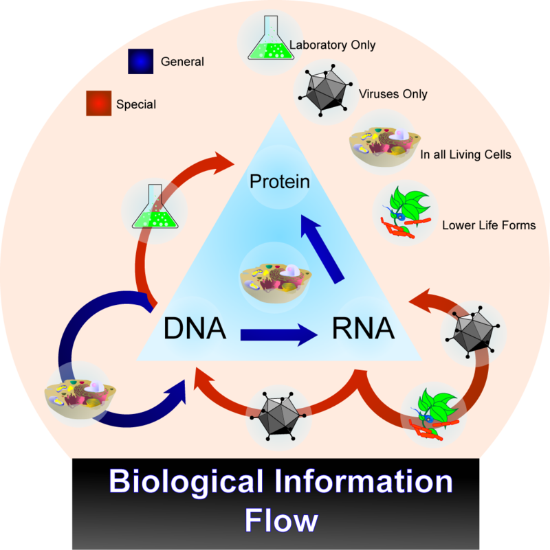

# Základy molekulární biologie
Martin Pospíšek

## Přehled
1. Základy
 - Historické milníky v genetice a molekulární biologii, vysvětlení základních experimentů.
 - Rozdíly mezi doménami Bacteria, Eukarya a Archaea. Modelové organismy, jejich krátký popis a srovnání.
 - Úvod do genomiky, transkriptomiky, proteomiky a metabolomiky.
 - Genomy a jejich analýza, hlavní veřejné mol. biol. databáze a orientace v nich.
2. Složení živých buněk
 - Malé molekuly a makromolekuly, chemické vazby a interakce.
 - Primární, sekundární, terciární a vyšší struktury nukleových kyselin a proteinů.
3. Uchovávání a replikace genetické informace
 - Definice genu.
 - Centrální dogma molekulární biologie a jeho dnešní podoba.
 - Bakteriální, archaealní a eukaryontní chromosom; plasmidová, mitochondriální a chloroplastová DNA.
 - Transposabilní elementy.
 - Replikace DNA a regulace iniciace replikace - srovnání bakterií, archae, eukaryont.
4. Projev (exprese) genů:
 - bakteriální, archaealni a eukaryontní transkripce a translace, genetický kód.
 - Postranskripční a posttranslační modifikace.
 - Lokalizace, stabilita a degradace proteinů a mRNA.
 - Modelové příklady regulace projevu genů u všech tří domén organismů.
 - RNA interference.
5. Mutace
 - Mutace, mutageneze a opravy DNA. Genetické základy kancerogeneze
6. Základní techniky genového inženýrství: PCR, Real-time PCR, sekvenování, analytická elektroforetická separace proteinů a nukleových kyselin, DNA vektory, základy tvorby rekombinantních molekul, genomové a cDNA knihovny. Metody sledování transkriptomu a mapování protein-proteinových interakcí in vivo. Základní mol. biol. databáze - práce s NCBI-NIH atd.

Více informací, texty a presentace přednášek včetně aktualizovaných seznamů doporučené literatury jsou pro studenty zapsané do kurzu k dispozici na http://web.natur.cuni.cz/~pospisek/

## 01
### Zdroje
#### Kniha
T.D.Pollard: Cell Biology

#### Internetové zdroje
Encyclopedia of Life Sciences: https://www.els.net
Databáze NCBI: https://www.ncbi.nlm.nih.gov
MIT Open Courses: https://ocw.mit.edu/index.htm

#### Zkouška
https://www.biologicals.cz/tostvou

### Molekulární genetika jako součást molekulární biologie
 - William T. Astbury: ~ Molekulární biologie je spíš způsob nahlížení na život než soubor technik pro biologický výzkum.

 - centrální dogma mol. biologie ... základní pravidlo genetického toku
   - DNA -> RNA -> Proteiny
   - DNA -> DNA
   - ...

#### Historické milníky
 - 1676 ... Anthony van Leeuwenhock ... Objev prvoků a mikroorganismů
 -  ... Gregor Mendel ... 3 zákony genetiky

#### Zkreslení u výzkumu genetiky
 - zvláštní, že studovány byly především modelové organizmy a to většinou ***eucaryota***
 - archea zcela opomíjena
 - rostliny mají často výrazně odlišné mechanismy

 - první DNA
   - 1838 ... W. T. Astbury zjišťuje difrakční obrazce DNA, návrh struktury
   - 1928 ... Griffit ... Griffitův experiment
     - ***Griffitův experiment*** ... ukázal, že virulentní kmen streptokoka
   - Koch ... Kochovy postuláty
     - ***Kochovy postuláty*** ... infekční agens v čistém stavu -> infekce -> izolace toho stejného infekčního agens (potvrzení)
     - 1957 ... Francis Crick, George Gamov ... Formulace Centrálního dogmatu molekulární biologie
     - 1953 ... Francis Crick, James Walton
     - ***Hershey-Chase experiment*** . 
 - ***Genentech*** ... zajímavá společnost, která se zabývá genovým inženýrstvím.

#### Obecné vlastnosti ideálního modelu:
 - vhodný pro řešení námi položené otázky, tedy pro typ experimentu (výzkumu), který hodláme provádět
 - krátká generační doba
 - lehce kultivovatelný a množitelný
 - s dobrým (známým) genetickým pozadím
 - maximálně probádaný (nabídka experimentálních technik, mutantů, kmenů, fyzikální a genetické mapy atd.)
 - s možností kontroly párování
 - s možností využití genetického inženýrství
 - ve středu zájmu společnosti - tj. umožňující získání finančního prostředků

### Genom
 - velikosti genomu:

| Skupina | Druh | Česky | Velikost genomu |
| ---- | ---- | ---- | ---- |
| Řasy | Pyrenomonas salina | ~ Rhodomonas salina | 6,6 x 10e5 |
| Mykoplasmata | Mycoplasma pneumoniae | dělá třeba bronchytidu | 1,0 x 10e6 |
| Baktérie | Escherichia coli | střevní bakterie | 4,6 x 10e6 |
| Kvasinky | Saccharomyces cerevisiae | kvasinka pekařská | 1,3 x 10e7 |
| Hlenky | Dictyostelium discoideum | prostě druh hlenky, žije v půdě | 5,4 x 10e7 |
| Nematoda | Caenorhabditis elegans | haďátko octové | 8,7 x 10e7 |
| Hmyz | Drosophila melanogaster | octomilka obecná | 1,4 x 10e8 |
| Ptáci | Gallus domesticus | kur domácí | 1,2 x 10e9 |
| Obojživelníci | Xenopus laevis | drápatka vodní | 3,1 x 10e9 |
| Savci | Homo sapiens | člověk lidský :D | 3,3 x 10e9 |

 - sekvenovaný genom =! popsaný genom
   - sekvenovaný ... spousta písmenek
   - popsaný ... víme kde co je a jak to funguje

 - známe asi 68e3 genomů, ale jen sekvenace, ne popis!

# 02 Složení buňky
 Docela umím, nedělám si zápisky...
### DNA
Pravotočivá dvoušroubovice.

#### Malý a velký žlábek
 - definice je:
   - velký žlábek jde vrchem a malý žlábek spodem
   - hrot AK - purinu - směřuje do velkého žlábku
 - velký žlábek ... častější interakce (často se navazuje a modifikuje, oproti malému žlábku)

#### Keto a enol konformace NK
 - 10^4 případů, nicméně může se to stát
 - občas ty NK prostě vypadají jinak
