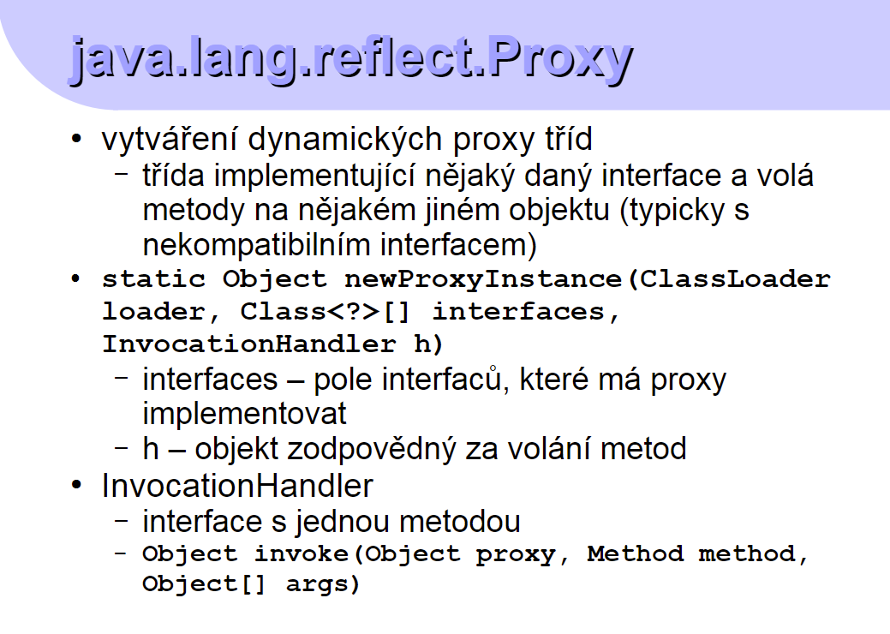

# Pokračování v Javě

# 01
### Podmínky:
- zápočťák -> netriviální použití technologie z kurzu
- zkouška
- úkoly -> alespoň 75%

### Osnova předmětu
 - hlubší pohled do jazyka Java
    - přehled a historie platformy Java
    - reflection API
    - generické typy, anotace
    - class loaders, security 
- GUI
- distribuované technologie: RMI,...
- komponentový model JavaBeans
- JEE: Servlety, EJB, Spring,...
- JME: CLDC, MIDP, MEEP
- RTSJ
- další technologie založené na platformě Java: Java APIs for XML, JDBC, JMX,...
- další jazyky kompilované do Java byte
- code
- Android

### O Javě
 - silně typový jazyk (všechno je objekt nějaké třídy nebo primitivního typu) 
 - neexistují globální proměnné -> statické proměnné
 - viditelnost je možné ovlivnit pomocí `public` a `private`
 - změny typů jsou možné, ale pozor!
   - covariantní změna ... ze specifické na obecnější
   - contravariantní změna ... naopak

### Reflection API
 - Reflection: Mění strukturu a stav objektů
 - Introspection: Zkoumá strukturu objektů
 - Umožňuje
   - zjišťovat informace o třídách, atributech, metodách
   - vytvářet objekty
   - volání metod
   - ...
 - java.lang.reflect
 - java.lang.Class

### java.lang.Class<T>
 - generický typ
 - primitivní typy jsou reprezentovány jako instance třídy Class<T>
 - získání instance třídy Class
   - getClass() na třídě objekt
   - literál class (int.class)
 - Class.forName(String className)
 - Má spoustu dalších metod 
   - is... -> array, primitivní typ etc.
   - pro arraye další metody etc.
   - pro získání konstruktorů, získání polí etc.
   - vrací pole konstant enumu a typ objektů v poli
   - získávání modifikátorů etc

### Java.lang.reflect
 - .Field: getName, getType ...
 - .Method - získávání metody a volání metody
 - Constructor
 - Executable
 - .Array: dynamická práce s polema

### Reflexe vs. generické typy
 - úplně jsem nechytil ... :(

### Anotace
 - můžeme anotovat na úrovni bytecodu -> řekneme si příští týden!

### Reflexe a moduly
 - řekneme si také příště

### Použití
 - je to hodně praktické, přímý přístup dovnitř našeho kódu

### .Proxy


### Pluginy
 - samostatně fungující segment kódu

# 02

### Java platform
 - JSE ... java standard edition
 - JEE ... java enterprice edition

### Výkon
 - spuštění vždy virtual - machine
   - má Just-in-time compilation
   - má optimalizaci za běhu
 - srovnatelný s normálními aplikacemi
 - velká spotřeba paměti

### Implementace Javy
 - Oracle: Oficiální implementace
 - Windows, Linux, macOS
 - OpenJDK: podporovaná Oraclem
   - z ní vychází oficiální implementace
 - existují i jiné implementace, ale nejsou příliš použité

### Androidové aplikace
 - Android compiluje do Java bytecodu,
 - má jinou virtual-machine

### Generické typy
 - opakování a nové informace
 - obdoba šablon z C#
 - parametry pro typy
 - cíl: přehlednější kód a typová bezpečnost.
   - `List<Integer>`
 - nejde dávat primitivní typy, interně se to mění na `Object`

 - není možné typy měnit
 - otazník (wildcard) je libovolný typ
   - `List<?>`
 - omezený `?` dáme extends
   - povolujeme kovariantní změnu (`List<? extends Shape>`)
   - děláme kontravariantní změnu (`List<? super T>`)
 - max() -> porovnatelné prvky -> implementují Comparable<Object>

### Anotace
 - dřív (Java 5) nebyly snadno přidávatelné.
 - nyní lze přidat ke každému elementu
 - i na dalších místech
 - lze omezit, na co půjde použít

@ a identifikátor
 - mega cool věc...

# 03
### Třídy javy a classloadery
- virtual machine natahuje třídy dynamicky
- java.lang.ClassLoader ... má classloader

#### Postup VirtualMachine
1. natažení třídy
   - hledá bytecode podle cesty k němu
   - může vyhodit pár errorů (ClassFormatError ... kompilováno špatnou verzí javy, NoClassDefFoundError ... nebyla nalezena)
   - může nastat i OutOfMemoryError
2. "linking"
 - verifikace bytecodu ... odpovídá specifikaci? ... LinkageError
   - VerifyError
 - příprava
   - vytvoření static atributů
   - OutOfMemoryError
3. inicializace
4. vytvoření nové instance

#### Třída a classloader
 - při použití různých classloaderů je i stejná třída nekompatibilní
 - classloader má i předka
 - pokud není classloader implicitně specifikovaný, použije se systémový classloader
 - hierarchický výběr classloadera
 - pokud jsou potřeba další třídy načíst s danou třídou, použije se stejný classloader

#### Vlastní ClassLoader
 - napsat si potomka třídy ClassLoader, předefinování jeho metody defineClass

### ServiceLoader
- obsahuje cesty k jednotlivým službám
- vrací služby, má iterátor etc.

### Bytecode
Formát:  
```byte
ClassName{
  U4 magic;
  U2 majorVersion;
  U2 minorVersion;
  U2 constant_pool_count; // pole konstant (pojmenování)
  cp_info constant_pool[constant_pool_count-1];
  u2 access_flags;
  ...
  u2 interfaces_count;
  u2 interfaces[interfaces_count];
  u2 fields_count;
  field_info fields[fields_count];
  ...
}
```

Metody:  
Virtual machine je zásobníkový stroj.

***InvokeDynamic***    
Od Java 7 překlad dynamických jazyků do Java bytekódu  
Od Java 8 použita i pro překlad lambda výrazů  

#### Nástroje pro práci s Bytecodem
 - ASM
   - http://asm.ow2.org/
   - manipulace s bytecodem
   - vytváření nových tříd
   - upravování existujících tříd
 - BCEL,
 - SERP,...

### Nativní kód
 - integrace Java kódu do nativního kódu

#### JNA
 - externí knihovna pro převod nativní knihovny do Javy
 - ***JNI*** naopak mapuje *Javu* do *C*

# 04
### Moduly
další vrstva k balíčkům  
classpath je křehký  
u classpath chybí zapouzdření  
   - public věci jsou vidět všude

Moduly umožňují komplexnější a vícevrstevnaté aplikace.  
Spojování aplikací dohromady.  
Je možné distribuovat části programů do vývojových týmů.  
Umožňuje definovat komplexní závislosti.  
Zlepšení architektury programu.  
   - program ví o svých závislostech
   - dokáže spravovat své závislosti
Vnitřní implementace modulů si každé IDE udělalo trochu jinak.  
Moduly znemožňují hackování architektury.  

Moduly jsou definovány v balíčku (co požadují a co dávají).  
Moduly jsou většinou ve formě jaru.

Používají se pomocí "module path".  

Virtual machine si staví graf závislost jednotlivých modulů na sobě navzájem.

klíčová slova:
```java
module // deklarace modulu

requires // požadavek modulu
static //
export // co balíček ze sebe publikuje

open // je možné přistoupit i k neexportované části balíčku
open module // je možné přistupovat k čemukoli z něj
```

layer - vrstva  
přiřazuje classloadery k jednotlivým třídám  

moduly jsou normálně přístupné v jar balíčcích  
automatické moduly vzniknou, když jar balíček nemá module-info.java soubor

### Skriptovací api Javy
 - skriptovací jazyky jako např. shell
 - nejsou kompilované, ale interpretované
 - třeba JavaScript!

```java
ScriptEngineManager manager = new Manager();
ScriptEngine engine = Manager.searchEngineByName("JavaScript");
engine.eval("printf(\"hello world\")");
```

Je možné si vytvořit vlastní skriptovací jazyk!

# 05
### GUI ... Graphics User Interface

*AWT* ... Nativní GUI komponenty  

**Swing** ... kompletní GUI v Javě  

**JavaFX** ... 2007 ... něco jako Flash. Není ve standardní knihovně.  

SWT ... Javovská obálka nad knihovnou operačního systému.  

QT ... knihovna, existuje její mapování do Javy.  

### Swing
- balíčky `javax.swing`, využívá třídy z `java.awt`, potřebuje `java.desktop`
- používá model událostí

#### Look & feel
... string pro nastavení vzhledu a chování  

#### Události
Generují se při každé akci.  
Je potřeba mít `Listener`, který `Eventy` registruje.

#### Co dalšího Swing má
 + Kontejnery, Layout, Layout Manager
   + BorderLayout - SJVZ+střed
   + FlowLayout
   + atd. -> všechno je hezky v příkladech

 + přehled vizuálních komponent
 + `JLabel`
   + text, obrázek
 + Tlačítka
   + `JButton`,
   + `JToggleButton`,
   + `JCheckBox`,
   + `JRadioButton` --> `ButtonGroup`
 + Ikonky a obrázky
   + `Icon` interface
   + třída `ImageIcon` - gif, png, jpg
 + Nad komponentami je možné nastavit tool tipy
 + `JTextField`
 + `JTextArea`
 + `JComboBox` ... text field + menu


+ `JTree`
+ `JTable`
+ `JToolBar`
+ `JSplitPane`
+ `JDesktopPane`
+ `JDialog`

# 12
## Android v Javě
### Fragmenty
+ podaktivity v uživatelském rozhraní
### Intents
### Services
#### IntentService
### Vlákna
+ jednovláknové
#### AsyncTask
+ něco jako SwingWorker
### Dialogy
+ speciální případ fragmentů
+ předpřipravené typy dialogů

## Jazyky překládané do Java bytecodu
+ Scala
+ Closure
+ Groovy
+ Kotlin
+ Jython
+ JRuby

# 13
## Scala
+ Mix objektového a funkcionálního jazyka
+ Byla i verze pro .NET
+ používá se
  + Twitter od r. 2009
  + LinkedIn do 2015
+ je možné najít různé knihovny pro paralelní programování
+ použití
  + přímo z příkazové řádky
  + `scalac` obalený kompilátor
+ proměnné
  + `var identifikátor[:typ] = hodnota`
  + `val nemoznemenit[:typ] = hodnota`
+ třídy
  + `class`
  + `object` ... singleton
+ trait
  + částečně implementovaná třída
+ volná syntax
  + volitelný středník
  + metody jako infix operátory
  + vytvořené tak, aby bylo možné ji rozšiřovat -> je možné vkládat kód jako argument metodám
## Groovy
+ objektový jazyk
+ dynamický
+ kombo Javy a Ruby
  + většina Java kódu je v Groovy kompilovatelná
+ trochu konkurent Scaly
+ je skriptovací na top levelu
+ rozšířené možnosti inicializace a práce s listy oproti Javě
+ má svoje vlastní GroovyBeans

## Kotlin
+ objektový a funkcionální jazyk
+ jako Scala, ale umírněnější v syntaxi
+ podpora všech IDE
+ od autorů IntelliJ, JetBrains
+ psaní v Kotlinu
  + středník volitelný
  + funkce pomocí slova `fun`
  + proměnné: `var` & `val`
  + super práce se stringy!!
  + výjimky
    + `try`/`catch`/`finally`
    + místo `switch` má `when`
      + více možností než v Javě
    + `for` cyklus iteruje přes prvky čehokoliv `iterable`
      + `break` a `continue` v principu jako u Javy
  + vylepšení typů oproti Javě
    + `any` -- předek všech typů!
    + `unit` ~ v Javě void
      + je to typ, singleton 
      + vrací se, když funkce nic nevrací
    + `nothing` -- podtyp všech typů
  + konstruktory
    + primární konstruktor rovnou inicializuje atributy pomocí values v argumentech
    + je možné si udělat i sekundární konstruktory s jinými parametry
    + není zde kw `new`
  + dědičnost
    + explicitní určování dědičnosti tříd
    + pokud se nepovolí pomocí `open`, není povolená
  + má gettery a settery (`val` jen gettery)
    + je možné je předefinovat
  + infix tvar funkcí se může používat, ale je potřeba explicitně to říct pomocí kw `infix`
  + 


