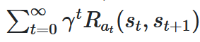

# Přírodou inspirované algoritmy
Martin Pilát
[Stránky předmětu](http://ktiml.mff.cuni.cz/~pilat/cs/prirodou-inspirovane-algoritmy/)

Kačka Macková
[Stránky cvičení](https://github.com/kackamac/Prirodou-inspirovane-algoritmy)
katerina.mackova@ktiml.mff.cuni.cz

### Obsah
[Přírodou inspirované algoritmy](#přírodou-inspirované-algoritmy)
 - [01 Úvod a algoritmy obecně](#01-úvod-a-algoritmy-obecně)
 - [Zpětnovazebné učení](#02-zpětnovazebné-učení)
 - 

### Podmínky
- zápočet za cvičení
  - 3 úkoly (5, 8 a 11 cvičení)
- zkouška ... [požadavky](http://ktiml.mff.cuni.cz/~pilat/cs/prirodou-inspirovane-algoritmy/pozadavky/)
  - obecně výběr techniky a způsob řešení problému

### Zdroje
Každá přednáška má souvislý text!

## 01 Úvod a algoritmy obecně
[přednáška](http://ktiml.mff.cuni.cz/~pilat/cs/prirodou-inspirovane-algoritmy/umela-inteligence-vypocetni-inteligence-aplikace/)

### Co je AI?
 - vytváří agenty, které jsou schopny se samostatně chovat
 - AI má nějaké vstupy a má nějaký cíl
#### Symbolická AI
 - využívá formální popis světa, na základě toho AI reaguje
 - využívá plánování
   - S ... počet stavů
   - A ... akce (jméno, předpoklady, + efekty, - efekty)

#### Výpočetní AI
 - Machine Learning
   - Stromy, k-means, etc.
   - neurální sítě ... hluboké učení
 - Evoluční algoritmy (EA), přírodou inspirované algoritmy

#### Obecná AI
 - není specifická, má hodně obecný záběr

### Neurální síť ... NS
 - neurony ... x vstupů, funkce, výstup
   - vstupy vydráždí neuron, neuron dá něco na výstup
   - mají ***lineární funkce***
Příklad:
```txt
neuron ... n
vstupy ... x1...x4
funkce neuronu ... sgn(SUM_Vx(xi))
```

***Často používané funkce***
 - Sigmoida ... sigmoid(x) = 1/(1+e^(-lx))
   - l ... parametr
 - Rectified Linear Unit ... ReLU(x) = max(0,x)

### Historie

#### Historie perceptronů
***1959 Rosenblat***
- vymýšlí "perceptron" (typ základní komponenty NS)
***1970-85***
***Martin Minsky***
 - argumentuje proti perceptronu... nedokáže např. XOR!?
  - jde obejít tím, že se dá víc perceptronů dohromady
  - Minsky si ale myslí, že nikdy nebude algoritmus, který by NS učil sám

1985 ... obnovení zájmu
2000 + ... nejlepší výsledky v AI

#### Historie evolučních algoritmů
- už konec 70. let
- genetický algoritmus cca polovina 80. let
- dnes se používají i k návrhu elektrických obvodů etc.

### Strojové učení a optimalizace
 - jde o to nastavit **parametry** tak, aby co nejlépe **odpovídaly datům**
 - dělení (3):
   - *s učitelem*
   - *bez učitele*
   - *zpětnovazebné učení*

#### Učení s učitelem
 - jsou zadané objekty a jsou známé výstupy
 - algoritmus musí najít model, který pro daný objekt najde správný výstup
 - kategorické učení ... jde o to rozlišit kategorii objektu
 - regrese ... jde o to najít číselnou hodnotu pro daný objekt (ocenění domu etc.)

#### Učení bez učitele
 - jsou zadány objekty, ale ne výstupy
 - cílem je
   - naučit sdružovat objekty do skupin (shlukování)
   - generování nových objektů (generativní modely)

#### Zpětnovazebné učení
 - cíl je naučit agenta, aby došel k co nejlepšímu výsledku
 - využívání předchozích pokusů a porovnávání jejich výsledků

### Aplikace a výsledky
 - megaaa!
 - SuperMario,
 - Evoluční anténa,
 - popisky obrázků,
 - GO, StarCraft a další!

### Třídicí algoritmy
 - 

## 02 Zpětnovazebné učení
 - agent dělá akce v prostředí a získává zpětnou vazbu
 - cyklus ... (stav st, odměna rt) -> akce at -> t = tm
 - Mountain Car

### Typy prostředí
 - spojité x diskrétní
 - prozkoumatelné x neprozkoumatelné
 - statické (deterministické) x dynamické
 - ...

### Markovské rozhodovací procesy
MDP ... Markovovské rozhodovací procesy
*(S,A,P,R)* ... (stavy, akce, přechodová funkce, odměny (Ra(s,s')))  
*P* ... pro stavy *s*,*s'* a akci *a* je přechod mezi nimi pravděpodobnost *P_a(s,s')*  
Pravděpodobnost musí splňovat Markovskou podmínku.  
strategie ... pí(s,a) ... pravděpodobnost, že ve stavu *s* provedu akce *a*  

> Pokud píšu něco jiného než co říkám, raději mi to řekněte. Správně je totiž pravděpodobně to, co si myslím, což je možná něco úplně jiného. -- Martin Pilát. 24/2/2022

### Výroba optimální strategie
Jde o to maximalizovat odměnu, kterou agent dostane.
Dělá se to pomocí strategie. Ohodnocení strategie je dané vzorečkem:  
  
Cílem učení je pak najít nejlepší strategie.  

Cíl je najít strategii *pí\** takovou, aby V^pí* = max_pí(V^pí(s))

### Monte-Carlo metody

### Q-učení

## 02 P
Přechodové funkce -- ***S,A,P,R*** -> *Markovský rozhodovací proces*  

## 03 L Ještě strojové učení a úvod do evolučních algoritmů

### Problém: OneMAX
Máme posloupnost {0,1}^n, maximální počet jedniček.
0101101001 ... 5
1011101111 ... 8
1111111111 ... 10  ... hey!

Každá posloupnost ... jedinec  
Počet jedniček ... fitness funkce  
Jde o to: (... genetické učení)   
1. vygenerovat populaci,
2. selektovat nejlepší jedince,
3. skřížit nejlepší jedince ... např. jednobodové - v jednom bodě crossover (1011 + 1101 -> 1001 + 1111)
4. mutace (flipování)
5. jít na `1.`

### Selekce  
+ ruletová selekce
  + Pi=(fi)/∑(fj) ... ale fitness musí být >= 0)
  + malé rozdíly ve fitness mají poměrně malé rozdíly v šanci být přijaty
+ turnajová selekce
  + vybere se lepší ze dvojice jedinců (s určitou pravděpodobnoctí)

+ ***elitismus*** ... necháme rodiče také ve skupině pro selekci
+ *explorace* ... jak moc jdeme do prostoru
+ *exploatace* ... vylepšování nalezeného místa v prostoru

### Křížení
+ bodové (+ dvoubodové, tříbodové ...) ... zvolí se bod a prohodí se příslušné sekvence obou jedinců
  + uniformní křížení ... rozhodování pro každou pozici v sekvenci

1. a
   1. ab
   2. ac
   3. ad
2. b
   1. ba
   2. bc
   3. bd
