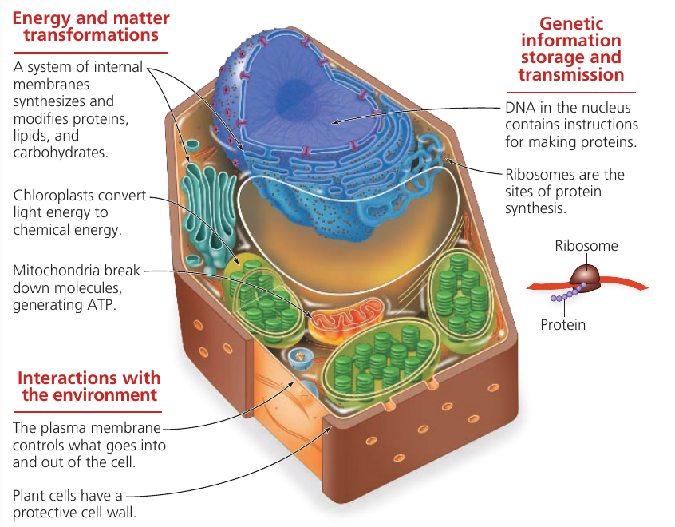
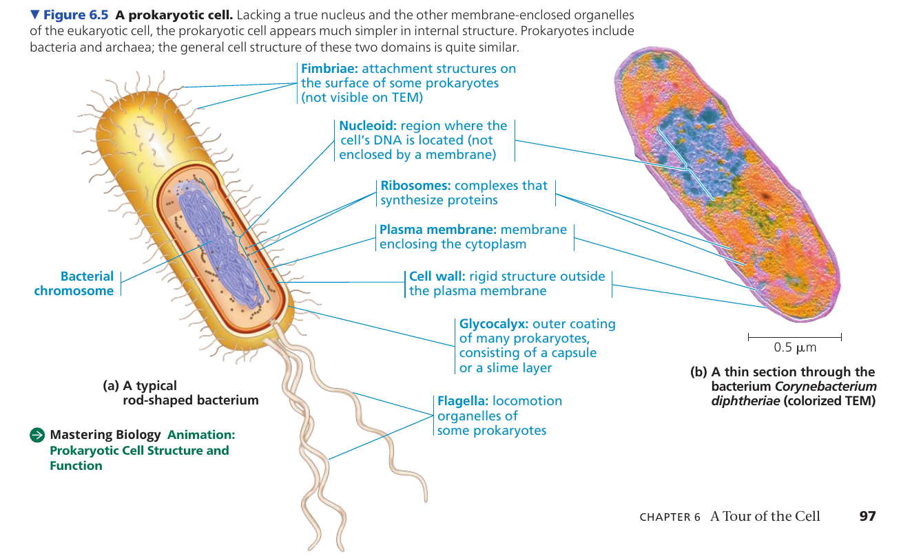

# README
Čauky!

Tenhle soubor jsou moje poznámky z průběžnýho učení na státnice. Neříkám, že jsou kompletní, ale někomu by se mohly hodit :)

Zatím jsou under construction :D

Vycházím ze [státnicových otázek na SISu](https://is.cuni.cz/studium/predmety/index.php?id=7b4a1f9cb7c5f97f6a546844bfc00ea4&tid=&do=predmet&kod=MSZBB004&skr=2022).

U některých zpracovaných otázek jsou odkazy na materiály, ze kterých vycházím (přednášky etc.).

==========

Teď uprostřed sepisování jsem si všiml, že některé poznámky jsou napsané dost mašťácky. Tak to berte pls jako spíš moje poznámky, kterými si připomínám teorii a pro cokoliv podrobnějšího se podívejte do zdrojů, které tam mám napsané. Sorry :D

# Otázky
## Požadavky znalostí k bakalářské státní závěrečné zkoušce z bioinformatiky

### Matematika & informatika
1. Matematická analýza
   1. Posloupnosti a řady, konvergence, Cauchyovské posloupnosti.
   2. Reálně funkce jedné proměnné. Limita v bodě a spojitost. Derivace funkcí: definice a základní pravidla, věty o střední hodnotě, derivace vyšších řádů. Extrémy funkcí. Aplikace, např. průběh funkcí, Taylorův polynom.
   3. Integrální počet. Primitivní funkce a Newtonův integrál. Určitý (Riemannův) integrál a jeho použití.
2. Lineární algebra
   1. Soustavy lineárních rovnic, metody řešení.
   2. Matice, operace s maticemi. Hodnost matice, regulární matice a inverzní matice. Odstupňovaný tvar matice.
   3. Základní algebraické struktury: grupy, tělesa, vektorové prostory.
   4. Základní vlastnosti konečně generovaných vektorových prostorů, vektorové podprostory. Báze a dimenze.
   5. Lineární zobrazení. Základní vlastnosti, maticová reprezentace, skládání lineárních zobrazení.
   6. Skalární součin a norma. Vlastnosti v reálném i komplexním případě, Cauchy-Schwarzova nerovnost. Kolmost. Ortogonální doplněk a jeho vlastnosti, ortogonální projekce.
   7. Determinanty. Definice a základní vlastnosti determinantu. Úpravy determinantů, výpočet.
   8.  Vlastní čísla a vlastní vektory matic. Výpočet a základní vlastnosti. Diagonální tvar matice, diagonalizovatelnost. Jordanův normální tvaru (v obecném případě).
3. Kombinatorika, pravděpodobnost a statistika
   1. Binární relace, ekvivalence a částečná uspořádání. Kombinatorické počítání: kombinační čísla, binomická věta, princip inkluze a exkluze.
   2. Teorie grafů. Základní pojmy teorie grafů: grafy a podgrafy, izomorfismus. Stromy a jejich základní vlastnosti, kostra grafu.
   3. Rovinné grafy, barvení grafů. Toky v sítícha aplikace. Souvislost grafů (míra souvislosti), Mengerovy věta.
   4. Náhodné jevy, podmíněná pravděpodobnost, nezávislost náhodných jevů. Náhodné veličiny, střední hodnota, linearita střední hodnoty. Bodové odhady a testování hypotéz.
4. Algoritmy a datové struktury
   1. Časová složitost algoritmů. Metoda ,,rozděl a panuj'' - aplikace a analýza složitosti, dynamické programování.
   2. Binární vyhledávací stromy, vyvažování, haldy.
   3. Třídění - sekvenční třídění, porovnávací algoritmy, přihrádkové třídění, třídící sítě.
   4. Grafové algoritmy - prohledávání do hloubky a do šířky, souvislost, topologické třídění, nejkratší cesta, kostra grafu, toky v sítích. Tranzitivní uzávěr.
   5. Algoritmy vyhledávání v textu - Aho-Corasicková, KMP, sufixový strom, sufixové pole. Algebraické algoritmy - DFT, Euklidův algoritmus. RSA. Aproximační algoritmy. Automaty a gramatiky - typy automatů a gramatik, vztahy, příklady.
5. Aplikovaná informatika
   1. Principy a základy implementace objektově orientovaných jazyků - třída, dědičnost, polymorfismus, virtuální funkce, atd. Generické programování a knihovny šablony a generika, kompilační polymorfismus.
   2. Normální formy, referenční integrita. Základy SQL.
   3. Unix - základní pojmy (systém souborů, komunikace mezi procesy), shell (syntaxe, programové konstrukty), základní utility.

### Biologie
1. Složení živých buněk - malé molekuly a makromolekuly, jejich interakce, vlastnosti vody a vodných roztoků důležité pro život, kyseliny, zásady a pufry, role vody v živých tělech,
2. Stavba buňky, funkce buněčných kompartmentů, srovnání buněčné stavby pro- a eukaryot, povrchové struktury buněk, význam specifických struktur rostlinných buněk (buněčné stěny, plastidů, vakuol) pro životní strategii rostlin
3. Membrány - stavba, biogeneze a funkce membrán, membránové proteiny, membránový potenciál a transmembránový přenos látek
4. Struktury proteinů a nukleových kyselin - primární, sekundární, terciální a kvartérní struktury, motivy a domény, supramolekulární komplexy (ribosom, spliceosom, proteasom...); princip komplementarity bází, primární a sekundární struktury DNA a RNA
5. Enzymy a jejich vlastnosti - mechanismy katalýzy, regulace enzymové aktivity, názvosloví enzymů
6. Energetický metabolismus - makroergní fosfátové sloučeniny, glykolýza a citrátový cyklus, fermentace, oxidativní fosforylace a transport elektronů, fotosyntéza - celkový přehled, dílčí reakce a komplexy, jejich lokalizace
7. Zpracování genetické informace. Centrální dogma molekulární biologie, struktura virových, pro- a eukaryotických genomů. Vertikální a horizontální přenos dědičné informace. Transpozony, viry, epigenetická dědičnost, priony
8. Základy genetiky - Mendelovy zákony, základní pojmy, různé verze definice genu. Intra- a intergenové interakce, genová vazba, genetické aspekty sexuality, chromozomové určení pohlaví, pohlavně vázaná dědičnost, mimojaderná dědičnost.
9. Mutace a mutageneze - mutace genové, chromozomové a genomové, molekulární podstata mutací, mutageny, reparace poškozené DNA
10. Exprese genů a její regulace na úrovni transkripční, posttranskripční, translační a posttranslační, genetický kód, syntéza a distribuce proteinů v buňce, folding a účast chaperonů, posttranslační modifikace, regulace stability proteinů
11. Dynamika a funkce buněčných kompartmentů - endoplasmatické retikulum, Golgiho komplex, vezikulární transport, endo- a exocytóza, sekreční dráha a nitrobuněčné adresování proteinů, lyzosom, vakuoly, peroxisom, hydrogenosom
12. Funkční anatomie buněčného jádra - stavba jádra, jaderný obal, organizace genetické informace, chromozomy, chromatin, jadérko
13. Semiautonomní organely - evoluční historie, stavba, funkce, replikace a exprese organelového genomu
14. Cytoskelet - cytoskeletální proteiny, molekulární motory a jiné asociované proteiny, interakce s dalšími buněčnými strukturami, úloha v morfogenezi buňky a buněčném cyklu, růst a pohyb buněk
15. Mezibuněčné spoje a mezibuněčná hmota –napojení buněk na mezibuněčnou hmotu, složení a význam mezibuněčné hmoty; buněčná stěna u prokaryot a eukaryot
16. Buněčný cyklus a programovaná buněčná smrt - porovnání cyklu prokaryotní a eukaryotní buňky, fáze cyklu, replikace DNA, u eukaryot jaderné dělení, mitoza a meioza, rekombinace DNA, cytokineze, apoptóza, buněčná onkogeneze
17. Komunikace uvnitř buněk a mezi buňkami, mezibuněčný a intracelulární přenos signálu, membránové a intracelulární receptory, vybrané příklady signálních drah
18. Principy základních metod molekulární biologie - metody analytické separace makromolekul, PCR, sekvenování, molekulární klonování, genomika, proteomika, transkriptomika. Modelové organismy v molekulární biologii a genetice a jejich krátký popis a srovnání. Nejvýznamnější sekvenační projekty 
19. Evoluce, různá její pojetí, významné události v dějinách teorie evoluce.
20. Lamarckismus, darwinismus, neodarwinismus
21. Mechanismy evoluce - drift, draft, evoluční tahy, genový tok, selekce
22. Mutace jako zdroj evolučních novinek, typy mutací, náhodnost mutací co do místa, času a směru
23. Selekce - mechanismus, typy, úrovně
24. Pohlavní výběr - intrasexuální a intersexuální selekce, epigamní znaky, evoluce
25. Speciace: mechanismy a typy speciací
26. Evoluce pohlavního rozmnožování
27. Homologie, analogie, plesiomorfie a apomorfie v evoluci organismů

### Bioinformatika
1. definice oboru- historie bioinformatiky – oblasti bioinformatiky- biologická data
2. sekvenční srovnávání - dotplot – substituční tabulky – metody dynamického programování–lokální a globální alignment – parwise versus multiple sequence alignment
3. hledání podobných sekvencí – Blast versus FASTA - statistické zhodnocení významnosti nálezu - profilové metody (PSI-BLAST) – HMM metody
4. hledání domén a motivů – predikce transmembránových proteinů – predikce buněčné lokalizace a postranslačních modifikací
5. databáze – vlastnosti databází – formáty dat- validace dat – významné bioinformatické databáze
6. strukturní srovnávání – hledání podobných struktur
7. predikce struktury makromolekul
8. fylogenetika – stavba stromů – základní metody tvorby stromů (ML, MP, NJ, Bayes) – bootstrap analýza

# Poznámky
## Co jsem ještě nestihl doprojít
<!-- TODO -->
- Hidden Markov Models
  - [Bioinformatické algoritmy, přednášky 7,8,9](https://drive.google.com/drive/u/2/folders/1jAY334cmBiOS3Tx06VBPDkjNM--tGqBo)

- derivace
  - základní vzorečky pro derivování
## Co bych si rád ještě připoměl
- derivace
  - vzoreček pro definici derivace
  - leibnitzova formule
  - Taylorův polynom
  - zkusit si pár příkladů
- integrály
  - definice primitivní funkce
  - vzorečky pro výpočet délky křivky funkce a objem tělesa
- nerovnosti
  - Markovova
    - na wiki se jmenuje "Čebyševova nerovnost I. typu"
    - pro náhodnou veličinu X a $\epsilon>0$ platí
      - $P(X>\epsilon) \leq \frac{E(X)}{\epsilon}$
  - Čebyševova
    - na wiki "Čebyševova nerovnost II. typu"
    - pro náhodnou veličinu X a $\epsilon>0$
      - $P(|X-E(X)<\epsilon) \geq \frac{var(X)}{\epsilon^2}$
  - Cauchy-Schwarzova
    - lingebra
      - absolutní hodnota skalárního součinu dvou vektorů je nejvýše hodnota součinu norem těchto vektorů

## Matematika & informatika
### 1. Matematická analýza
- k celé matematické analýze jsou [sripta od Klimošové ("poznámky z přednášek") na disku](https://drive.google.com/drive/u/2/folders/1iJyceZk9aKkYBAnl3T4XAQ2f2PTM7tpD)
- dále [řešená cvičení](https://drive.google.com/drive/u/2/folders/1w_V7L8AeSFNtrY82J33ATe0AU3vG7-6z)
  - a tamtéž je i fajn tahák ze studnice vědomostí (vzorečky na hodnoty goniometrických funkcí, derivace, integrování etc.)

- podle spolužáků, co už mají státnice za sebou:
  - u státnic jsou otázky i v matematice prý spíš povídací
  - u důkazů jsou potřeba vědět hlavně jejich myšlenky
  - jsou potřeba základní definice
  - počítací věci jen hodně v základu, určitě žádné "špeky"
#### 1. Posloupnosti a řady
> Posloupnosti a řady, konvergence, Cauchyovské posloupnosti

- literatura
  - přednášky 2, 3 ve skriptech
  - kromě Cauchyovské posloupnosti - [dávám odkaz na Wikipedii](https://cs.wikipedia.org/wiki/Cauchyovsk%C3%A1_posloupnost)

- nejprve definice posloupnosti:
  - Nechť *M* je množina. Pak posloupnost s hodnotami v M je zobrazení z ***ℕ*** do *M*.
    - Každé přirozené číslo je tedy zobrazené na nějaký prvek z *M*
    - $(a_1,a_2,a_3,...)$ se značí jako $(a_n)_{n=1}^{∞}$
- posloupnost může být:
  1. omezená (shora/zdola)
  2. rostoucí/klesající
  3. monotónní <=> nerostoucí nebo neklesající

- posloupnost může mít limitu
  - vlastní limita je definovaná v reálných číslech
  - definice pro limitu v nekonečnu (nevlastní limita) je podobná
  - Řekneme, že posloupnost $(a_n)_{n=1}^{∞}$ má limitu v bodě L, pokud
    - L ∈ ℝ
    - pro každé $ϵ$ ∈ ℝ existuje $n_0$ ∈ ℕ
      - pro každé $n$ > $n_0$, $n$ ∈ ℕ
      - $a_n$ - L < $ϵ$

  - věta o jednoznačnosti limity
    - každá posloupnost má nejvýše jednu limitu
    - => když najdeme dvě podposloupnosti s různými limitami, posloupnost nemá limitu
  - věta o aritmetice limit
    - pro dvě posloupnosti s limitami
    - součet posloupností má limitu danou součtem limit původních posloupností
    - to stejné platí o součinu i o podílu, jen je potřeba si zkontrolovat, že je výraz definovaný (žádné dělení nulou nebo součiny nekonečna s mínus nekonečnem)
  - věta o limitě a uspořádání
    - pro dvě posloupnosti s limitami v bodech a,b ∈ ℝ
    - pokud a>b, tak pro nějaké $n_0$ budou i další hodnoty první posloupnosti větší než druhé
  - věta o dvou policajtech
    - pokud si můžeme "uzavřít" posloupnost do dvou posloupností - jedna bude vždycky větší a druhá vždycky menší - a ty mají limitu v jednom čísle, tak i ta uzavřená posloupnost v něm má limitu
  -  věta monotónní posloupnosti
    -  každá monotónní posloupnost má monotónní podposloupnost

- řada je vlastně suma členů posloupnosti
  - nekonečná řada je suma všech prvků posloupnosti
  - n-tý částečný součet řady je součet pouze prvních n prvků posloupnosti

  - důležité příklady řad
    - geometrická řada
      - $\sum_{n=0}^∞q^n$
        - q ∈ (-1,1) ... součet řady je $\frac{1}{1-q}$
        - q ∈ [1,∞) ... dtto je ∞
        - q ∈ [-1,-∞) ... dtto neexistuje
    - řady typu
      - $\sum_{n=0}^∞\frac{1}{n^s}$
        - konvergují, pokud s>1
        - jinak divergují
        - pokud s = 1 -> **harmonická řada**
          - diverguje, ale její prvky konvergují k 0

- Cauchyovské posloupnosti
  - používá se pro definici metrického prostoru
  - je to posloupnost, jejíž členové mohou být libovolně blízko sebe
    - tzn. pro libovolné reálné číslo budou existovat 2 prvky této posloupnosti, které budou mít k sobě menší vzdálenost
    - každá konvergující posloupnost je zároveň Cauchyovská
      - opačně implikace neplatí
        - např. pokud operujeme v racionálních číslech, tak Cauchyovská posloupnost může konvergovat k iracionálnímu číslu
    - metrický prostor úplný pouze tehdy, když má každá Cauchyovská posloupnost v tomto prostoru i svou limitu

#### 2. Reálné funkce a limity, derivace
> Reálně funkce jedné proměnné. Limita v bodě a spojitost. Derivace funkcí: definice a základní pravidla, věty o střední hodnotě, derivace vyšších řádů. Extrémy funkcí. Aplikace, např. průběh funkcí, Taylorův polynom.

- literatura
  - kapitola 4

- Reálné funkce jedné proměnné
  - funkce, které řešíme, jsou definované z M do R, M je podmnožina R
  - funkce může být
    - shora/zdola omezená - pro funkci existuje horní/dolní závora
    - rostoucí/klesající
    - monotónní/nerostoucí/neklesající
    - periodická - existuje *p*, které když přičteme k jakémukoli *x*, tak dostaneme zase stejnou hodnotu funkce
    - prostá - různé hodnoty v definičním oboru implikují různé hodnoty v oboru hodnot
  - inverzní funkce k $f$
    - $f^{<-1>}(y)=x$ <=> $f(x)=y$
  - elementární funkce
    - Eulerovo číslo ... definováno jako součet řady
      - $e(x):=\sum_{n=0}^∞\frac{x^n}{n!}$
      - $e:=e(1)≈2.7$
    - logaritmus - řešení rovnice $e^x=y$
    - goniometrické funkce
      - sinus, cosinus, tangens, cotangens
    - cyklometrické funkce
      - arcsin, arccos, arctan
        - inverzní funkce na intervalu (-1,1)

- Limita v bodě a spojitost.
  - je potřeba definovat okolí bodu
    - $δ$-okolí bodu $a$ - $U(a,δ)$
      - $δ ∈ ℝ$, $δ > 0$
      - $a ∈ ℝ$
      - $U(a,δ) := {x ∈ ℝ: |a-x|<δ}$
        - pro a ∈ {-∞, ∞}
          - pro ∞, podobně pro -∞: $U(a,δ) := {x ∈ ℝ: x>1/δ}$
    - prstencové okolí bodu je definované jako okolí bodu bez toho bodu
  - definice limity
    - limita pro funkci $f$ má v bodě $a$ hodnotu $A$, pokud pro všechna $ϵ$ existuje $δ$ takové, že se prstencové okolí bodu $a$ zobrazí na okolí bodu $A$
      - $x∈P(a,ϵ) => f(x)∈U(A,δ)$
    - zajímavé je, že funkce ani nemusí být definovaná v bodě a, aby tam mohla mít limitu
    - ještě je zajímavé, že když sčítáme, násobíme a dělíme funkce navzájem, tak se stejně dá operovat s jejich limitami (musí být ale definované a i ty operace musí být definované)
  - spojitost funkce
    - funkce $f$ je spojitá v bodě $a ∈ ℝ$, pokud hodnota její limity je rovna hodnotě funkce $f$ v tomto bodě
    - např. absolutní hodnota signum ($|sgn|$) není spojitá v nule - limita je v bodě 0 rovna 1, ale funkce má v bodě 0 hodnotu také 0
  - na spojitých funkcích je např. zajímavé, že zobrazuje interval vždy na nepřerušený interval

- Derivace funkcí: definice a základní pravidla
  - derivace z fyzikálního pohledu říká něco jako "rychlost" růstu určité funkce
    - toho se využívá při aproximacích funkcí, např. pomocí Taylorova polynomu
  - definice derivace:
    - máme funkci $f:M→ℝ$,
    - bod $b∈M$,
    - okolí bodu $U(b,δ)$, $δ>0$
    - pak derivace funkce $f$ v bodě $b$ je definovaná takto:
      - $f':=lim_{h→0}\frac{f(b+h)-f(b)}{h}=lim_{x→b}\frac{f(x)-f(b)}{x-b}$
  - vlastnosti derivace
    - derivace existuje, pokud existují příslušné jednostranné derivace
    - zajímavost (viz úvod) - druhá definice derivace je v podstatě směrnice přímky dané bodem [x,f(x)] a [b,f(b)]
  - věta: diferencovatelnost implikuje spojitost funkce
    - pokud existuje v bodě $b$ derivace, pak je funkce v bodě $b$ spojitá
  - věta: aritmetika derivací
    - trochu složitější oproti limitám!
    - sčítání funkcí funguje v pohodě
    - násobení funkce reálným číslem je taky v pohodě
    - pro násobení je Leibnitzova formule:
      - $f, g: U(b,δ)→ℝ$ jsou funkce, které mají v bodě b derivace
      - $(f⋅g)'(b) = f'(b)g(b) + f(b)g'(b)$
    - pro dělení je formule docela podobná násobení
      - $(\frac{f}{g})(b)' = \frac{f'(b)g(b) - f(b)g'(b)}{g(b)^2}$
  - věta: derivace složené funkce
    - funkce $f,g$,
    - body $a,b$,
    - $f$ má derivaci v bodě $b$
    - $g$ má derivaci v bodě $a$
    - $g(a) = b$
    - $g$ je spojitá v bodě $a$
    - pak platí, že
      - $(f(g))'(a) = f'(b)g'(a)$
  - věta: derivace inverzní funkce
    - $f→J$ je na $J$ spojitá a ryze monotónní funkce a $f(a)=b$
    - pak když $b!=0$: $(f^{<-1>})'(b) = 1/f'(a)$
    - jinak když je $f$ rostoucí, tak $(f^{<-1>})'(b) = ∞$
      - (když je klesající, tak -∞)
  - věta: L'Hospitalovo pravidlo
    - funkce $f,g$ mají na $P(a,δ)$ vlastní derivaci a $g'(a)!=0$ na $P(a,δ)$
    - pak i pokud jejich limity na $P(a,δ)$ jsou rovny nule, platí, že
      - $lim_{x→a}\frac{f(x)}{g(x)}=lim_{x→a}\frac{f'(x)}{g'(x)}$
    - pokud má funkce $g$ limitu rovnou $+-∞$, pak platí výše uvedená rovnice také.
    - to platí i pro jednostranné limity
  - věta: nutná podmínka pro lokální extrém
    - pokud funkce v bodě $a$ nemá nulovou derivaci, pak se v bodě $a$ nenachází (lokální) extrém funkce

      - 

- věty o střední hodnotě
  - věta: Rolleova a Lagrangeova (o střední hodnotě)
    - Rolleova věta
      - pomocí ní jde ověřit, že na nějakém intervalu je minimum
      - nechť $-∞ < a <b < ∞$
      - funkce $f$
        - je na intervalu $[a,b]$ spojitá
        - má na intervalu $(a,b)$ derivaci
        - $f(a)=f(b)$
      - Pak existuje $c∈(a,b)$ takové, že $f'(c)=0$.
    - Lagrangeova věta je zobecnění Rolleovy věty.
      - f(a) se nemusí rovnat f(b)
      - existuje c takové, že $f'(c)=\frac{f(b)-f(a)}{b-a}$
    - ze vzorečku Lagrangeovy věty se dá vyjít pro definování konvexity a konkavity funkce
      - Pro interval $I$ a funkci $f: I→ℝ$
        - $f$ je konvexní na $I$, pokud pro všechna $a,x,b ∈ I$,
          - $a<x<b$
        - platí, že $f(x)≤f(a)+(x-a)\frac{f(b)-f(a)}{b-a}$
          - tzn oproti jakékoli přímce vytvořené na fuknkci dvěma body je funkce vydutá
        - pro konkávní je to stejné, jen naopak - je vypouklá
          - $f(x)≥f(a)+(x-a)\frac{f(b)-f(a)}{b-a}$
        - ryze konvexní a ryze konkávní je funkce, když platí rovnice bez rovnosti - funkce |x| je konkávní, ale ne ryze

- derivace vyšších řádů
  - věta: konvexita, konkavita a druhá derivace
    - mějme funkci f na intervalu I
      - pokud je druhá derivace f'' na I kladná, pak je f na I konvexní
      - pokud je druhá derivace f'' na I záporní, pak je f na I konkávní

- Extrémy funkcí.
  - v poznámkách jsem to trochu přejel, ale myslím, že se to řeší přes derivaci funce - kde je derivace 0 tam může být lokální extrém, viz teorii okolo Rolleovy věty

- Aplikace, např. průběh funkcí,
  
- Taylorův polynom.
  - pomocí něj se dají aproximovat různé funkce
  - pro motivaci - aproximace funkce $f$ v bodě např. $a$
    - bude funkce $t(x) = f(a)+f'(a)(x-a) $
      - tedy přímka procházející bodem $a$ se směrnicí $f'(a)$
    - $t$ je v tomto případě polynom stupně 1, pro který platí
      - $\lim_{x→a}\frac{f(x)-t(x)}{x-a}=0$
  - nyní hledáme polynom P stupně nejvýše n, pro který platí
    - $\lim_{x→a}\frac{f(x)-P(x)}{(x-a)^n}=0$ (existuje právě jeden)
  - definice Tailorova polynomu
    - $a ∈ ℝ$
    - $f$ je definovaná v okolí $a$ a má zde derivaci $n$-tého stupně ($f^{n}(a) ∈ ℝ$)
    - pokud $n = 0$, předpokládáme spojitost $f$ v bodě $a$
    - pak Taylorův polynom řádu $n$ funkce $f$ v bodě $a$ je definován jako suma:
      - $T^{f,a}_n:=∑_{i=0}^n\frac{f^i(a)}{i!}(x-a)^i$

#### 3. Integrály
> Integrální počet. Primitivní funkce a Newtonův integrál. Určitý (Riemannův) integrál a jeho použití.

- Literatura
  - skripta, kapitoly 10-13

- primitivní funkce
  - funkce, která umožňuje z derivované funkce rekonstruovat původní funkci
  - definice primitivní funkce
    - nechť $-∞ < a < b < ∞$
    - nechť je definovaná funkce $f: (a,b) → ℝ$
    - nechť je definovaná funkce $F: (a,b) → ℝ$, která má na $(a,b)$ derivaci $F'$
    - pokud $F'(x) = f(x)$ pro všechna $x ∈ (a,b)$, nazveme funkci $F$ primitivní funkcí k funkci $f$
  - výše uvedená definice nám ještě moc neříká o tom, jak integrovat, jen, že je to opačný proces k derivování
  - navíc je určena až na konstantu
    - tzn., pokud je $F_1$ primitivní funkce $f$, pak $F_2 = F_1 + c$, $c ∈ ℝ$, je také primitivní funkce k $f$
    - $∫$ je symbol, který označuje množinu všech primitivních funkcí
    - $F(x) ∈ ∫f(x)dx$
  - věta: spojitá funkce má primitivní funkci
  - věta: funkce s primitivní funkcí má Darbouxovu vlastnost
    - (interval se zobrazí na interval)
  - věta: aritmetika primitivních funkcí
    - pozor, na rozdíl od derivací není obecný vzoreček pro násobení a dělení!
    - mějme funkce $f,g$,
    - které mají na intervalu I ∈ ℝ
    - primitivní funkce $F,G$
    - mějme skaláry $α, β ∈ ℝ$
    - pak platí, že
      - $(αF + βG)' = αf+βg$
    - tzn. funguje sčítání, odčítání a násobení skalárem
  - neexistuje univerzální technika pro výpočet primitivní funkce (ve skriptech uvádí [Klimošová tohle přirovnání](https://xkcd.com/2117/)):
  - 

- počítání primitivních funkcí
  - věta o substituci
    - je to věta o derivaci složené funkce naruby
    - $∫ f(ϕ'(t))ϕ'(t) dt = F(ϕ(t))+c$
  - věta: integrace per partes
    - pro funkce $f,g$,
    - které jsou spojité na intervalu $I ∈ ℝ$
    - a mají na $I$ primitivní funkce $F,G$
    - platí, že
      - $∫f(x)G(x)dx + ∫F(t)g(t)dt = F(x)G(x) + c$
    - ((vzoreček je Leibnitzova formule naruby))
  - aplikace věty o integraci per partes
    - předchozí věta dává přímočaře vzoreček na úpravu integrálu, který se občas může hodit
      - $∫f(x)G(x)dx = F(x)G(x) - ∫F(t)g(t)dt$
  - řešení racionálních funkcí
    - obecně jsou integrály pro racionální funkce (funkce, která je možná napsat jako podíl dvou polynomů)
    - řešitelné
      - výsledná funkce se bude skládat z racionálních funkcí, logaritmu a arctangens
    - to sice nedává ještě návod k jejich řešení, ale tak co už

- určitý integrál
  - přímo k primitivním funkcím se vztahuje Newtonův integrál
  - definice Newtonova integrálu
    - hodí se, když na intervalu známe hodnotu primitivní funkce pro funkci
    - mějme funkci $f: (a,b)→ℝ$,
    - $a, b ∈ ℝ$
    - předpokládáme, že $F$ je primitivní funkce $f$ na intervalu $(a,b)$ s limitami v bodech $a,b$
    - pak Newtonův integrál je toto:
    - $[F]_a^b=∫_a^bf(x)dx = F(b^-)-F(a^+)=\lim_{x→b^-}F(x)-\lim_{x→a^+}F(x)$
      - tady vidím analogii pro počítání pravděpodobnosti jevu ve spojitém rozdělení pomocí CDF v určitém intervalu
  - pro Newtonův integrál fungují metody zmíněné u výpočtu primitivní funkce
    - věta: per partes
    - věta: substituce
  - druhý typ integrálu (Riemannův integrál) vychází z trochu víc geometrické motivace
    - jde o to spočítat plochu pod grafem funkce $f$
  - definice Riemannova integrálu
    - definice je trochu složitější,
    - je potřeba si definovat dělení intervalu a horní a dolní sumu
    - horní a dolní Riemannův integrál
      - pak když se tyto rovnají, máme teprve Riemannův integrál
    - začneme tím, že máme body $a,b ∈ ℝ$ (tedy bez nekonečen)
    - "dělení" $D$ je $k$-tice bodů $(a_0,a_1,...,a_k)$, splňující, že
      - $a = a_0 < a_1 < ... < a_k = b$
      - dělení $D$ dělí interval $I=[a,b]$ na intervaly
        - $I_i = [a_i,a_{i+1}]$ s délkou $|I_i|$
    - nyní můžeme definovat horní (S) a dolní (s) sumu
      - pro dělení $D$ má horní suma hodnotu součtu nejvyšších hodnot funkce $f$ na intervalech $I_i$
        - formálněji
          - $m_i=inf{f(x):x∈I_i}$
          - $M_i=sup{f(x):x∈I_i}$
        - $s(f,D) = ∑_{i=0}^{k-1}m_i×|I_i|$
        - $S(f,D) = ∑_{i=0}^{k-1}M_i×|I_i|$
      - pardoon, nechce se mi dopisovat horní a dolní integrál, ale jde o to, že jsou definované jako nejvyšší resp. nejnižší suma přes všechna dělení
      - pokud se rovnají, mají hodnotu Riemannova integrálu
- vlastnosti určitých integrálů
  - tvrzení: když není funkce omezená, Riemannův integrál neexistuje
  - věta: vlastnosti dělení a horního/dolního Riemannova integrálu
    - jako to je docela obvious, ale pro všechna dělení je dolní suma ≤ dolní integrál ≤ horní integrál ≤ horní suma
  - příklad na počítání
    - pro výpočet Riemannova integrálu funkce 1/x na intervalu [0,1] se použilo vlastně převodu hledání nejmenší a největší sumy na limitu posloupnosti
      - $∫_0^1xdx$
      - dělení $D_n = (0, 1/n, 2/n, ... 1)$
        - sumy
          - $s(f,D_n)=∑_{i=1}^n 1/n \frac{i-1}{n}$
          - $S(f,D_n)=∑_{i=1}^n 1/n \frac{i}{n}$
        - $lim_{n→∞}(∑_{i=1}^n 1/n\frac{i-1}{n}) = lim_{n→∞}(∑_{i=1}^n 1/n\frac{i}{n})=1/2$
  - věta: kritérium integrovatelnosti
    - funkce je Riemannovsky integrovatelná právě tehdy, když pro všechna $ϵ>0$ existuje dělení $D$ takové, že $0≤ S(f,D)-s(f,D) < ϵ$
  - věta: pokud je funkce monotónní, pak je Riemannovsky integrovatelná
  - věta: pokud je funkce spojitá, pak je také Riemannovsky integrovatelná
  - věta: 1. základní věta analýzy
    - pokud je funkce $f$ na intervalu $[a,b] ∈ ℝ$ Riemannovsky integrovatelná a uděláme funkci "F", která je definována jako Riemannův integrál $f$ od bodu $a$ do bodu $x∈[a,b]$, pak "F" je spojitá a její derivace je rovna funkci $f$
    - tedy věta přiznává Riemannovskému integrálu některé vlastnosti primitivní funkce
  - věta: 2. základní věta analýzy
    - pokud existuje Newtonův a Riemannův integrál funkce, pak jsou si rovny
  - věta: spojité funkce jsou Newtonovsky i Riemannovsky integrovatelné
    - pozor, existují funkce s Newtonovým, ale ne Riemannovým integrálem a naopak
  - věta: integrální kritérium konvergence
    - dává do souvislosti konvergenci řad a limitu integrálu
- aplikace
  - integrály jsou fajn na počítání ploch a délek křivek
    - pro složitější případy je potřeba vícerozměrný integrál
  - věta: délka křivky funkce
    - nechť funkce $f: [a,b] → ℝ$ má na $[a,b]$ spojitou derivaci $f'$
      - pak na délku křivky funkce $f$ platí vzoreček
        - $∫_a^b\sqrt{1+(f'(t))^2}dt$ 
  - věta: objem a povrch rotačního tělesa
    - těleso O, vzniklé rotací rovinného útvaru daného funkcí $f: [a,b] → ℝ$ a body $a,b ∈ ℝ$ okolo osy $x$
      - objem ... $π∫_a^bf(t)^2dt$
      - povech ... $2π∫_a^bf(t)\sqrt{1+(f'(t))^2}dt$

### 2. Lineární algebra
- mám záměr dělat celou lingebru z Hladíkovy učebnice - Lineární algebra nejen pro informatiky
  - je na [Google Disku Bioinformatika](https://drive.google.com/drive/folders/0BzEbjnxrwP6Obi1BT0dzX25zelE?resourcekey=0-FmLJvLRy3SlujojoDsMReA&usp=sharing)
#### 1. Soustavy lineárních rovnic, metody řešení.
> Soustavy lineárních rovnic, metody řešení.

- tahle otázka se většinou řeší na začátku skript, jako dobrá motivace pro zavedení matic
- důležité pojmy jsou kromě matice tzv. elementární operace, tedy operace s maticí, které nezmění množinu řešení lieárních rovnic, které matice reprezentuje
- dále Gaussova(-Jordanova) eliminace, což jsou postupy, jak z maticové reprezentace lineárních rovnic získat jejich řešení
- z dalších kapitol víme, že soustava má právě jedno řešení, pokud je matice regulární - v opačném případě má soustava 0 nebo nekonečně mnoho řešení a matice je singulární

- strašně moc se mi nechce se vypisovat s definicí matice a vektoru, doufám, že to je jasný (prostě tabulka/jednorozměrná tabulka čísel)
- soustava lineárních rovnic je *n* rovnic, Ax=b, kde x je vektor neznámých, b je to za rovnítkem u rovnic a A je to před rovnítkem. Soustava má řešení, pokud existuje právě jeden vektor x, který rovnici vyhovuje
- elementární operace jsou ty, které nezmění množinu řešení soustavy rovnic
  1. vynásobení řádku (reálné nenulové číslo)
  2. přičtení násobku jednoho řádku k druhému
  3. prohození řádků
- Gaussova eliminace
  1. dopředná eliminace - pomocí elementárních úprav je matice převedená do odstupňovaného stavu
  2. substituce - postupně se dosazují hodnoty neznámých do rovnic a určují se zatím neurčené
- odstupňovaný tvar matice (REF(A), row echelon form) 
  - pro matici $n×m$
    - řádky 1...r jsou nenulové
    - řádky r+1 ... m jsou nulové
    - každý nenulový řádek má jednoho pivota
      - tady to je potřeba napsat matematicky, hrozně se mi do toho nechce
        - $p_i=min(j: a_{ij}!= 0)$, $p_1<p_2<p_3<...<p_r$
      - sloupce p1,...pr se nazývají bázické, ostatní nebázické - to pak souvisí s vektorovými prostory...
- hodnost matice ($rank(A)$) je počet nenulových řádků (tedy číslo *r*)
- redukovaný REF (RREF(A), reduced row echelon form)
  - jako REF, ale na místech pivotů jsou jen jedničky a jinak nuly, vlastně to odstraňuje nutnost provést krok substituce - máme přímo hodnoty jednotlivých neznámých
- Frobeniova věta
  - soustavy jsou řešitelné právě tehdy, když hodnost matice A je stejný jako hodnost rozšířené matice A|b (b je vektor hodnot za rovnítkem u rovnic)

- soustavy lineárních rovnic, metody řešení.

#### 2. Matice, operace s maticemi
> Matice, operace s maticemi. Hodnost matice, regulární matice a inverzní matice. Odstupňovaný tvar matice.

- matice je tabulka čísel, pro reálná čísla, n řádků a m sloupců se tato matice značí $ℝ^{n×m}$
- vektor je speciální případ matice s pouze 1 sloupcem

- hodnost matice je počet pivotů po převedení matice do REF tvaru
- regulární matice je speciální typ matice
  - pojem má smysl jen pro čtvercovou matici (m=n)
  - matice A je regulární, pokud soustava $Ax=0^n$ má pouze jedno řešení - $x=0^n$
  - jinak se matice nazývá *singulární*
- regulárita matice $A ∈ ℝ^{n×n}$ je ekvivalentní s tím, že
  - matice $RREF(A) = I_n$ ($I_n$ je jednotková matice - má jedničky na diagonále)
  - $rank(A)=n$
- tohle má vztah i k řešení soustavy lineárních rovnic
  - A je regulární je ekvivalentní s tím, že soustava rovnic Ax=b má řešení pro libovolné b
- co se týká maticového násobení, pokud A,B jsou regulární matice, pak jejich součin je regulární
- pokud alespoň jedna z nich je singulární, pak i jejich násobek je singulární
- elementární úpravy - jde snadno ukázat, že celý proces Gaussovy(-Jordanovy) eliminace jde vyjádřit jako násobení matice A regulární maticí elementárních úprav Q
- mch., každá regulární matice jde vytvořit postupnými elementárními operacemi jednotkové matice
- a to se teď využije u inverzní matice
  - $RREF(A) = AQ = I_n$
  - $I_nQ^{-1}=A$
  - Q je inverzní matice k A (A^{-1}=Q)

- regularita matice je ekvivalentní s tím, že matice má inverzní matici
- jinak inverzní matice je definována tak, že $A^{-1}$ je inverzní k matici A, pokud $A^{-1}A = AA^{-1} = I_n$

- transponovaná matice - $A^T$ - matice s prohozenými indexy řádků a sloupců

- odstupňovaný tvar matice je popsaný v předchozí otázce

#### 3. Základní algebraické struktury: grupy, tělesa, vektorové prostory.
> Základní algebraické struktury: grupy, tělesa, vektorové prostory.

- úvod
  - tohle téma je pokryté ve dvou přednáškách
  - grupy a tělesa jsou potřeba pro použití 

- grupa
  - mega abstraktní pojem
  - množina s binární operací
    - aby množina s tou nějakou operací byla grupa, musí splňovat 3 podmínky
      1. operace je asociativní (je jedno, v jakém pořadí jsou na prvcích operace provedeny, např. (1 + 2) + 3 = 1 + (2 + 3))
      2. existuje neutrální prvek, (tzn. v množině je prvek, který přes operaci nezmění výsledek (0+1 = 1, 0 je neutrální prvek))
      3. ke každému prvku existuje inverzní prvek (tzn. při operaci prvku a inverzního prvku je výsledkem neutrální prvek, např. 1 + (-1) = 0)
  - speciální typ grupy je Abelova grupa, která splňuje komutativitu (je jedno, jestli sčítám 1+2 nebo 2+1)
  - konkrétní příklady grup jsou ve skriptech na str. 63-64
  - prvky v grupě mají několik vlastností (Tvrzení 4.4)
    - docela u toho funguje intuice ze sčítání na celých číslech a násobení na $R\{0}$...
  - grupa může mít tzv. podgrupu, což je grupa, jejíž množina prvků je podmnožinou té původní grupy a její operace dává na jejích prvcích stejný výsledek, jako originální operace
- ve skriptech jsou teď permutace, ale to bych přeskočil
- důležité, že permutační grupy jsou zajímavá skupina grup...

- těleso
  - potřebujeme množinu a dvě operace, které vytvoří Abelovy grupy
  - Těleso je množina $T$ s dvěma operacemi ("+" a "×")
    - (T,+) je Abelova grupa, nulový prvek "0" a inverzní prvek k prvku a je -a
    - (T\\{0},×) je také Abelova grupa, nulový prvek je "1" a inverzní prvek prvku a je a$^{-1}$
    - také musí platit distributivita
      - a × (b + c) = a × b + a × c
  - charakteristika tělesa ... kolik "1" musíme "sečíst" ("+"), abychom získali "0"
    - $Z_n$ má charakteristiku $n$
    - pokud $n$ neexistuje (nekonečná tělesa, např. $R$), je charakteristika 0
  - věta: Malá Fermatova
    - prvočíslo p,
    - těleso $Z_p$
    - $0 \neq a ∈ Z_p$
      - platí, že $a^{p-1} = 1$ v tělese $Z_p$
- vektorový prostor
  - je v něm definováno sčítání vektorů a násobení skalárem
  - je definován nad nějakým tělesem
  - vektorový prostor nad tělesem T je množina vektorů (V), s operacemi sčítání vektorů a násobení vektoru skalárem
    - musí splňovat 5 vlastností
      1. (V,+) je Ábelova grupa, neutrální prvek *o* a inverzní k v je -v
      2. násobení skalárem je asociativní (a×(b×v) = (a×b)×v)
      3. 1v = v (násobení vektoru neutrálním prvkem z T)
      4. distributivita pro skaláry (a×v + b×v = (a+b)×v)
      5. distributivita pro vektory (a×(u+v)=a×u+a×v)
  - tvrzení: vlastnosti vektorového prostoru
    - 0v = o
    - ao = o
    - av = o => a=0 v v=o
    - (-1)v = -v

#### 4. Základní vlastnosti konečně generovaných vektorových prostorů, vektorové podprostory. Báze a dimenze.
- vektorový podprostor
  - U je podmnožina V
  - U je podprostorem, když platí 3 podmínky:
    1. o ∈ U
    2. pro všechny vektory u,v z U platí, že u+v ∈ U
    3. pro všechny a ∈ T a u ∈ U platí, že au ∈ U
- věta: průnik vektorových prostorů je opět vektorový prostor
- lineární obal
  - definovaný pro množinu vektorů
  - nejmenší možný podprostor pro dané vektory
  - je actually definován jako průnik všech vektorových prostorů, které tuto množinu obsahují
- s tím se blízce pojí lineární kombinace vektorů
- věta: všechny lineární kombinace množiny vektorů tvoří vektorový prostor rovný lineárnímu obalu těchto vektorů
- lineární závislost
  - vektory jsou lineárně závislé, když by odebrání nějakého vektoru z množiny neovlivnilo vektorový prostor, který tato množina generuje
  - také se to dá popsat tak, že nějaký vektor z množiny je lineární kombinací ostatních vektorů
- báze
  - lineárně nezávislý systém generátorů (lineárně nezávislá množina vektorů generujících vektorový prostor)
  - věta: pro každý vektor u z vektorového prostoru, který má bázi v1,v2,...,vn platí, že existují jednoznačně dané koeficienty a1,a2,...,an takové, že
    - $u=\sum_{i=1}^na_iv_i$
    - jednoznačnost plyne z lineární nezávislosti vektorů báze
- souřadnice
  - na základě předchozí věty o jednoznačném určení koeficientu pro lineární kombinaci daného vektoru je možné definovat souřadnice 
  - Mějme vektorový prostor V s bází B = {v1,v2,...,vn}. Pak souřadnice vektoru u z V jsou koeficienty a1,a2,...,an, pro které platí, že $u=\sum_{i=1}^na_iv_i$. Vektor souřadnic se značí $[u]_B :=  (a1, a2,...,an)$.
  - pro souřadnice platí, že
    - $[av]_B = a[v]_B$ a 
    - $[u+v]_B=[u]_B+[v]_B$

- Steinitzova věta o výměně
  - lepší ve skriptech, ale v principu jde o to, že pokud máme lineárně nezávislý systém n vektorů, tak tyto vektory mohou nahradit v bázi vektorového prostoru n bazických vektorů
  - i z toho pak je důsledek, že všechny možné báze jednoho vektorového prostoru budou mít stejný počet vektorů
- dimenze vektorového prostoru
  - na základě tohoto poznatku můžeme definovat dimenzi
    - dimenze je velikost báze vektorového prostoru
  - pokud máme lineárně nezávislý systém vektorů z vp V o velikosti dimenze V, pak tento lineárně nezávislý systém vektorů je báze V
- tady na stránce 89 je super obrázek na znázornění různých podprostorů $R^3$
- spojení podprostorů
  - buďte U,V podprostory vektorového prostoru W
  - pak spojení vektorových podprostorů je definováno takto:
    - $U+V := {u + v: uϵU, vϵV}$
  - to dovysvětluje ještě tvrzení, že $U+V = span(U ∪ V)$
  - tzn., (poznámka pro mě, abych si to ujasnil)
    - $U∪V ⊆ U+V$
    - to popisuje i další věta
      - $dimU+dimV=dim(U+V)+dim(U ∩ V)$

#### 5. Lineární zobrazení.
> Lineární zobrazení. Základní vlastnosti, maticová reprezentace, skládání lineárních zobrazení.

- lineární zobrazení je funkce ($f$), která zobrazuje vektor ($u,v$) na jiný vektor ($w$) ($f: v → w$)
  - pro $f$ platí, že
    - $f(u+v) = f(u) + f(v)$
    - $f(αv) = αf(v)$ ($α$ je z tělesa nad kterým je vektorový prostor)

- maticové prostory
  - máme sloupcový prostor matice (prostor generovaný sloupci matice, jakoby to byly vektoru) (S(A))
  - řádkový prostor matice (to stejný jen pro řádky?) (R(A))
  - a jádro - prostor řešení rovnice Ax=o (značí se Ker(A))

- zajímavý point - součin Ax (x libovolný vektor odpovídající dimenze) dává množinu lineárních kombinací sloupců matice A
- pokud se podíváme na matici A v RREF tvaru, tak prvních r sloupců RREF(A) tvoří bázi vp S(A) (jsou lineárně nezávislé a generují celý prostor S(A)), r je hodnost matice A
- to celé dává pointu, že rank(A)+dim(ker(A))=n, pokud A je m×n
  - např. pokud je A regulární, n×n, tak rank(A) = n, ker(A) = 0
  - když je singulární, tak existuje alespoň jedna dimenze v ker(A) - vektory alespoň jedné dimenze matice A "pohltí" a pronásobí na 0

- maticemi je možné reprezentovat jakékoli lineární zobrazení
  - v rovině ($R^2$) jsou lineární zobrazení operace
    - překlopení (dá se udělat jako kombinace natažení s koeficientem $α=-1$ a rotace o 180˚)
    - natažení (mám pocit, že to bude matice $αI_n$, $α>0$)
    - rotace
      - speciálně pro rotaci je fajn vědět matici
      - $A=\begin{bmatrix}
        cos(α) & -sin(α) \\
        sin(α) & cos(α)
        \end{bmatrix}$
  - posunutí není lineární zobrazení!
- jádro zobrazení - $ker(f)$ - je množina vektorů z vektorového prostoru V, které zobrazení $f$ zobrazí na nulový vektor
- jádro zobrazení souvisí přímo s jádrem matice
  - pokud f(v) = Av, pak ker(f) = ker(A)
- pro každé lineární zobrazení existuje matice lineárního zobrazení, která toto zobrazení provede
- matice lineárního zobrazení
  - máme bázi vektorového prostoru U, $B_U$ a bázi V, $B_V$
  - když máme lineární zobrazení $f$, které zobrazuje vektory z U do V (vektorových prostorů), tak pro každý vektor x z U platí, že
    - existuje matice $_{B_V}[f]_{B_u}$ taková, že
      - $[f(x)]_{B_v} = _{B_V}[f]_{B_u}[x]_{B_U}$
    - matice $_{B_V}[f]_{B_u}$ tedy převádí souřadnice vektoru x na souřadnice jeho obrazu
    - tato matice je jenom jedna pro dané zobrazení
- matice přechodu
  - pro dané dvě báze existuje matice, která převede souřadnice vektoru v jedné bázi na souřadnice v druhé bázi
- isomorfismus
  - isomorfismus je vzájemně jednoznačné zobrazení pro vektorové prostory U, V
    - isomorfismus má inverzní zobrazení
    - dimenze prostorů s isomorfizmem je stejná (dim(U)=dim(V))
    - zobrazení složené ze dvou isomorfních zobrazní je také isomorfní
    - zobrazení je isomorfní právě tehdy, když se jakákoliv báze U zobrazí na nějakou bázi V
- pro počítání matice přechodu z jednoho VP do druhého je možné použít "mnemotechniku"
  - $([B_u]|[B_v])~^{RREF}([I_n]|_{B_v}[id]_{B_U})$
- věta o dimenzi jádra a obrazu
  - mějme f: U→V,
  - $B_U$ je báze U
  - $B_V$ je báze V
  - A = $_{B_V}[f]_{B_U}$
  - Pak
    - $dim(ker(f)) = dim(ker(A))$
    - $dim(f(U)) = dim(S(A))$
- to má důsledek, že dim(U) = dim(ker(f))+dim(f(U))
- důsledek - matice lineárního zobrazení
  - $f$ je prosté právě tehdy, když má matice zobrazení lineárně nezávislé sloupce
  - $f$ je "na" právě tehdy, když má matice lineárně nezávislé řádky

#### 6. Skalární součin a norma.
>Skalární součin a norma. Vlastnosti v reálném i komplexním případě, Cauchy-Schwarzova nerovnost. Kolmost. Ortogonální doplněk a jeho vlastnosti, ortogonální projekce.

- Skalární součin
- jde o operaci vektorů mezi sebou navzájem
- pro u,v z V nad T, a z T, u × v = a
  - standardní skalární součin: $x^Ty=∑_{i=0}^n x_i y_i$
  - z hlediska geometrie platí, že $x^Ty=||x||||y||cos(ϕ)$
- skalární součin ve vektorovém prostoru V nad R je zobrazení $<.,.>: V^2 → R$, které pro všechna x,y,z z V a α z R splňuje tyto 4 podmínky:
  1. $<x,x> ≥ 0$ a rovnost nastane jen pro x=0
  2. $<x+y,z> = <x,z> + <y,z>$
  3. $<αx,y>=α<x,y>$
  4. $x,y>=<y,x>$
- norma indukovaná skalárním součinem je odmocněný skalární součin sama se sebou
- kolmost: vektory jsou kolmé, když jejich skalární součin je nula
- pythagorova věta: spíš zajímavé, že má v tomhle kontexu docela jednoduchý důkaz
  - $||x+y||^2=<x+y,x+y>=<x,x+y>+<y,x+y>=<x+y,x>+<x+y,y>=<x,x>+<y,x>+<x,y>+<y,y>=$(($<x,y>=<y,x>=0$, protože $x,y$ jsou kolmé))$<x,x>+<y,y>=||x||^2+||y||^2$
- Cauchyho-Swarzova nerovnost
  - pro všechny x,y z V platí, že $|<x,y>|≤||x|| ||y||$
    - pro reálná čísla, standardní skalární součin a euklidovskou normu se dá nerovnost nahlédnout z toho, že víme, že $<x,y>=||x|| ||y|| cos(ϕ)$, přičemž $cos(ϕ)≤1$
- norma obecně
  - norma je zobrazení ||.|| vektoru do reálných čísel, které je vždy kladné, lineární pro násobení skalárem a splňující trojúhelníkovou nerovnost

- ortogonální a ortonormální systém vektorů
  - tyhle pojmy úzce souvisí s bázemi v otázce č. 4, např. vektory e1,e2 a e3 tvořící kanonickou bázi v.p. $R^3$ splňují obě vlastnosti
  - systém vektorů je
    - ortogonální, když jsou všechny vektory na sebe vzájemně kolmé
    - ortonormální, když mají všechny vektory normu 1 a navíc je systém ortogonální
- ortonormální vektory jsou vzájemně lineárně nezávislé
- ortogonalizace báze (Gram-Smidtova)
  - pro nějakou bázi se postupně vektory nakolmují (vezme se první, na něj se nakolmí druhý, třetí atd.) a po nakolmení se ještě normalizují (podělí vlastní normou)
  - používají se při tom Fourierovy koeficienty
  - máme bázi {x1,x2,x3}={(2,0,0), (-1,1,0), (0,1,2)}
    - nejprve upravíme první vektor
      - ten se nenakolmuje
      - y1 = x1
      - z1 = y1/||y1||=(1,0,0)
    - u druhého vektoru již využijeme nakolmení
      - $y_2 = x_2 - ∑_{i=1}^1<x_2,z_i>z_i = (-1,1,0)-(-1×(1,0,0)) = (0,1,0)$
      - z2 = y2/||y2|| = (0,1,0)
    - třetí vektor
      - $y_3 = x_3 -  ∑_{i=1}^2<x_2,z_i>z_i = (0,1,2)-(0×(1,0,0)+1×(0,1,0)) = (0,0,2)$
      - z3 = y3/||y3|| = (0,0,1)
    - vyšla tedy kanonická báze - cože je dané tím, že první vektor byl násobkem vektoru z kanonické báze. Kdybych začal s třeba x3, tak by výsledek dopadl jinak
- výrazu <x,z> pro vektor x a vektor z z ortonormálního systému vektorů se říká "Furierův koeficient"

- ortogonální doplněk
  - množina vektorů $M$ má ortogonální doplněk $M^⊥$ tvořený vektory kolmými na vektory množiny $M$
  - ortogonální doplněk má následující základní vlastnosti (M,N množina vektorů z V, $M^⊥$, vektorový prostor V):
    1. $M^⊥ ∩ V$
    2. pokud $M$ je podmnožina $N$, pak $N^⊥$ je podmnožina $M^⊥$
    3. $M^⊥$ je ortogonálním doplňkem vektorového prostoru generovaného $M$ ($span(M)$)

- ortogonální doplněk je možné definovat i pro vektorový prostor
  - pokud U je podprostor vektorového prostoru V, tak platí
    1. pokud z1,z2,...,zm je ortonormální báze U a z1,...,zm+1,...,zn je rozšíření této báze na bázi V, pak zm+1,...,zn je báze U$^⊥$
    2. dimenze V je součtem dimenze U a jeho ortogonálního doplňku
    3. V = U + U$^⊥$
    4. $(U^⊥)^⊥=U$
    5. průnik U s jeho ortogonálním doplňkem je vektorový prostor pouze s nulovým vektorem

- ortogonální projekce
  - mějme vektorový prostor V a jeho podprostor U. Ortogonální projekce vektoru x z V do podprostoru U je jeho obraz x$_U$, který splňuje, že $||x-x_U||={min_{y ∈ U}(x-y)}$
- věta: existuje právě jedna projekce pro daný vektor
  - pokud je báze (z1,...,zn) prostoru U ortonormální, pak $x_U=∑_{i=0}^n <x,z_i>z_i$

- co tu chybí
  - ortogonální doplněk a projekce v $R^n$
  - ortogonální matice
  

- metoda nejmenších čtverců
  - ortogonální projekce - funguje na principu, že matice projekce do prostoru $S(A)$ je $A(A^TA)^{-1}A^T$
  - hledáme prostor takový, aby vzdálenosti řešení jednotlivých rovnic byly od prostoru co nejmenší
  - ukazuje se, že stačí pouze známou rovnici $Ax=b$ přenásobit $A^T$ zleva
    - $A^TAx'=A^Tb$
    - $x'=(A^TA)^{-1}A^Tb$

#### 7. Determinanty
>Determinanty. Definice a základní vlastnosti determinantu. Úpravy determinantů, výpočet.

- determinant je taková zvláštní vlastnost matice
- pomocí determinantu se dá spočítat inverzní matice k regulární matici
- zobrazení pomocí matice A mění "objem" objektu s koeficientem det(A) (délku/plochu/objem)

- mějme matici A, která je n×n a všechny permutace indexů $S_n={1,...,n}$
  - $det(A) = ∑_{pϵP_n}sgn(p)∏_{i=0}^{n}a_{ip(i)}$

- vlastnosti determinantu
  - $det(A) = det(A^T)$
    - to vyplývá z definice determinantu
  - obecně determinant součtu matic není roven součtu determinantů matic
    - platí ale tzv. řádková linearita determinantu
      - těžký přesně popsat slovy, matematicky:
        - $det(A+e_ib^T)=det(A)+det(A+e_ib^T-A_{i*})$
  - snadno se spočítá determinant trojůhelníkové matice
    - je roven pouze jednomu produktu, a to produktu prvků na diagonále, protože ostatní permutace použijí v produktu alespoň jednou nulu
      - pokud je matice A horní trojúhelníková, pak její determinant (det(A)) je možné spočítat jako $∏_{i=0}^{n}a_{ii}$
  - na základě toho, se vyplatí vědět, jak se mění determinant při převodu matice do REF, protože tím si matici převedeme na trojúhelníkovou
    - při elementární úpravě (matice A' je matice po provedení dané elementární úpravy)
      - vynásobení i-tého řádku koeficientem $α$
        - $det(A')=α×det(A)$
      - výměna i-tého a j-tého řádku
        - $det(A')=-det(A)$
      - přičtení $\alpha$ násobku jednoho řádku ke druhému determinant nemění
    - pro výpočet determinantu pomocí převodu matice na REF tvar nám stačí si pouze pamatovat koeficient, kterým byl původní determinant přenásoben
  - matice A o rozměrech n×n je regulární právě tehdy, když $det(A)\neq 0$
  - součin determinantů matic A,B je roven determinantu součinu matic A,B
    - $det(A)×det(B)=det(AB)$
  - pro regulární matici ($det(A)\neq 0$) platí, že $det(A^{-1})=det(A)^{-1}$
  - výpočet determinantu pomocí Laplaceova rozvoje
    - determinant matice $A ϵ T^ {n×n}$, n>2 je možné spočítat tak, že pro vybraný (i-tý) řádek spočítáme součet determinantů matic vzniklých vyškrtnutím i-tého řádku a j-tého sloupce pro j=1,...,n a vhodným pronásobením, viz vzoreček
      - $det(A)=∑_{j=1}^{n}(-1)^{i+j}a_{ij}det(A^{ij})$
- Cramerovo pravidlo
  - řešení soustavy rovnic (Ax=b) je možné dát i explicitním vzorcem, přestože to není ve většině případů ten nejrychlejší způsob, jak najít řešení
    - Buď $A ϵ T^ {n×n}$ regulární
      - $b ϵ T^n$
      - $(A+(b-A_{*i})e_i^T)$ je matice A s nahrazeným i-tým sloupcem vektorem b
      - pak $x_i=\frac{det(A+(b-A_{*i})e_i^T)}{det(A)}$

- asi to nebude potřeba, ale dál učebnice uvádí adjugovanou matici
  - po prvcích je adjugovaná matice k matici A definována takto
    - $adj(A)_{ij}=(-1)^{i+j}det(A^{ij})$
      - $A^{ij}$ je opět matice A s vyškrtnutým i-tým a j-tým řádkem/sloupcem
    - je tam podobnost s laplaceovým rozvojem pravidlem (mnemotechnika)
    - zajímavý je výpočet inverzní matice, protože $A^{-1}=\frac{1}{det(A)}adj(A)$

#### 8.  Vlastní čísla a vlastní vektory matic
> Vlastní čísla a vlastní vektory matic. Výpočet a základní vlastnosti. Diagonální tvar matice, diagonalizovatelnost. Jordanův normální tvaru (v obecném případě).

- vlastní čísla představují další možnou charakteristiku matice
  - definice
    - pro matici $A ϵ C^{n×n}$
    - je číslo $λ ϵ C$ vlastním číslem matice A,
    - pokud existuje jemu příslušný vlastní vektor $x ϵ C^{n}$ tak, že platí
      - $Ax = λx$ a $x \neq o$

- vlastní čísla a vektory mají hezkou geometrickou interpretaci
  - vektor x se zobrazením pomocí matice A pouze prodlouží, či zkrátí a to právě λ-krát

- věta: charakteristika vlastního čísla a vektoru
  - pro matici a platí, že λ je vlastním číslem matice A právě tehdy, když $det(A-λI_n)=0$
  - x je vlastním vektorem právě tehdy, když náleží do $Ker(A-λI_n)$
- důsledkem této věty je, že k jednomu vlastnímu číslu náleží $n-rank(A-λI_n)=dim(Ker(A-λI_n))$ lineárně nezávislých vektorů

- vlastní čísla je možné získat zkombinováním znalostí vlastností vlastních čísel a determinantu
  - $det(A-λI_n)=0$ -> rozepsáním definice determinantu získáme rovnici, kterou je možné převést na tzv. charakteristický polynom matice A
  - $p_A(λ)=det(A-λI_n)$
  - $det(A-λI_n) = (-1)^{n}λ^{n}+a_{n-1}λ^{n-1}+...+a_1λ+a_0$

- výpočet vlastních čísel pomocí charakteristického polynomu
  - příklad
    - $$A = \begin{bmatrix}
        0 & -2 \\
        2 & 0
        \end{bmatrix}
        $$
    - $$A-λI_n = \begin{bmatrix}
      -λ & -2 \\
       2 &  -λ
      \end{bmatrix}
      $$
    - $det(A - λI_n) = λ^2 + 4$
    - kořeny jsou $\plusmn2i$, což jsou i vlastní čísla matice (obor komplexních čísel)
- spektrum a spektrální poloměr
  - spektrum je množina vlastních čísel matice
  - spektrální poloměr je (v absolutní hodnotě) největší vlastní číslo
- algebraická a geometrická násobnost vlastního čísla
  - algebraická násobnost je násobnost λ, kořene charakteristického polynomu
  - geometrická násobnost je počet lineárně nezávislých vlastních vektorů (tedy pro matici n×n je rovno $n-rank(A-λI_n)$)
  - algebraická násobnost je vždy větší/rovna geometrické násobnosti
- vlastní čísla trojúhelníkové matice jsou prvky matice na diagonále
- tvrzení
  - det(A)=λ1×λ2×...×λn
  - trace(A)=λ1+λ2+...+λn
    - trace(A)=a11+a22+...ann
- typy a úpravy matic a vlastní čísla
  1. ekvivalence - vlastní číslo je nula a matice je singulární
  2. matice je regulární, inverzní matice má vlastní čísla jako inverzní prvky k původním, vlastní vektory se nezmění
  3. umocnění matice umocní vlastní čísla, vlastní vektory se nezmění
  4. přičtení násobku jednotkové matice k matici zvýší vlastní čísla o tento násobek
  5. násobení matice skalárem vynásobí skalárem vlastní čísla
  6. transpozice matice zachová vlastní čísla, ale může změnit vektory
- platí, že pokud vlastní číslo λ je komplexní číslo, pak i komplexně sdružené číslo k λ je vlastní číslo matice

- matice společnice
  - ukazuje převoditelnost problému hledání kořenů polynomu na problém hledání vlastních čísel matice
  - mějme polynom $p(x)=x^n+a_{n-1}n^{n-1}+...a_1x+a_0$
  - pak matice společnice je definovaná tak, že na pozicích $C_{2,1}$ až $C_{n,n-1}$ jsou jedničky a v pravém sloupci jsou sestupně koeficienty $a_i$ (hezčí je obrázek na str. 175), v prvním řádku je $a_{n-1}$ a v posledním řádku $a_0$

- Cayleyho-Hamiltonova věta
  - přeskakuji, není v otázce

- diagonalizovatelnost
  - pokud se povede diagonalizovat matici, pak její vlatní čísla v této podobě můžeme přímo vyčíst z diagonály matice
  - nejdřív se ale definuje podobnost
    - matice A a B jsou si "podobné", pokud existuje regulární matice S tak, že $A = SBS^{-1}$
  - věta: podobné matice mají stejná vlastní čísla
  - věta: podobné matice mají stejný počet lineárně nezávislých vlastních vektorů
  - matice je diagonalizovatelná, pokud se podobá nějaké diagonální matici
    - tedy $A = SΛS^{-1}$, kde S je regulární a  diagonální
  - věta: matice je diagonalizovatelná právě tehdy, když má $n$ lineárně nezávislých vlastních vektorů
    - pokud známe vlastní vektory a vlastní čísla matice A, tak matici S sestavíme jako vektory (podle sloupců) a matici Λ bude mít pouze vlastní čísla na diagonále (tak, aby odpovídaly vlastním vektorům)
    - pokud má matice n navzájem různých vlastních čísel, pak je diagonalizovatelná
  - pokud je matice diagonalizovatelná, pak má mnoho fajn vlastností
    - např. $A^k = S Λ^ kS^{-1}$
    - pomocí diagonalizovatelných matic se dají (mocněním diagonální matice) řešit rekurzivně zadané posloupnosti

- Jordanova normální forma
  - "nejjednodušší tvar matice pro podobnost"
  - Jordanova buňka
    - pro komplexní číslo λ a
    - přirozené číslo k
    - je Jordanova buňka $J_k(λ)$ čtvercová matice řádu k
      - má tvar, že pokud i=j, je tam λ
      - a jednu buňku nad λ je jednička, pokud i není 1 
        - možná lepší, pokud indexy i=j+1, je tam jednička
  - Jordanova normální forma
    - matice je v Jordanově normální formě, pokud má na diagonále jako podmatice Jordanovy buňky, jinak má všude 0
    - věta: každá matice má k sobě podobnou matici v Jordanově normální formě. Tato matice je až na pořadí Jordanových buněk jednoznačná
    - počet vlastních vektorů je roven počtu Jordanových buněk

### 3. Kombinatorika, pravděpodobnost a statistika
- materiály na učení
  - zkusím, co půjde, brát z ["Kapitol z diskrétní matematiky"](https://drive.google.com/drive/u/2/folders/0BzEbjnxrwP6Ob0lCMGFoRXZldG8?resourcekey=0-mbJ_xaUndffDgaZGjEh0XA) (na Bioinformatickym GDrivu)
  - zbytek asi doberu z Wikipedie, pamatuju si, že mi v prváku některé věci z učebnice nějak nedávaly smysl
  - toky v sítích jsem musel vzít z jiných zdrojů, konkrétně z [webovek Martina Kouteckého](https://research.koutecky.name/db/teaching:kg12021_prednaska) (je to 7-8 přednáška na uvedené stránce)

#### 1. Binární relace, ekvivalence a částečná uspořádání. Kombinatorické počítání: kombinační čísla, binomická věta, princip inkluze a exkluze.
- binární relace
  - ekvivalence/uspořádání
  - binární relace je zavedená na nějaké množině
  - prvky množiny tuto relaci buďto splňují, nebo nesplňují
  - prvky množiny mohou být např. další množiny nějakých prvků, např.
    - A={1,2,3,4}
    - B={4,3,2,1}
    - C={1,3}
    - D={1,5,6,7}
  - relace mohou mít čtyři základní vlastnosti:
    - jsou reflexivní
    - jsou symetrické
    - jsou antisymetrické
    - jsou tranzitivní
  1. reflexivita - prvek množiny je v relaci sám se sebou
    - např. $A\subseteq A$
    - např. "nebýt podmnožinou" není reflexivní, protože množina nemůže nebýt podmnožinou sama sebe
  2. symetrie
    - pokud platí, že v relaci ("R(.,.)") je jsou např. R(A,D), pak relace platí i pro R(D,A)
      - např. relace "obsahuje stejný počet prvků" - |A|=|D| je symetrická
      - naopak
  3. antisymetrie
    - jediný případ, kdy platí symetrie je, když je relace na prvku sama se sebou (např. A=A)
    - tady jsem trochu vždycky nechápal, kde je to odlišení od symetrie, ale je to v tom, že u symetrie musí to prohození fungovat úplně vždycky (R(a,b) => R(b,a) pro všechna a,b), zatímco antisymetrie funguje jen pro ten stejný prvek
  4. tranzitivita
    - když relace platí mezi a-b a b-c, platí mezi a-c
  - ekvivalence 
    - kategorie relací, které dávají něco jako zobecněnou rovnost - např. "množiny mají stejnou velikost" nebo "předměty mají stejnou barvu"
    - ekvivalence jsou všechny relace, které jsou reflexivní, symetrické a tranzitivní
  - (částečné) uspořádání
    - je to něco jako zobecněné porovnávání prvků
    - např. "být podmnožinou" je částečné uspořádání
    - musí splňovat reflexivitu, antisymetrii a tranzitivitu
    - to "částečné" znamená, že nejde porovnat každý prvek množiny s každým
      - např. pro množiny A-C mohu říct, že $A\subseteq C$, ale pro A-D nemůžu říct ani že $A\subseteq D$, ani že $D\subseteq A$
      - například $\geq$ na reálných číslech je úplné uspořádání - pro každá dvě čísla mohu říct, které je větší/rovno tomu druhému
        - rovnost nastane pouze pokud jsou čísla stejná - antisymetrie
  - trochu se rozepisuju ... pro mě je důležitý si ty pojmy ujasnit, i když jejich obsah je docela intuitivní...
  - ještě je fajn zmínit **Hasseův diagram**, což je zobrazení částečně upořádané množiny, v učebnici v něm ukazovali příklad na množině 1,2,...,10 a relaci "dělitelnost"

- kombinatorické počítání
  - s pojmem kombinatorického počítání souvisí pojmy 
    - permutace,
    - variace a
    - kombinace
  - jde o pojmy pro různé typy uspořádaných a neuspořádaných k-tic prvků dané množiny
  - **permutace**
    - na množině (A) jsou všechny uspořádané n-tice prvků A, přičemž n = |A|
    - pro A={1,2,3} jsou permutace
      - (1,2,3),
      - (1,3,2),
      - (2,1,3),
      - (2,3,1),
      - (3,1,2),
      - (3,2,1)
    - velikost množiny všech permutací prvků množiny A je $n!$
  - **variace**
    - jsou uspořádané k-tice prvků z množiny (A), $k\leq n=|A|$
    - pro A={1,2,3} a k=2 jsou variace
      - (1,2)
      - (1,3)
      - (2,1)
      - (2,3)
      - (3,1)
      - (3,2)
    - velikost množiny variací je $\frac{n!}{n-k!}$
    - tohle byly variace bez opakování, pro variace s opakováními (každý prvek může být použit i vícekrát) platí vzoreček $n^k$ - pro příklad výše by přibyly ještě (1,1), (2,2), (3,3)
  - kombinační čísla,
    - něco jako variace bez opakování, které nejsou navíc uspořádané ({1,2}={2,1})
    - vlastně stačí podělit vzoreček pro variaci ještě počtem permutací k prvků, což je k!
    - počet prvků v množině kombinací je $\frac{n!}{k!(n-k)!}$, což se značí $n\choose k$
      - možná je kvůli dalšímu matfyzovýmu používání lepší znát formulku pro kombinační čísla $\frac{\prod_{i=0}^{n-k}(n-i)}{k!}$
    - pro A jsou kombinace pouze 3
      - {1,2}
      - {1,3}
      - {2,3}
    - pro kombinační číslo platí několik základních vztahů
      - $n \choose 0$ $= \frac{n!}{0!×(n-0)!} =$ $n\choose n$ $=\frac{n!}{n!×(n-n)!}$ $=1$
      - $n \choose k$$=$$n \choose n-k$
      - $n \choose k$$+$$n \choose k+1$$=$$n+1 \choose k+1$
      - tohle je dobře vidět u [Pascalova trojúhelníku](https://cs.wikipedia.org/wiki/Pascal%C5%AFv_troj%C3%BAheln%C3%ADk)
- binomická věta
  - ještě je fajn zmínit, že množinu všech k-prvkových podmnožin množiny (X) značíme $X \choose k$ a její velikost je pro n=|X| rovna $n\choose k$
  - binomická věta v základu říká, že
    - $(a+b)^n = \sum_{k=0}^n$$n \choose k$$a^kb^{n-k}$
      - např. $(a+b)^3 = a^3×b^0 + 3a^2b^1 + 3a^1b^2 + a^0b^1$
- princip inkluze a exkluze
  - pro množiny s konečným počtem prvků A,B platí, že
    - $|A \cup B| = |A|+|B|-|A \cap B|$
    - tohle se dá zobecnit
      - nechce se mi vzoreček rozepisovat (je v učebnici na str. 84)
      - jde o to, že se pro lichý počet množin průniky lichých k-tic množin přičítají a sudých k-tic odčítají a naopak

#### 2. Teorie grafů. Základní pojmy teorie grafů: grafy a podgrafy, izomorfismus. Stromy a jejich základní vlastnosti, kostra grafu.
- Základní pojmy teorie grafů grafy a podgrafy
  - graf G je dvojice (V,E), kde V je neprázdná množina a E je množina hran
    - $v_1,v_2,...,v_n ∈ V$ jsou vrcholy
    - dvojice $e_{ij}=\{v_i,v_j\}∈E$, i,j ∈ {1,2,...,n}, i!=j (pro neorientované grafy bez hran sama na sebe) jsou hrany
      - dvoubodové podmnožiny V
  - podgraf H=(V',E') je podgrafem grafu G=(V,E), pokud $V'\subseteq V$ a $E' \subseteq E$
    - hrany E' jsou tvořeny pouze vrcholy z V' ($E' \subseteq E \cap$$V' \choose 2$)
    - H je indukovaným podgrafem G, pokud jsou zachovány všechny hrany, které mohly být zachovány ($u,v ϵ V':\{u,v\} ϵ E \implies \{u,v\} ϵ E'$)
    - 
- izomorfismus
  - dva grafy (G,G') nazveme *izomorfní*, jestliže existuje vzájemně jednoznačné zobrazení $f : V \rightarrowtail V'$, že platí {x,y}∈E právě tehdy, když {f(x),f(y)}∈E'
- možná se vyplatí i vědět pojmy jako
  - vrcholová souvislost
    - (počet vrcholů, které je potřeba odebrat, aby se graf rozpadl na dvě komponenty)
  - hranová souvislost
  - stupeň vrcholu
    - (počet hran z vrcholu)
- Stromy a jejich základní vlastnosti
  - strom je souvislý graf bez cyklu
  - možná fajn vědět pojmy
    - tah
      - pro $v_0,v_1,...,v_t ϵ V$ a $e_1,e_2,...,e_t ϵ E$ ($e_i = \{v_{i-1},v_i\}$)
      - pro $i \neq j$ platí, že $e_i \neq e_j$
      - je tah posloupnost $(v_0,e_1,v_1,...,e_t,v_t)$
        - v tahu se tedy nemohou opakovat hrany, ale mohou se opakovat vrcholy
        - tah je např., když se kreslí na jeden pokus takovej ten domeček na 5 vrcholech
    - cesta
      - jako tah, jen se tam nesmí opakovat ani vrcholy
    - cyklus
      - jako cesta, jenom $v_0 = v_t$
    - délka hrany - funkce dávající každé hraně číselnou hodnotu
    - algoritmus pro nejkratší cestu
      - Dijkstrův algoritmus
  - lemma: strom (mající alespoň dva vrcholy) má alespoň 2 vrcholy stupně 1 (koncové vrcholy, říká se jim *list*)
  - tvrzení: pokud G je graf a v ∈ G je list pak G je strom právě tehdy, když G-v je také strom
  - věta: charakterizace stromu
    - následují je ekvivalentní:
    - G je strom
    - G je souvislý a vynecháním libovolné hrany vznikne nesouvislý graf
    - pro každé dva vrcholy z G existuje právě jedna cesta
    - G neobsahuje kružnici a když se přidá mezi libovolnými dvěma vrcholy G hrana, tak vzniklý graf bude mít kružnici
    - G je souvislý a platí Eulerův vzorec: |V|=|E|+1

- kostra grafu
  - kostra grafu G je jeho podgraf, který je zároveň strom
    - je vidět, že G má kostru právě tehdy, když je souvislý
      - strom musí splňovat souvislost + vznikne jen odstraňováním hran z G
      - kostra obsahuje jen hrany, které v G už byly, takže protože strom je souvislý tak i G musí být souvislý
    - kostra se docela snadno konstruuje
      - vezmeme vrcholy z G a postupně k nim budeme (v jakémkoliv pořadí) přidávat hrany
      - pokud vznikne přidáním nějaké hrany kružnice, zahodíme ji a pokračujeme s dalšími
      - po projití všech hran máme kostru grafu G (pokud byl graf souvislý)
    - můžeme řešit problém minimální kostry
      - vtipné je, že na to funguje hladový Kruskalův algoritmus
        - hrany se seřadí podle velikosti
        - provede se výše zmíněný algoritmus na vytváření kostry grafu v pořadí hran od nejmenší do největší
  - počet koster na úplném grafu
    - popisuje Cayleyho formule (asi důležitý vědět)
      - k ní je spoustu důkazů
      - pro kompletní graf na n vrcholech $\kappa(n)$ platí, že počet stromů tohoto grafu je roven $n^{n-2}$
        - říkal jsem si, že bych rád uměl aspoň ten důkaz Cayleyho formule s obratlovcema, tak ho tu zkusim reprodukovat

- obratlovčí důkaz Cayleyho formule
  - máme úplný graf $\kappa(n)$ o n vrcholech
  - obratlovec je kostra grafu s jedním vrcholem označeným čtvercem a jedním jako kolečkem
  - množina $O$ označuje všechny obratlovce
  - každá jedna kostra má $n^2$ obratlovců
  - počet koster je tedy $\frac{|O|}{n^2}$
  - teď se využije lemma, které se dokáže potom
    - mezi zobrazením množiny všech zobrazení vrcholů V sama na sebe (je jich tolik, kolik je variací s opakováním délky n pro n prvků, tedy $n^n$) a množinou všech obratlovců existuje bijekce ($F$)
  - z bijekce vyplývá, že počet zobrazení vrcholů V na sebe je stejný, jako počet všech obratlovců, tedy $|O|=n^n$
  - protože počet koster známe, můžeme dosadit $\frac{|O|}{n^2}=\frac{n^n}{n^2}=n^{n-2}$. $\square$
  - hmhm. to lemma je docela velký, nechce se mi to rozepisovat.
  - cílem je ukázat, že každý obratlovec dané kostry má k sobě právě jednu permutaci vrcholů a že z každé permutace je možné zpětně zkonstruovat toho obratlovce, přičemž tam platí bijekce
    - důkaz je vlastně konstruktivní, ukazuje se způsob, jak pro každého obratlovce udělat zobrazení
    - postup je takový, že se nejprve udělá zobrazení vrcholů z "páteře", tedy cesty z kroužku do čtverečku, sama na sebe (permutace), a pak se zobrazí každý další vrchol směrem na vrchol co jde k páteři
    - jen se ještě musí dokázat, že teda každé zobrazení má obratlovce, který se z něj dá rekonstruovat

#### 3. Rovinné grafy, barvení grafů. Toky v sítícha aplikace. Souvislost grafů (míra souvislosti), Mengerovy věta.¨
- Rovinné grafy
  - graf můžeme "nakreslit" do roviny
  - nakreslení je funkce, která každému vrcholu grafu z množiny V přiřadí bod b(v) v rovině a každé hraně z E přiřadí v rovině oblouk (křivku?) o(e)
  - Kuratowského věta
    - graf je rovinný právě tehdy, když není isomorfní dělení grafu $K_{3,3}$ ani $K_5$

- barvení grafů
  - rovinné grafy jde obarvit 4 barvami
    - dost složitý důkaz
    - pro 5 barev není důkaz složitý
  - obarvení je funkce, která každému vrcholu grafu přiřazuje prvek z množiny {1,2,...,k}, žádná hrana nesmí spojovat dva vrcholy stejné barvy
  - barevnost grafu, značí se k(G), je minimální počet barev potřebných k obarvení grafu G

- toky v sítích a aplikace
  - v principu jsou toky definované na orientovaných grafech (hrany mohou být dané v případě potřeby tam i zpátky)
  - kapacita toku je funkce, která dává každé hraně v grafu nezápornou hodnotu
  - zdroj a stok jsou dva specifické vrcholy
  - tok je funkce, která každé hraně dá hodnotu, která bude mezi 0 a její kapacitou
    - pro každý uzel kromě zdroje a stoku musí navíc platit, že kolik do něj vstoupí, tolik musí i vystoupit
      - tahle vlastnost se jmenuje 1. Kirhofův zákon
      - pro zdroj platí, že z něj vystupuje více/rovno, než do něj vstupuje
      - pro stok platí naopak, že do něj vstupuje více/rovno, než do něj vstupuje
  - "Síť" je čtveřice (G,z,s,c)
    - G je orientovaný graf
    - z,s ϵ V(G)
    - $c: E(G) → ℝ\geq0$
  - "Tok" je funkce $f:E(G)→R\geq0$, která splňuje následující podmínky
    1. pro každou hranu e platí, že $f(e) \leq c(e)$
    2. pro každý vrchol $vϵV(G)-\{z,s\}$ platí, že $\sum_{(x,v)ϵE(G)}f(x,v)=\sum_{(v,y)ϵE(G)}f(v,y)$ 
  - "velikost toku" je to, co odtéká ze zdroje bez toho, co do něj přitéká
  - "maximální tok" - existuje
  - řez je množina hran, které rozdélí graf tak, že nevede žádná cesta ze zdroje do stoku
  - kapacita řezu
    - kolik je součet kapacit na řezu
  - maximálmní tok grafu je roven kapacitě nejmenšího řezu
  - Ford-Fulkersonův algoritmus
    - hledání maximálního toku
    - opakovaně se najde nenasycená cesta a nasytí se
    - pro racionální čísla najde vždy maximální tok

- Souvislost grafů (míra souvislosti)
  - hranový řez je množina hran $F \subseteq G$, jejichž odstraněním z grafu přestane být graf souvislým
    - vrcholový řez podobně pro vrcholy, $A⊆G$
  - hranová souvislost
    - velikost minimálního hranového řezu
  - kritická souvislost - odebrání libovolného vrcholu/hrany sníží souvislost (např. stromy jsou hranově kriticky 1-souvislé)
  - $k_v(G) \leq k_e(G)$
  - $k_e(G)-1 \leq k_e(G-e) \leq k_e(G)$
  - Ford-Fulkersonova věta - pro G t.ž. $k_e(G) = k$ existuje právě $k$ hranově disjunktních cest

- Mengerova věta: G je $k_v(G)\geq t$ vrcholově souvislý právě tehdy, když mezi každými dvěma vrcholy existuje $\geq t$ vrcholově disjunktních cest
  - dokazuje se trikem z Ford-Fulkersonovy věty
    - každý vrchol se nahradí dvěma - jeden vstupní a druhý výstupní - a mezi nimi je hrana kapacity 1
      - tím se problém převede na problém hranové souvislosti

#### 4. Pravděpodobnost a statistika 
> Náhodné jevy, podmíněná pravděpodobnost, nezávislost náhodných jevů. Náhodné veličiny, střední hodnota, linearita střední hodnoty. Bodové odhady a testování hypotéz.

- literatura
  - používám skripta z předmětu PaSt I. od Roberta Šámala, jsou na [GDrivu](https://drive.google.com/drive/u/2/folders/1R81slCRWpVnEALIiYgbiQjoGgATiVhIB)

- náhodné jevy
  - tady asi stojí za to definovat pravděpodobnostní prostor
    - $\Omega$ je množina elementárních jevů
    - $F \sube \Phi(\Omega)$ je prostor jevů ($\Phi(\Omega)$ je potenční množina $\equiv$ prostor všech možných jevů)
    - $P$ je funkce: $P: F → [0,1]$ - zobrazuje prvky z prostoru jevů na reálné číslo od 0 do 1 tak, že
      - $P(\Omega)=1$ a
      - pravděpodobnost sjednocení po dvou disjunktních jevů je rovna součtu jejich pravděpodobností (jev je množina podmnožina množiny elementárních jevů)
    - pravděpodobnostní prostor je trojice $(\Omega, F, P)$
  - příklady pravděpodobnostních prostorů
    - klasický - konečná množina elementárních jevů, každý elementární jev má stejnou pravděpodobnost
    - diskrétní - konečná množina elementárních jevů, jednotlivé prvky množiny mají různé pravděpodobnosti
    - geometrický - $\Omega \sube \Reals^n$, pravděpodobnost je daná přímo úměrně k velikosti vybrané množiny jevů - např. v dim 1 je to uniformní rozdělení

- podmíněná pravděpodobnost
  - pravděpodobnost jevu A za podmínky, že platí jev B
  - $P(A|B)=\frac{P(A\cap B)}{P(B)}$
  - 

- nezávislost náhodných jevů
  - jevy jsou nezávislé, pokud $P(A\cap B) = P(A)P(B) \equiv P(A|B) = P(A)$

- náhodné veličiny
  - diskrétní náhodná veličina
    - funkce $X : \Omega \rightarrow \Reals$
      - pokud Im(X) je spočetná a
      - pro všechna $x \in \Reals:X^{-1}(x) \in F$
        - (F je prostor jevů)
        - ((tady je pro mě trochu confusing to "všechna x" - jakože asi to nechápu, jak to je napsaný ve skriptech. Na wiki píšou, že dnv je v praxi definovaná jako funkce, která každýmu prvku z elementárních jevů dá bod na reálné ose...))
  - pravděpodobnostní funkce
    - $px: \Reals \rightarrow [0,1]$
      - px(x)=P({X=x})
  - označení X=x je množina, která pro reálné číslo x obsahuje prvky z množiny elementárních jevů, které se na x zobrazí pomocí náhodné veličiny X ($\{x=X\} = \{ \omega \in \Omega : X(\omega) = x \}$)
    - tohle bylo pro mě na statistice dost confusing zapsání, takže to tu mám potřebu dát explicitně :D
  - pravděpodobnost px(x)=P({X=x}) se běžně zapisuje pouze jako P(X=x)

  - Bernoulliho (alternativní) rozdělení
    - náhodná veličina,
    - pro x=1 je pravděpodobnost p,
    - pro x=0 je pravděpodobnost 1-p,
    - pro x>1 je pravděpodobnost 0
      - p je parametr [0,1]
      - např. pravděpodobnost, že při jednom hodu kostkou padne 6 je 1/6, tedy p=1/6
      - pokud by mince nebyla cinklá, tak číslo kolikrát padne panna při jednom hodu je také dána Bernoulliho rozdělením, p=0.5
    - střední hodnota je p
  - Geometrické rozdělení
    - $P(X=x)=p×(1-p)^x-1$ pro x=1,2,3,...
      - pro jiná x je P(X=x)=0
    - pravděpodobnost, že v x-tém bodu padla šestka poprvé
    střední hodnota 1/p
  - Binomické rozdělení
    - pro x=k={0,1,...,n} je pravděpodobnost
    - $px(k)=$$n \choose{} k$$p^k × (1-p)^{n-k}$
      - p je pravděpodobnost jednoho úspěšného pokusu
    - např. pravděpodobnost k-úspěšných hodů pro n-celkových hodů
    - střední hodnota je np
  - hypergeometrické
    - taháme n míčků z krabice, kde je celkem N míčků, z toho K červených
    - jaká je pravděpodobnost, že vytáhneme právě k červených míčků? ($0\leq k\leq n\leq N$, $k<K$)
      - $p_X(k)=($$K \choose k$$N-K \choose n-k$$)/$$N \choose n$
      - E(X)=$\frac{nK}{N}$
  - Poissonovo rozdělení
    - např. kolik přijde emailů za hodinu
    - parametr $\lambda$
    - $p_X(k) = \frac{\lambda^k}{k!}e^{-\lambda}$
    - střední hodnota $\lambda$

- střední hodnota
  - pro danou diskrétní náhodnou veličinu je definována jako
    - $E(X) = \sum_{x\in Im(X)}x×P(X=x)$
  - platí pro ní linearita
    - tzn. E(a.X + b) = a.E(X) + b
    - a E(X+Y) = E(X) + E(Y)

- rozptyl
  - $var(X) = E((X-E(X))^2)$
    - pro DNV se počítá prakticky pomocí sumy
      - $var(X) = \sum_{x \in Im(X)} (x-E(X))^2$
- směrodatná odchylka
  - odmocnina z rozptylu

- spojité náhodné veličiny
  - podobně jako diskrétní
  - každý bod má samostatně nulovou pravděpodobnost, počítá se s pravděpodobností v intervalu
    - kumulativní distribuční funkce (CDF, značí se většinou $F_X$) pro danou veličinu je něco jako primitivní funkce, jen k funkci rozdělení dané veličiny
    - CDF je definovaná i pro diskrétní náhodné veličiny
  - funkce pravděpodobnosti se nazývá "hustota náhodné veličiny" (PDF, značí se $f_x$) a definuje se jako
    - $F_X(x) = \int_{-\infty}^x f_X(t) dt$
  - střední hodnota je definována jako integrál
    - $E(X)=\int_{-\infty}^{\infty}xf_X(x)dx$
  - rozptyl
    - $var(X)=E(X-E(X)) = \int_{-\infty}^{\infty} (x-E(X))^2 dx$
      - u rovnosti se využívá "pravidlo naivního statistika", že střední hodnota veličiny v nějaké funkci je přímočaře výpočet střední hodnoty z definice s hodnotami veličiny upravené podle té funkce
- spojitá rozdělení
  - uniformní rozdělení
    - pro interval od a do b je konstantní pravděpodobnost
    - PDF je f(x)=1/(b-a)
    - CDF je
      - (x-a)/(b-a) pro x z [a,b]
      - 0 pro x<a
      - 1 pro x>b
    - E(X) = (a+b)/2
  - exponenciální rozdělení
    - PDF(x)
      - 0 pro x<0
      - $1-e^{-\lambda x}$
  - normální rozdělení (asi nejčastěji využívané)
    - standardní rozdělení
      - $PDF(x) = \phi(x) = \frac{1}{\sqrt{2\pi}}e^{-x^2/2}$
    - obecné normální rozdělení
      - značí se $N(\mu,\sigma^2)$
        - $\mu$ je střední hodnota
        - $\sigma$ je směrodatná odchylka
        - vlastně se jen přeškáluje obecné normální rozdělení
          - $N(\mu,\sigma^2)(x) = \frac{\phi(\frac{x-\mu}{\sigma})}{\sigma}$

- kvantilová funkce
  - značí se $Q_X(p)$
  - dává pro danou pravděpodobnost nejnižší hodnotu x z X takovou, že $p \leq F_X(x)$
  - u spojitých rozdělení je to inverzní funkce k CDF
  - medián je Q(0.5)
  - n-tý kvartil je Q(n/4)
  - n-tý percentil je Q(n/100)
  - atd.

- nerovnosti
  - Markovova
    - na wiki se jmenuje "Čebyševova nerovnost I. typu"
    - pro náhodnou veličinu X a $\epsilon>0$ platí
      - $P(X>\epsilon) \leq \frac{E(X)}{\epsilon}$
  - Čebyševova
    - na wiki "Čebyševova nerovnost II. typu"
    - pro náhodnou veličinu X a $\epsilon>0$
      - $P(|X-E(X)<\epsilon) \geq \frac{var(X)}{\epsilon^2}$

- statistika
  - náhodný výběr
    - posloupnost n.n.v. $X_1,X_2,...,X_n$ se stejným rozdělením

- intervalové odhady nejsou v otázce zahrnuty...

- bodové odhady
  - pro náhodný výběr X1,X2,...,Xn ~ Fθ, parametr $\theta$ a funkci g nazveme bodový odhad $\Theta_n$
    - nevychýlený, pokud $E(\Theta_n)=g(\theta)$
    - asymptoticky nevychýlený, pokud $lim_{n\rightarrow\infty}E(\Theta_n)=g(\theta)$
    - konzistentní, pokud $\Theta$ jde k $g(\theta)$ v pravděpodobnosti
  - vychýlení - rozdíl mezi $E(\Theta)$ a skutečnou hodnotu parametru $\theta$
  - střední kvadratická chyba (MSE)
    - $MSE(\Theta_n)=E((\Theta-\theta)^2)$
  - máme tři základní výběrové bodové odhady
    1. výběrový průměr $X̄_n = \frac{1}{n} \sum_{i=1}^n X_i$
    2. výběrový rozptyl 1 - $S_n^2 = \frac{1}{n} \sum_{i=1}^n (X_i-X̄_n)^2$  
    3. výběrový rozptyl 2 - $\^S_n^2 = \frac{1}{n-1} \sum_{i=1}^n (X_i-X̄)^2$
  - $X̄_n$ je konzistentní a nestranný odhad střední hodnoty
  - $\^S^2_n$ je konzistentní a nestranný odhad rozptylu
  - $\^S^2_n$ a $S_n^2$ jde mezi sebou převádět pomocí tzv. Besselovy korekce - to je pronásobení členem $\frac{n}{n-1}$
- metoda momentů
  - 1. moment je střední hodnota
  - 2. z momentu se počítá rozptyl
  - 3. z momentu se počítá šikmost (skewness)
  - 4. z momentu se počítá špičatost (curtosis)
  - $m_r(\theta):=E(X^r)$ ... r-tý moment náhodné veličiny $X$
  - $\^m_r(\theta):=\frac{1}{n}\sum_{i=1}^n X_i^r$ ... r-tý výběrový moment náhodné veličiny
    - $\^m_r(\theta)$ je konzistentní nestranný odhad $m_r(\theta)$
  - pro střední hodnotu se tedy pomocí metody momentů odhadne tak, že vezmeme výběr hodnot, dáme je do vzorečku pro $\^m_1(\theta)$, což je to stejné jako výběrový průměr, tedy $\frac{1}{n} \sum_{i=1}^n X_i$
  - pro rozptyl využijeme to, že $E(X^2)=var(X)+E(X)$
    - to dává, že $var(X) = E(X^2)-E(X)$, tedy odhadneme pomocí prvního a druhého momentu ... $\^m_2(\theta) - \^m_1(\theta)$ (což mch. je ale výběrový rozptyl 1, $S_n^2 = \frac{1}{n} \sum_{i=1}^n (X_i-X̄_n)^2$)
  - upřímně - v téhle fázi jsem nepochopil, proč by mě měla metoda momentů zajímat, ale tak co už
- metoda maximální věrohodnosti (maximal likelihood)
  - z [Wiki](https://en.wikipedia.org/wiki/Computational_phylogenetics#Maximum_likelihood) jsem pochopil, že je to metoda velmi podobná max. parsimonii, jen je možné nastavit pravděpodobnosti záměn na jednotlivých pozicích / obodovat je

- Studentův t-test
  - intervalový odhad náhodné veličiny
  - věta
    - X1,X2,...,Xn je náhodný výběr z $N(\mu,\sigma^2)$. Parametr $\theta=(\mu,\sigma)$ neznáme, určujeme $\sigma$.
    - $\alpha \in (0,1)$,
    - Studentovo t-rozdělení s n-1 stupni volnosti má CDF $\Psi_{n-1}$, hodnota $t_{\alpha/2}$ je definována tak, že $\Psi_{n-1}(t_{\alpha/2})=1-\alpha/2$
    - nechť $\delta = t_{\alpha/2}\frac{\^S_n}{\sqrt{n}}$
    - a nechť $C'''''''_n=[X̄_n-\delta,X̄_n+\delta]$
    - pak $P(\mu \in C'_n)\geq 1-\alpha$

- testování hypotéz
  - máme dvě hypotézy
    - $H_0$ ... nulová hypotéza, to, co předpokládáme
    - $H_1$ ... alternativní hypotéza
  - hladina významnosti ($\alpha$)
    - pokud je pravděpodobnost naměřeného jevu nižší, než hladina významnosti za nulové hypotézy, tak nulovou hypotézu musíme odmítnout
    - dále se označuje jako $1 - \beta$ "síla testu", tedy pravděpodobnost, že naměřená data nejsou z kritického oboru (to, že máme zamítnout nulovou hypotézu), za předpokladu, že platí alternativní hypotéza (pravděpodobnost, že nebylo přijato to, co mělo být odmítnuto) lol už jsem asi unavenej :D
      - $\alpha$ prostě označuje pravděpodobnost, že vznikne chyba prvního typu
      - $\beta$ označuje pravděpodobnost, že vznikne chyba 2. typu
  - p-value ... pravděpodobnost, že tak "špatná" pozorovaná data vznikla 
  - testy dobré shody
    - už se mi nechce rozepisovat...

### 4. Algoritmy a datové struktury
- asi na celý použiju knížku ["Průvodce labyrintem algoritmů"](https://pruvodce.ucw.cz/)
- fajn je pro ujasnění si pustit algoritmy tady: [Visualgo](https://visualgo.net/en)
  - a tady [Algovision](https://www.algovision.org/Algovision/pool.html)

#### 1. Časová složitost algoritmů, rozděl a panuj a dynamické programování
> Časová složitost algoritmů. Metoda ,,rozděl a panuj'' - aplikace a analýza složitosti, dynamické programování.

- časová složitost algoritmů
  - kapitola 2.3 v Průvodci
  - časová složitost se obvykle uvádí v závislosti na velikosti vstupu
  - je zavedené značení složitosti podle tříd složitosti
  - každá ze tříd je definovaná podle nejrychleji rostoucího členu
    - navíc se zanedbávají konstanty
  - např. složitost $3n^2+log(n)$ je v třídě $O(n^2)$
  - formálně se to definuje takhle:
    - máme funkce $f,g: \N \rightarrow \Reals$, $c\in \Reals^{0,+}$
      - říkáme, že $f(n)$ je třídy $O(g(n))$, pokud pro "skoro všechna n" platí, že $f(n) \leq cg(n)$
    - "skoro všechna n" znamená, že může existovat konečně mnoho hodnot n, pro která nerovnost neplatí. Nebo se to může zjednodušit, že existuje nějaké $n_0$ t.ž. pro všechna $n > n_0$ je $f(n) \leq cg(n)$

- metoda rozděl a panuj
  - kapitola 10 v Průvodci
    - princip - rozdělení problému na části, které už je možné vyřešit jednoduše
  - aplikace    - příklady
      - Hanojské věže
        - přenesení celé věže až na největší kámen z 1 kolíku na 3 kolík
        - pak přesunutí hlavního kamenu z 1 kolíku na 2 kolík
        - pak přesunutí celé věže z 3 kolíku na 2 kolík
      - MergeSort
  - analýza složitosti
    - nejjednodušší je vytvořit strom rekurze
      - např. pro MergeSort
        - vytvoření stromu, kde každý uzel je slévání
          - kořen je slévání dvou polí velikosti n/2 (n je počet prvků v tříděném poli)
          - -> n/2 porovnávání
        - kořen (a každý další vrchol) má dva syny, které mají poloviční velikost, takže k-tá "hladina" vrcholů bude mít $n/2^k$ vrcholů
        - složitost bude rovna součtu operací v hladině * počet hladin
          - v k-hladině je $2^{k-1}$ uzlů a každý z nich má $n/2^k$ operací, což se v každé hladině sečte na $n/2$ operací
          - hladin je $log_2(n)$
          - složitost je $O((n/2)*log_2(n))=O(log(n))$
  - Kuchářková věta <!-- TODO -->

- dynamické programování
  - princip: převedení rekurzivního programování zpravidla do tabulky
    - využívá se toho, že podproblému v rekurzivním algoritmu mají stejná částečná řešení (kešujeme je)
    - příklady:
      - výpočet Fibonacciho čísel pomocí rekurze
      - alignment 2 sekvencí aminokyselin

#### 2. Binární vyhledávací stromy, vyvažování, haldy.
> Binární vyhledávací stromy, vyvažování, haldy.

- binární vyhledávací stromy
  - kapitola 8 v Průvodci
  - v základu - zakořeněný strom, každý uzel má nejvýše 2 potomky
  - vyhledávací strom
    - levý potomek je menší než rodič a ten je zas menší než pravý potomek
    - výhoda oproti poli - rychlé vyhledávání v třídě O(log(n))
    - problém - přidávání potomků tak, aby byl strom vyvážený
      - ve špatném případě může vyhledávání trvat až O(n)
- vyvažování
  - binární vyhledávací strom je "dokonale vyvážený", pokud pro každý vrchol v platí, že $|L(v)|-|R(v)| \leq 1$
  - důležitější je pojem "hloubkově vyvážený strom" - $|h(l(v))-h(p(v))| \leq 1$
    - AVL stromy využívají hloubkové vyvážení
    - operace Insert a Delete na stromě budou normálně přidávat/odebírat vrcholy, ale pak ještě ověří, jestli strom zůstal hloubkově vyvážený, příp. udělají vyvážení
      - v každém z vrcholů je kromě hodnoty uloženo znaménko {+,0,-} - o kolik se hloubkově liší pravý a levý podstrom
      - vyvážení se dělá dvěma operacemi (Průvodce, str. 193)
        - rotace
        - dvojitá rotace
- AB-stromy
  - více hodnot ve vrcholech
  - jednodušší vyvažování
  - $a\geq 2$, $b\geq 2a-1$
  - každý uzel má a až b synů, vrchol může mít 2 až b synů
  - všechny vnější vrcholy jsou ve stejné hloubce (prázdné vrcholy),
  - pro k synů má vrchol k-1 hodnot
  - přidávání - vyhledá se místo, kam přidat hodnotu
    - pokud je v uzlu méně ne

- haldy
  - Kapitola 4.2 v Průvodci
  - halda je datová struktura ve tvaru binárního stromu
  - pro každý vrchol platí, že má nejvýše takovou hodnotu, jako jeho synové (směrem k potomkům hodnota stoupá)
  - ve vrcholu je tedy minimum
  - všechny hladiny jsou zaplněné, až na poslední
    - poslední hladina je zaplněná zleva
  - přidávání
    - prvek se přidá na co nejlevější místo v poslední hladině
    - pokud se porušilo haldové uspořádání (syn je větší než rodič), tak se "probublává" - přidaný prvek se prohodí s rodičem, vyzkouší se, jestli rodič není větší - pokud ano, zase se prohodí atd., nejvýše až ke kořenu haldy
    - přidání má složitost O(log(n)) (počet hladin)
  - odebírání
    - zpravidla se halda dělá kvůli rychlému nalezení minima
      - odebírá se minimum v kořeni
      - po odebrání kořene
        - na místo kořene jde poslední prvek v nejnižší hladině
        - probublává dolu - vyměňuje se s menším z obou synů

#### 3. Třídění
> Třídění - sekvenční třídění, porovnávací algoritmy, přihrádkové třídění, třídící sítě.

- přímé aloritmy
  - select sort
  - buble sort
  - insert sort
- rychlejší algoritmy
  - merge sort

- přihrádkové třídění,
  - counting sort
    - (započítá se, kolikrát bylo číslo k na vstupu pro čísla od 1 do r)
  - bucket sort
    - jako counting sort, jen pro obecné "klíče" u položek, místo počítadla je tam seznam
  - lexikografický bucket sort
    - pokud klíč není jedno číslo, ale k-tice čísel
    - vlastně se udělá bucket sort pro jednotlivé pozice v k-tici, začíná se s nejméně významnou
  - radix sort
    - upřímně, nechápu rozdíl mezi radix sortem a lexikografickým bucket sortem v myšlence, až na to, že lex-bucket sort třídí obecné klíče a radix sort na místo nich třídí jednotlivé číslovky, kde jedna přihrádka je dolní celá část logaritmu k o základu "z" plus 1
      - (nevím, jak se dělá dolní celá část v LaTeXu)
- třídící sítě
    - komparátorová síť
      - Průvodce, str. 392 (kapitola 15.3)
      - výstup je permutace, setříděný vstup
      - např. pro bubble sort má O(n^2) hradel na n vrstvách -> paralelizace, setřídění v O(n)
      - přes bitonické třídičky se výklad stáčí ke slévacím třídičkám
        - síťový merge sort
        - síť hloubky $\Theta(log^2n)$
          - $\Theta(nlog^2n)$ komparátorů

#### 4. Grafové algoritmy
> 4. Grafové algoritmy - prohledávání do hloubky a do šířky, souvislost, topologické třídění, nejkratší cesta, kostra grafu, toky v sítích. Tranzitivní uzávěr.

- přehled některých grafových algoritmů (abych si nepletl jména)
  - Dijkstrův algoritmus
    - hledání nejkratší cesty
    - Průvodce kap. 6.2
    - nefunguje pro záporné cykly
  - relaxační algoritmy
    - zobecnění Dikstry
    - Průvodce kap. 6.3
    - Dijkstra jen vybírá z množiny otevřených vrcholů ten s nejnižší prozatimní délkou cesty od počátku
  - BFS
    - hledání do šířky, je trochu analogický s Dijkstrovým algoritmem
    - Průvodce str. 110
  - Bellman-Fordův algoritmus
    - jako Dijkstra, jen se z otevřených vrcholů nevezme ten s nejnižším ohodnocením, ale nejdéle přidaný (fronta)
  - Floyd-Warshal
    - matice vzdáleností každého vrcholu s každým
    - Průvodce kap. 6.4
  - Ford-Fulkersonův algoritmus
    - hledání maximálního toku

- prohledávání do hloubky a do šířky
  - do šířky - BFS (breadth-first search), Průvodce str. 110 (fronta)
  - do hloubky - DFS (deep-first search), Průvodce kap. 5.6 (zásobník)
- souvislost
  - hranová vs. vrcholová souvislost
    - mosty ... hrana není most, když leží na kružnici
    - artikulace ... vrchol, jehož odebráním se graf rozpadne na více komponent
  - komponenty souvislosti (v neorientovaném grafu)
    - v náhodném nenavštíveném vrcholu spustíme BFS
      - pokud jsme navštívili všechny vrcholy -> graf je souvislý
      - jinak jsme objevili celou komponentu souvislosti
      - další komponentu nalezneme tak, že spustíme BFS na dalším dosud nenavštíveném vrcholu
  - jak rozpoznat DAG (directed acyclic graph)
    - např. spouštění DFS, podobně jako u hledání mostů, opakovaně
- topologické třídění,
  - asi ekvivalent topologického uspořádání?
  - Průvodce str. 128
  - vztahuje se na DAGy
    - nejprve se najde "zdroj"
      - ten se umaže a prohlásí za první v uspořádání
      - pak se znovu najde zdroj, druhý v uspořádání atd.
  - 
- nejkratší cesta
  - Dijkstrův algoritmus
  - Bellman-Fordův algoritmus
  - Floyd-Warshalův algoritmus

- kostra grafu,
  - graf může mít mnoho koster
  - algoritmy se mohou lišit v tom, kterou kostru naleznou
  - vždy se snaží nalézt minimální kostru (i těch ale může být i víc)
    - Jarníkův algoritmus
      - seřadí hrany podle vah
      - přidává nejmenší hranu do tvořené kostry (právě jeden z vrcholů ale musí být "nový", tj. ještě není přidaný)
      - to, že Jarníkův algoritmus dá kostru není zas tak těžké nahlédnout (vždy se přidá "nový" vrchol, takže nevznikne cyklus a každý vrchol (který není v jiné komponentě) bude nakonec přidán)
      - trochu složitější je to s minimalitou, ale to se zase nahlédne z toho, že nejlehčí hrana z nějakého elementárního řezu bude v kostře grafu
    - Borůvkův algoritmus
      - kdyby Jarník pěstoval jeden strom, Borůvka pěstuje mnoho naráz (tolik, kolik je vrcholů)
      - postupně stromy slučuje (spojuje vždy dva vrcholy nejmenší možnou hranou)
    - Kruskalův algoritmus
      - přidává do "lesa" vždy nejmenší hranu, poté, co zkontroluje, že by nevytvořila cyklus
    - Union-Find
      - datová struktura, která pomáhá u Kruskalova algoritmu
      - pro dva vrcholy zjistí, zda leží ve stejné komponentě (FIND)
      - umí přidat hranu a spojit dvě komponenty (UNION)
      - implementováno pomocí "keříků"
        - 1 komponenta = 1 keřík
        - keřík má kořen a ten má ohodnocení hloubkou
        - pokud spojíme dva keříky, přepojíme mělčí keřík pod kořen toho hlubšího

- toky v sítích
  - maximální tok = minimální řez
  - základní algoritmus je Ford-Fulkersonův
    - Ford-Fulkersonův algoritmus
      - hledá zlepšující cestu
      - vždycky se zlepší cesta o "bottle-neck"
    - FF algoritmus je dobrý i pro hledání maximálního párování v bipartitním grafu
    - Diniciův algoritmus
      - definuje si "průtok hranou"
      - síť rezerv
      - blokující tok
        - pokud je na každé cestě alespoň jedna hrana, která brání zlepšení (dosáhla kapacity)
      - pročišťování
    - Goldbergův algoritmus

- tranzitivní uzávěr
  - tranzitivní uzávěr je množina hodnot true/false pro všechny dvojice vrcholů, zda se z prvního je možné dostat do druhého nějakou cestou v grafu
  - zpravidla se reprezentuje jako matice
  - je možné jej získat pomocí Ford-Fulkersona
  - také existuje docela fajn trik
    - když se udělá matice (A), kde jednička na pozici i,j znamená, že z vrcholu i vede do vrcholu j (orientovaná) hrana, tak $A^2$ je matice, kde na pozici i-j je jednička, když vede z i do j cesta přes dvě hrany
    - pokud je v grafu n vrcholů, tak $A+A^2+...+A^n$ je matice tranzitivního uzávěru na grafu G

#### 5. Další algoritmy
> 5. Algoritmy vyhledávání v textu - Aho-Corasicková, KMP, sufixový strom, sufixové pole. Algebraické algoritmy - DFT, Euklidův algoritmus. RSA. Aproximační algoritmy. Automaty a gramatiky - typy automatů a gramatik, vztahy, příklady.

- Algoritmy vyhledávání v textu
  - Aho-Corasicková,
    - Průvodce, kap. 13.3
    - textový algoritmus pro vyhledávání mnoha slov najednou
    - FSA, zpětné hrany (failure state), zkratky
    - [Vizualizace](https://brunorb.com/aho-corasick/)

  - KMP,
    - Průvodce, kap. 13.2
    - Knuth-Morris-Pratt
    - textový algoritmus, který vyhledává výskyty pro zadané slovo
      - vytvoří se FSA s přechody mezi písmeny slova a tím se proskenuje celý text
      - oproti Aho-Corasickové dokáže vyhledat jen 1 slovo
        - FSA vypadá jako nerozvětvený řetízek
  - sufixový strom
    - je možné jej v lineárním čase převést na sufixové pole a naopak
    - Průvodce, kap. 13.5
    - trie - složená ze všech sufixů sekvence
    - vyhledáme jehlu v trii (u vrcholů je uvedené, kde mají dané sekvence začátek)
  - sufixové pole
    - asi jsme se to na ADS neučili..
    - Průvodce, kap. 13.4 (za Rabin-Carpem)
    - tabulka na opakované vyhledávání v textu
    - celý text se rozseká na všechny sufixy od pozice 1 do n (pro text délky n)
      - např. rokoko se rozseká na
        1. rokoko
        2. okoko
        3. koko
        4. oko
        5. ko
        6. o
        7. $\epsilon = \empty$
    - sufixy se setřídí abecedně a najdou se pro ně 3 hodnoty
      - X(i) ... původní pořadí v abecedě i-tého sufixu
      - R(i) ... inverzní funkce k X $\rightarrow R(X(i))=i$
      - L(i) ... nejdelší společný suffix se sekvencí, která následuje v abecedě

|$i$|$X$|$R$|$L$| sufix |
|:-:|:-:|:-:|:-:|:------|
| 0 | 6 | 6 | 0 |$\epsilon$|
| 1 | 4 | 5 | 2 | ko    |
| 2 | 2 | 2 | 0 | koko  |
| 3 | 5 | 4 | 1 | o     |
| 4 | 3 | 1 | 3 | oko   |
| 5 | 1 | 3 | 0 | okoko |
| 6 | 0 | 0 | - | rokoko|

- 
  -
    - pro zadanou "jehlu" je potřeba najít jen začátek a konec oblasti, kde sufixy začínají na tuto jehlu
    - všechny sufixy mezi nimi také začínají na jehlu, takže jejich pozice (hodnota X) vrátíme
    - protože můžeme vyhledávat binárně, časová složitost je logaritmická
    - velikost tabulky je lineární vůči délce sekvence, protože stačí uložit pouze číselné hodnoty, suffixy existují implicitně

- Algebraické algoritmy
  - DFT
    - Průvodce, kap. 17
    - Diskrétní Fourierova transformace je lineární zobrazení vektoru komplexních čísel na jiný vektor komplexních čísel podle vzorce
      - $F: \Complex^n \rightarrow \Complex^n$ tak, že
        - $F(x)=y$, $x,y \in \Complex^n$
        - $y_j = \sum_{k = 0}^{n-1} x_k × e^{-\frac{i2\pi}{n}jk}$,
          - $e^{-\frac{i2\pi}{n}}$ je jedna z primitivních n-tých odmocnin jedničky
            - také je možné ji zapsat jako
              - $cos(\frac{2\pi}{n})+isin(\frac{2\pi}{n})$
    - možná by bylo fajn trochu rozepsat FFT (Rychlou Furierovu transformaci)
    - FFT
      - implementace DFT se složitostí $\Theta(nlog(n))$
      - využívá rekurze
      - zvoli jako koeficienty pro převedení polynomu do grafového tvaru mocniny nějaké n-té primitivní odmocniny jedničky (komplexní číslo) a pak provádí rekurzivní proceduru
        - v principu - polynom rozdělí na dva, jeden se sudými a jeden s lichými koeficienty - to je možné, protože jsme zvolili hodnoty bodů, kde má být polynom vyhodnocen tak, aby body byly spárované (i-tá hodnota "x" je až na znaménko stejná, jako i+n/2 tá hodnota)
        - díky tomu, že hodnoty "x" jsou mocniny primitivního čísla, až na hodnotu "x^0" tam není jednička
        - je tam dalších několik myšlenek, díky kterým to funguje, ale v principu
        - využívá se rekurzivního převedení polynomu na jeho koordináty tak, že se v každém kroku rekurze zmenší na polovinu
      - DFT se dá využít např. pro rychlé násobení polynomu, odpovídá spektrálnímu rozkladu signálu na siny a cosiny - využívá se u MP3 a JPEG a u rozpoznávání řeči
  - Euklidův algoritmus
    - GCD (greatest common divisor)
    - Průvodce, str. 30-31
    - odčítací algoritmus
  - RSA
    - Zdroj: [Wiki](https://cs.wikipedia.org/wiki/RSA)
    - Rivest-Shamir-Adleman
    - algoritmus pro asymetrickou kryptografii, který vygeneruje veřejný a privátní klíč pro kódování/dekódování zprávy
    - jeho "neprolomitelnost" závisí na velké složitosti pro rozklad velkých čísel na prvočísla
    - vytvoření klíčů
      - náhodně se zvolí vysoká prvočísla p,q
      - n=pq
      - Eulerova funkce $\phi(n)=(p-1)(q-1)$
        - eulerova funkce dává počet čísel k od 1 do n takových, že NSD(k,n)=1
      - zvolí se celé číslo (prvočíslo) e (veřejný klíč) t.ž. $e<\phi(n)$ a $nsd(\phi(n),e)=1$ (většinou se používá e=65537)
      - najde se číslo d (privátní klíč) t.ž. $(e*d)\mod\phi(n)=1$ (to je možné v konstantním čase)
      - a to je všechno, (e,n) je veřejný klíč a (d,n) je soukromý klíč
    - zašifrování
      - m je zpráva
      - zašifrovaná zpráva $c=m^e\mod n$
    - dešifrování
      - $m = c^d \mod n$
  - Aproximační algoritmy
    - Průvodce, kap. 19.6
    - hledáme "dostatečně dobré řešení"
    - pro nějakou "cenu" řešení hledáme aproximaci, která svojí cenou nebude příliš odlišná od ceny - pro minimalizační algoritmy a $\alpha>1$, optimální cenu $c^*$ a aproximaci $c'$ bude $c'<\alpha c^*$, obdobně pro maximalizační problémy a $\alpha<1$
  
- Automaty a gramatiky
  - (1. přednáška od [Bartáka](http://ktiml.mff.cuni.cz/~bartak/automaty/lectures/lecture01.pdf))
  - typy automatů a gramatik,
    - (konečný) automat je pětice
      - množina stavů automatu
      - počáteční stav
      - přechodová funkce
      - vstupní symboly
      - množina přijímajících stavů
  - (6. přednáška od [Bartáka](http://ktiml.mff.cuni.cz/~bartak/automaty/lectures/lecture06.pdf)) gramatika je čtveřice - set neterminálních symbolů, set terminálních symbolů, počáteční terminální symbol a produkční systém
    - produkční systém vygeneruje ze zadané n-tice tvořené terminálními a neterminálními symboly jinou n-tici, první n-tice musí obsahovat alespoň jeden neterminální symbol
  - vztahy,
    - gramatika jde převést na automat
      - pravidla gramatiky se přepíšou do "hran" automatu (přechodové funkce)
      - vstupní sekvence je podle pravidel v automatu přes neterminály zpracovaná a vyústí v nějakém terminálu
  - příklady.

### 5. Aplikovaná informatika
#### 1. Objektově orientované a generické programování
> 1. Principy a základy implementace objektově orientovaných jazyků - třída, dědičnost, polymorfismus, virtuální funkce, atd. Generické programování a knihovny šablony a generika, kompilační polymorfismus.

- trochu mi není jasné, co všechno se po nás chce v téhle otázce, ale prostě si napíšu, co mě k pojmům v základu napadá

- [OOP na Wiki](https://cs.wikipedia.org/wiki/Objektov%C4%9B_orientovan%C3%A9_programov%C3%A1n%C3%AD)

- Objektově orientované jazyky
  - programovací jazyky, které pracují s "objekty", tzn., všechno je v nich svým způsobem objekt. Objekty mají určité vlastnosti - atributy a metody
  - oproti základnímu imperativnímu programování, které využívá sekvenci příkazů pro provedení určitého algoritmu, má OOP základ v tom, že pracujeme s objekty, které samy v sobě zpracují určitý výsledek a pak jej dají navenek. Spíš určujeme, jakým způsobem se mají objekty chovat a vzájemně interagovat
- třída
  - každý objekt patří do nějaké třídy
  - třída objektu popisuje, jaké bude mít objekt vlastnosti
  - správně by se do vlastností objektů nemělo zasahovat jinak, než skrze např. metody, které jsou právě definované ve třídě (zapouzdřenost)
- dědičnost
  - třídy jsou provázané relací dědičnosti
  - správně by každá třída měla mít právě jednoho předka (stromová struktura relace), až na nějakou obecnou třídu (v Javě třída Object)
  - třída dědí od svých rodičů atributy a metody, které ale může pozměnit
  - je možné vytvářet jen částečně implementované "abstraktní" třídy, které nemají objekty a jejich potomci musí jednotlivé vlastnosti doimplementovat
- polymorfismus
  - polymorfismus označuje to, že třídy v linii dědičnosti sdílejí alespoň část svých vlastností s rodičovskou třídou. Rodičovská třída se všemi třídami ve své linii dědičnosti sdílí celé své rozhraní
  - přestože je potřeba si být vědom, že potomci mohou vlastnosti rodičovské třídy implementovat vlastním způsobem, je možné je využít místo rodičovské třídy
- virtuální funkce
  - [Wiki](https://cs.wikipedia.org/wiki/Virtu%C3%A1ln%C3%AD_funkce)
  - pokud je funkce virtuální, je její implementace platná jen pro objekt rodiče, objekt potomka bude mít vlastní implementaci
  - nevirtuální funkce naopak je napevno implementovaná v rodiči
  - v Javě jsou funkce implicitně virtuální, v C# a C++ naopak 
  - metody třídy nemohou být virtuální
  - tím, jestli je funkce virtuální, či ne, se řeší problém se záměnností tříd v proměnné
    - při kompilaci se ještě neví, jestli bude do proměnné vložen objekt rodiče, nebo potomka, ale už je potřeba mít jasno, jaká metoda se spustí
    - pokud není virtuální, bude se spouštět vždy metoda rodiče, pokud virtuální je, program se před spuštěním funkce podívá, jaký objekt proměnná ve skutečnosti obsahuje
- atd.

- Generické programování
  - [Wiki](https://cs.wikipedia.org/wiki/Generick%C3%A9_programov%C3%A1n%C3%AD)
  - metoda programování, která umožňuje psát daný objekt/metodu obecně s tím, že to, jak bude výsledek vypadat se určí až dosazením konkrétního typu
  - např. ArrayList v Javě je generický, protože může být určen pro různé typy objektů (ArrayList<Integer>, ArrayList<String>), ale může být i velmi obecný, pokud jej definujeme pro jakékoli objekty (ArrayList<Object>).

- knihovny
  - [Wiki](https://cs.wikipedia.org/wiki/Knihovna_(programov%C3%A1n%C3%AD))
  - v objektově orientovaném programování je knihovna zpravidla třída, která obsahuje různé funkce pro běh programu
  - knihovnou může být i prostě jen soubor s různými funkcemi
  - u komplexnějších programů jsou knihovny často zřetězené (dependentní), ideálně se stromovou strukturou, ale po čase programování tam vzniknou cykly a pak je to hrozně messy - v Javě 

- šablony a generika
  - šablony (*templates*) jsou obecně napsané algoritmy/datové struktury
  - jsou obecné (generické), takže budou fungovat pro jakýkoliv typ, který se jim dá
  - samozřejmě všechny algoritmy nebudou fungovat obecně (např. výpočet NSD je algoritmus specifický pro integery), ale např. pro datové struktury jako list/fronta/halda (pokud dodefinujeme funkci pro porovnávání) to bude fungovat dobře

- kompilační polymorfismus
  - polymorfizmus (možnost nahradit jeden typ druhým) má dvě formy
    - kompilační
    - run-time
    - kompilační polymorfizmus znamená, že ještě v době kompilace nevíme, jaký typ se použije
    - například v Javě nastává při tzv. overloadingu

#### 2. Databáze
> 2. Normální formy, referenční integrita. Základy SQL.

- Normální formy
  - [Wiki](https://cs.wikipedia.org/wiki/T%C5%99et%C3%AD_norm%C3%A1ln%C3%AD_forma)
  - v kontextu databázových systémů jsou normální formy pravidla pro vytvoření funkční databáze
  - existují základní 3 normální formy, které se ve svých požadavcích na podobu databáze zvyšují (1NF, 2NF, 3NF)
  - 3NF
    - nejlepší norma běžně používaná norma, umožňuje efektivní ukládání dat i práci s tabulkami v SQL
    - existují případy, kdy mohou vznikat duplicity a anomálie při modifikacích dat i v 3NF - existují ještě 4NF a 5NF
    - má 5 pravidel
      1. tabulky neobsahují duplicitní sloupce
      2. každá tabulka obsahuje pouze data jedné kategorie objektů, objekty jsou označeny primárním klíčem
      3. v jednotlivých sloupcích tabulky je jen dále nedělitelná informace
      4. pokud mají data v určitém sloupci stejnou hodnotu (např. adresy lidí, přičemž lidé jsou si příbuzní), tak jsou data převedena do nové tabulky, která má primární klíč. Původní tabulka se na ní bude odkazovat pomocí cizího klíče
      5. v tabulce nejsou sloupce závislé na jiných sloupcích kromě primárního klíče (např. pokud se sloupec s učitelkou kurzu navštěvovaného studentem odvíjí od jména kurzu (jméno učitelky by mělo být někde v tabulce kurzů nebo v tabulce učitelek, ne v tabulce studentů navštěvujících kurzy))

- referenční integrita
  - [Wiki](https://cs.wikipedia.org/wiki/Referen%C4%8Dn%C3%AD_integrita)
  - pro dvě tabulky (T1, T2), které mají definovanou relaci, je potřeba kontrolovat, zda zachovávají integritu
  - zpravidla je to realizované tak, že
    - jedna tabulka (T1) má jako jednu z hodnot nějaký primární klíč (na základě primárního klíče je záznam jednoznačně odlišitelný od ostatních, čili 2 klíče nesmí být shodné a také nesmí být NULL)
    - druhá tabulka (T2) se na tu první odkazuje - má hodnotu označenou jako cizí klíč (foreign key)
    - pak mezi cizím klíčem v T2 a primárním klíčem v T1 je definované pravidlo, že v hodnotě cizího klíče T2 musí být hodnota obsažená v primárním klíči T1, nebo NULL, pokud nechceme uvádět relaci
    - naopak pro jakoukoli změnu záznamu, či odstranění záznamu v primárním klíči T1 musíme nejdřív zkontrolovat, že se na něj neodkazuje cizí klíč v T2
    - T1 se označuje jako master tabulka
    - T2 jako slave tabulka
    - např. tabulka firem F má jako cizí klíč PSČ pošt, čili se odkazuje na tabulku se seznamem pošt
      - tabulka pošt obsahuje jako primární klíč právě PSČ (např. dvě pošty v jednom městě jsou odlišené právě pomocí PSČ)
      - pak je vidět, že na jednu stranu nemůžeme přidat do PSČ firmy neexistující poštu (pokud si nejsme jistí, uvedeme NULL)
      - na druhou stranu nemůžeme z naší databáze odstranit poštu, dokud firmě nedáme jinou příslušnou hodnotu PSČ

- Základy SQL
  - tady trochu nechápu, co se po nás chce
  - v základu SQL a SQL-based jazyky jsou asi nejvíc používané jazyky pro práci s databázemi
  - SQL umožňuje vybírat a třídit data z tabulek (vyber 10 zaměstnanců s nejlepšími příjmy)
    - vkládat záznamy
    - odstraňovat a modifikovat záznamy
    - definovat relace (primární a cizí klíč)
    - umožňuje definovat závislosti dat na sobě (definovat primární klíč)

#### 3. Unix - základní pojmy (systém souborů, komunikace mezi procesy), shell (syntaxe, programové konstrukty), základní utility.
> 3. Unix - základní pojmy (systém souborů, komunikace mezi procesy), shell (syntaxe, programové konstrukty), základní utility.

- literatura
  - [Wiki](https://en.wikipedia.org/wiki/Unix)

- Unix
  - rodina operačních systémů
  - založené na principu modularity
  - jednotlivé procesy jsou seřazené do "pipes", předávají si postupně výstupy a na konci vypadne výsledek

- systém souborů,
  - stromová struktura
  - pomocí znaku `/` jsou oddělené složky
  - root je prostě jen znak `/`
  - jinak je to dost podobné jako u Windowsů
  - jinak asi nejčastěji se pracuje ve složce `/home/[name-of-user]/`

- komunikace mezi procesy
  - procesy jsou realizované pomocí pipes
    - tenhle princip je rozdílný oproti běžnému přístupu, kdy jeden program implementuje všechny nástroje, které používá sám (ale dochází tam k častým duplicitám)
  - každý nástroj má jasně daný účel, input i output

- shell (syntaxe, programové konstrukty)
  - může se používat přímo v terminálu, nebo v podobě skriptů
  - základní syntax je `[jméno nástroje] [možnosti] [input] >[output]`, např. `cat -T file.txt > output.txt`
  - příkazy se můžou řadit za sebe
    - znak `|` pošle výstup jednoho nástroje do druhého
    - znak `&&` spustí další nástroj, jen když doběhl předchozí proces úspěšně
    - znak `||` spustí další nástroj naopak, pokud předchozí proces dopadl neúspěšně

- základní utility
  - ?? asi už popsané? možná distribuce softwaru / package management system typu APT

## Biologie
- literatura
  - asi zkusím jet podle Campbella ([je na Bioinf disku](https://drive.google.com/drive/u/2/folders/1kWWqsS6XROSkxkqcxRPV3bUSRDlbdkZo))
  - obsah je na str. xxxii (35)
### 1. Složení živých buněk - malé molekuly a makromolekuly, jejich interakce, vlastnosti vody a vodných roztoků důležité pro život, kyseliny, zásady a pufry, role vody v živých tělech
- složení živých buněk - Campbell str. 29 (včetně vody, asi se počítá hmotnost, ne moly)
  - O ... 65%
  - C ... 18.5%
  - H ... 9.5%
  - N ... 3.3%
  - Zbytek 3.7% (Ca 1.5%, P 1%)

- interakce (Campbell str. 38-39)
  - pro malé molekuly jsou významné
    - vazebné interakce (velmi pevné)
    - nevazebné interakce
      - Van der Waalsova interakce - mezi pozitivně a negativně nabitou částí molekuly

- vlastnosti vody (Cpb str. 45-49)
  - silné nevazebné interakce (H~O, vodíkové můstky, spadá pod VdW interakce)
    - vysoké povrchové napětí
    - kapilární síly (vzlínání vody ve stromech)
  - vysoké specifické teplo
    - 1l vody potřebuje 4.184kJ pro ohřátí o 1˚C
      - vodní plochy mají schopnost brzdit výkyvy teplot
  - vysoké skupenské teplo
    - cca 2x vyšší než ethanol či amoniak
    - organizmy se mohou ochlazovat tím, že nechávají odpařovat vodu
  - nižší hustota vody za různých teplot
    - od 4˚C výše se voda rozpíná při zvyšování teploty (to je běžné i u dalších kapalin)
    - pod 4˚C zvláštnost - rozpíná se při snižování teploty
      - při 0˚C (změna skupenství na led) je ~ o 10% nižší hustota, než při 4˚C
    - voda v oceánech nezamrzá celá, vytváří se jen krusta ledu na povrchu
      - život může dál existovat při 4˚C pod ledem
  - polární rozpouštědlo
    - voda dobře rozpouští polární látky (např. sůl)
    - molekuly vody obalí ionty
    - nerozpouští nepolární látky
    - lipidové membrány (amfiterní molekula, má hydrofilní a hydrofobní část)

- kyseliny a zásady (Cpb str. 51)
  - i voda samotná má vlastnosti kyselin a zásad (spontánní rozpad na H3O+ a OH-, koncentrace toho je $10^{-7}$)
    - hydroxid OH- a hydronium H3O+
  - voda vytváří s různými prvky kyseliny a zásady
    - poučka, že (cca) když je elektronegativita prvku nižší, než vodíku, vznikne zásada, když vyšší, kyselina
    - ale třeba bor (2.04) vytváří kyselinu, a to má vodík elektronegativitu 2.2
- pufry (Cpb 52)
  - shopnost se chovat jako kyselina i zásada v závislosti na pH
    - nízké pH - přijetí H+ -> zvýšení pH
    - vysoké pH - odštěpení H+ -> snížení pH
    - v lidském těle velmi důležitý pufr kyselina uhličitá (vzniká spontánně z CO2 rozpuštěného ve vodě)
    - krev se udržuje na pH 7.4

- pH (Cpb str. 52)
  - záporný logaritmus koncentrace H+ iontů v roztoku
  - čistá voda má pH 7 (koncentrace H3O+ je $10^{-7}$)

### 2. Stavba buňky, funkce buněčných kompartmentů, srovnání buněčné stavby pro- a eukaryot, povrchové struktury buněk, význam specifických struktur rostlinných buněk (buněčné stěny, plastidů, vakuol) pro životní strategii rostlin
- literatura
  - v Campbellovi kapitola 6

  
  

- porovnání eukaryot a prokaryot
  - obojí mají **plasmatickou membránu**
  - membrána obaluje **cytosol**, ve kterém jsou umístěny další struktury
  - eukaryota mají DNA v jádře
  - prokaryota mají DNA v regionu **nukleoid**, který ale není striktně ohraničený
  - eukaryota mají v cytosolu **kompartmenty** (ohraničené membránou)
  - prokaryota mají procesy přímo v cytoplasmě
  - velikost
    - eukaryota ... 10-100 × 10^-6m
    - prokaryota ... typicky 1-5 × 10^-6m
    - prokaryota jsou limitovány tím, že se vrámci jedné buňky všechno potkávat, aby mohl probíhat metabolismus, eukaryota díky kompartmentalizaci můžou mít větší rozměry

- sorry, přijde mi to tak jasný a středoškolský, že to přeskočim - jen doporučuju obrázky jednotlivých typů buněk v Campbellovi na str. 100, 101

- tak jen přehled
- eukaryotická buňka má (skoro vždycky) (viz Cpb 100)
  - jádro
  - hrubé a hladké endoplazmatické retikulum
  - mitochondrie
  - ribozomy
  - plasmatickou membránu
  - Golgiho aparát
  - cytoskelet (taky centrozomy)
  - jadérko (nukleolus)

- prokaryotická buňka má (viz Cpb 97)
  - vždycky
    - membránu
    - nukleoid (1x chromozom)
    - ribozomy
  - často
    - buněčnou stěnu
    - bičíky
    - glykokalyx

- povrchové struktury buněk
  - plasmatická membrána (Cpb, kapitola 7)
    - především lipidy
    - membránové proteiny (receptory, kanálky/přenašeče a další funkce)
    - konkrétněji v otázce 3
  - buněčná stěna (Cpb, kapitola 27.1)
    - může být z peptidoglykanu (bakterie)
    - nebo z celulózy/chitin (rostliny/houby)
  - [glykokalyx](https://en.wikipedia.org/wiki/Glycocalyx)
    - vrstva z glykoproteinů (buňky střevního epitelu, bakterie)

- specifické struktury rostlin
  - [plastidy](https://en.wikipedia.org/wiki/Plastid)
    - mají vlastní DNA (buňka v buňce)
    - chloroplast
      - fotosyntéza a s tím spolené procesy (viz otázka 6)
    - chromoplast
      - syntéza a skladování barviv
    - leukoplast
      - syntéza a skladování látek (monoterpeny etc.)
      - má podkategorie
        - např. amyloplast (ukládá škrob)
  - [vakuola](https://en.wikipedia.org/wiki/Vacuole)
    - organela, která je ohraničená membránou
    - umí se zvětšovat a zmenšovat
    - různé typy - sklad
      - voda
      - malé molekuly
      - odpadní látky
      - proteiny
      - sacharidy
      - může také vyvažovat pH buňky a množství rozpuštěných iontů
  - [buněčná stěna](https://en.wikipedia.org/wiki/Cell_wall)
    - v rostlinách složená z celulózy, hemicelulózy a pektinu
    - především mechanické vlastnosti - chrání před mechanickým stresem, umožňuje rostlině růst do výšky etc.
    - je spíš elastická než rigidní
    - v daném tvaru je udržuvána tlakem buňky "zevnitř"

### 3. Membrány - stavba, biogeneze a funkce membrán, membránové proteiny, membránový potenciál a transmembránový přenos látek
- literatura
  - Asi hlavně Campbell kap. 7
  - [přednáška ze základů biochemie o lipidech](https://drive.google.com/file/d/10wC3dtHqRt-MTdTnu6M9qtzaBh6zmnVB/view) (BZ-12) na biosouborech

- typy
  - vnější membrána
  - membrána organel
  - membrána jádra

- všechny organely jsou tvořené především lipidy
- částečně cholesterol
- \+ membránové proteiny

- asi by bylo fajn říct hlavní typy lipidů, co jsou v membránách
  - [tady přednáška ze základů biochemie](https://drive.google.com/file/d/10wC3dtHqRt-MTdTnu6M9qtzaBh6zmnVB/view?usp=sharing), je to na slidech od 20 dál
  - důležité je dělení na **nasycené a nenasycené**
    - v nenasycená vazba (dvojná) v mastné kyselině způsobí zalomení molekuly -> membrána je mobilnější
  - glycerolfosfolipidy × sfingolipidy
    - 2 zbytky mastných kyselin na glycerolu, pak PO4 a alkohol
    - vs. sphingosine + 1 zbytek MK a PO4 + cholin/ mono/oligosacharid
    - typický glycerolfosfolipid - 2x kys. stearová/oleová, PO4 + ethanol
    - fosfatidylcholin (PC)
    - fosfatidyletanolamin (PE)
    - sfingomyelin (SM)

- lipidové struktury (ve vodě)
  - jsou udržované hydrostatickým tlakem
  - mycely (kuličky, hydrofobní konce dovnitř, hlavičky ven)
  - membrána (bilayer)
  - lypozóm (jakoby membrána obalující uvnitř zase vodu)
  - divná je dvojmembrána u jádra - normálně jsou tam dvě membrány za sebou, mezi sebou mají vodu

- složení lidské buněčné membrány (přednáška z biochemie, slide 34)
  - protein 30%
  - fosfolipid 30%
  - cholesterol 19%
  - další lipidy (galaktolipidy ...)

- biogeneze (Cpb 7.1 str. 131)
  - v endoplazmatickém retikulu se syntetizují proteiny i lipidy
  - pak vesikulárním transportem jdou do Golgiho aparátu, kde
    - se dokončí modifikace glycoproteinů
    - z některých lipidů se vytvoří glykolipidy
  - přesun opět ve váčcích k vnější membráně
  - obsah váčků se exocytuje, co je zakomponováno v membráně váčku jde do vnější membrány

- prostupnost membrány a přenos přes membránu (Cpb str 132)
  - přes membránu mohou přejít pouze hydrofobní malé molekuly (CO2, O2)
  - ionty neprojdou, H+ neprojde
    - membránový potenciál (svaly, neurony)
      - je možné vypumpovat ionty na druhou stranu membrány - osmotický tlak - je možné depolarizovat otevřením kanálů
  - transportní transmembránové proteiny
    - aquaporiny
      - přenos vody, 4 podjednotky, kanál pro vodu
    - pasivní transport
      - otevření kanálu pro specifickou molekulu
      - na principu osmózy (rozdíl v koncentraci iontů)
    - aktivní transport
      - např. výměna 3Na za 2K atd. Na-K ATPázou (antiport)
      - protonová pumpa - zvýšení koncentrace H+ mimo buňku, symport H+ s glukózou
        - podobně Na+ pumpa

### 4. Struktury proteinů a nukleových kyselin - primární, sekundární, terciální a kvartérní struktury, motivy a domény, supramolekulární komplexy (ribosom, spliceosom, proteasom...); princip komplementarity bází, primární a sekundární struktury DNA a RNA
- primární struktura - sekvence AA/NK
- sekundární struktura - lokální prostorová konformace
  - spontánně vzniká ještě před sbalením celé molekuly
- terciární struktura - globální prostorová konformace (celá molekula)
- kvartérní struktura - více molekul dohromady

- proteiny (Cpb str 129)
  - primární struktura
    - aminokyseliny - polymerované aminokyseliny, backbone + sidechains, vyjímka je prolin (rovnou "zalamuje" řetězec), jednotlivé typy aminokyselin (je jich 20(21 se selenocysteinem))
    - (deoxy-)ribonukleová kyselina - polymer (deoxy-)ribózy, jsou spojené fosfátovou skupinou, jednotlivé báze (ACGT)
  - sekundární struktura
    - především alpha-helixy a beta sheety, občas se do toho počítají nějaké fragmenty ve stylu motivů (motifs)
    - význam zde mají Van der Waalsovy síly (elektrostatická interakce) mezi aminoskupinou a COO- skupinou u aminokyselin -> stáčení molekuly, nebo krabatění
  - terciární struktura
    - sbalená molekula, velkou roli v tom hraje hydrofobní kolaps (má následek, že jsou hydrofilní AA na povrchu a hydrofobní uvnitř molekuly)
    - asi by se mezi to počítala dvojšroubovice DNA, RNA má občas fakt divný struktury
      - třeba jedna podjednotka jednotka ribozomu by se do toho taky počítala
  - kvartérní struktura
    - velká část proteinů i ribozomy mají různé modifikace (glykosilace atd.)
    - více podjednotek dohromady (hemoglobin ~ 4 podjednotky hemu s železem)
    - celý ribozom

- motivy a domény
  - motivem se rozumí nějaká lokální struktura, která se objevuje u nepříbuzných proteinů, které mají ale podobnou funkci, resp. ten motiv má podobnou funkci
  - doména je část proteinu s nějakou danou funkcí
    - proteiny často fungují tak, že mají více docela jasně oddělených domén, kdy každá má nějakou funkci

- ribosom (Cpb kap. 6.3, Cpb kap. 17, str 335, [wiki](https://en.wikipedia.org/wiki/Ribosome))
  - komplex rRNA a proteinů
  - dvě podjednotky (30S a 50S)
    - 30S je hlavně dekódující
    - 50S je hlavně katalytická
  - mRNA je dopraveno k ribozomu a je zahájena translace
  - v závislosti na tripletech RNA jsou "přitahovány" tRNA nesoucí aminokyseliny
  - syntetizuje se vlákno proteinu, které opouští ribozom a skládá se
  - ribozom může být volně v cytosolu i nasedlý na "pór" v endoplasmatickém retikulu a syntetizovat protein do něj
- spliceosom ([wiki](https://en.wikipedia.org/wiki/Spliceosome))
  - ribonukleoprotein
  - struktura pro "sestřihávání" pre-mRNA po jeho transkripci (vystřihávání intronů, spojování exonů)
  - nachází se v jádře eukaryotických buněk
  - 5 krátkých snRNA (U1-U6 bez U3) je v komplexu s mnoha proteiny
- proteasom ([wiki](https://en.wikipedia.org/wiki/Proteasome))
  - proteinový komplex, který degraduje proteiny
  - především kvůli nepotřebným proteinům (recyklace)
  - také špatně složené proteiny
  - 3 jednotky (2x cap, 1x tube)
  - degradovaný protein musí projít skrz "caps" část, která rozpoznává polyubiquitinové značky na něm
    - -> protease-ubiquitin system

- princip komplementarity bazí
  - AG je komplementární s T(U)C
  - purin s pyrimidinem
  - A (purin) má na 1- pozici parciální záporný náboj na N a na 6- pozici NH2 skupinu (kladně nabitou)
  - T (pyrimidin) má na 2- pozici O-, na 3- pozici NH a na 4- pozici O ... páruje 3,4 pozicí s 1,6 pozicí adeninu
    - Uracil je stejný, jen thymin má ještě na 5-pozici methyl- skupinu
  - G (purin) má na 1 pozici kladné NH, na 2 pozici kladné NH2 skupinu a na 6 pozici zápornou O skupinu
  - C (pyrimidin) má na 2 pozici O, na 3 pozici záporné N a na 4 pozici kladnou NH2 skupinu
    - C-G párují 2-1, 3-2, 4-6

- DNA vytváří dvojšroubovici ([wiki](https://en.wikipedia.org/wiki/DNA#Alternative_DNA_structures))
  - běžné tedy dsDNA, viry a vyjímečně ssDNA
  - sense a antisense strand
  - A-DNA
    - pravotočivá, jakoby stužka smotaná do válce
  - B-DNA
    - pravotočivá, nejčastější
    - jakoby vrtule, ale není symetrická - jeden "žlábek" je větší než druhý
  - Z-DNA
    - levotočivá, spíš divnost, vzniká, když je DNA hodně metylovaná

- RNA struktura
  - většinou v ss formě (single strand)
  - existuje i ds (double strand), především u virů

### 5. Enzymy a jejich vlastnosti - mechanismy katalýzy, regulace enzymové aktivity, názvosloví enzymů
- enzymy jsou proteinové biokatalyzátory (další jsou např. ribozymy)
- katalýza má většinou 3 části
  - binding reagované molekuly (substrátu)
  - katalýza
  - vypuštění koncové molekuly, restart funkce

- binding je specifický, díky velmi přesně komplementární struktuře enzymu k substrátu, vč. komplementárních parciálních nábojů etc.
- katalýza má více mechanizmu - obecně
  - stabilizace
    - zastabilizování molekuly v jejím nižším energetickém stavu
  - destabilizace
    - krátkodobé vyhození substrátu z jeho stavu nízké energie (např. přiblížení OH skupiny na tyrosinu)
  - usměrnění průběhu reakce
    - krátkodobé navázání substrátu proteinem, které vytvoří jiné než běžné podmínky pro reakci
- enzymy mají aktivní místo - active site - kde je prováděna katalytická reakce, regulace in situ
- také mají alosterické místo, pomocí kterého jsou regulovány (např. glykolitické proteiny jsou inhibovány nízkou hladinou glukózy)

- názvosloví - řekne se, na co působí, příp. jaký typ akce to dělá a pak se řekne "áza"
  - glokoza-1-fosfatáza
  - DNA-polymeráza
  - atd.

### 6. Energetický metabolismus - makroergní fosfátové sloučeniny, glykolýza a citrátový cyklus, fermentace, oxidativní fosforylace a transport elektronů, fotosyntéza - celkový přehled, dílčí reakce a komplexy, jejich lokalizace
- literatura
  - zkouším z hlavy + Campbell + wikiskripta

- makroergní fosfátové sloučeniny
  - především ATP a GTP
    - Adenosin/guanosin trifosfát
  - ATP je využívané skoro všude, kde je potřeba udělat endotermickou enzymatickou reakci
  - GTP má většinou speciální využití - G-proteiny
  - existuje i CTP, TTP a UTP, ale jen velmi minoritní využití

- glykolýza
  - zpracování glukózy (ostatní cukry jsou převedeny na glukózu)
  - kaskáda postupných fosforylací,
  - přeměna na ribózu 1-6difosfát
  - rozštěpení na 2 pyruváty
  - pyruvát -> PDH (pyruvát dehydroxyláza) -> acetyl-CoA
    - alternativně může být na pyruvát připojena molekula CO2 pyruvát karboxylázou za vzniku oxaloacetátu - výchozí molekula citrátového cyklu
  - acetyly jdou do citrátového cyklu (citrátový cyklus, protože kys. citronová = citrát)
  - za běžných podmínek je výtěžnost 1 glukózy 30-32 ATP, za anaerobních funguje jen právě glykolýza a výtěžnost je pouze 2ATP/glukózu

- citrátový cyklus
  - sled 8 reakcí, které "spálí" acetyl CoA
  - vznikne během něj 20ATP
  - teď bych mohl vyjmenovat reakce, ale dám [odkaz na wikiskripta](https://www.wikiskripta.eu/w/Citr%C3%A1tov%C3%BD_cyklus)
  - energie z něj se odebírá přes nabíjení NAD+ na NADH+H - to se nabíjí protonový gradient na vnitřní membráně mitochondrie a pohání ATP syntázu
  - FADH2 se také převádí na NADH+H
  - vytvoří se rovnou GTP

- fermentace
  - proces anaerobního metabolismu pyruvátu
  - metabolizuje se na kyselinu mléčnou
  - za spotřeby NADH+H+ se mění pyruvát na kyselinu mléčnou

- [oxidativní fosforylace](https://www.wikiskripta.eu/w/Adenosintrifosf%C3%A1t#Oxidativn%C3%AD_fosforylace)
  - má 5 komplexů
  - I,III,IV přenáší protony na vnější stranu za spotřeby NADH+H+ na NAD+
    - přenese se 10 protonů
  - II spotřebovává FADH2 - elektrony posílá do dalších komplexů
    - přenese se 6 protonů
  - V je protein s rotujícími podjednotkami, za přenosu 4 protonů vytvoří 1 ATP

- fotosyntéza (Cpb kap. 10)
  - proces, kdy se za pomocí energie z fotonu syntetizuje glukóza z CO2 a H2O (C6H12O6 = 6CO2+6H20-6O2 (z vody se produkuje O2))
  - probíhá v chloroplastech
  - má dvě fáze - světlou a tmavou, ke světlé je potřeba světlo
  - světlá fáze
    - v thylakoidech (na vnitřní membráně chloroplastu) se nabíjí ATP a NADPH
      - rozkládá se voda za vzniku kyslíku
  - tmavá fáze
    - Calvin cycle
    - mezi membránami chloroplastu (ve stromě)
    - spotřeba ATP, NADPH a CO2, produkce glukózy
  - víc konkrétně
    - světlá fáze
      - ve chlorophyl (a,b) nebo karotenové barvivo zachytí foton, excituje se a uvolní elektron s vysokou energií
      - fotosystém
        - komplex
          - reakčního centra (přijímá excitovaný e-)
          - light harvesting complex (má molekuly chlorofylu a/b nebo karotenů)
        - rostliny používají zároveň fotosystémy II (P680) a I (P700)
      - ve P680 se excituje elektron
      - chybějící elektron je doplněn elektronem z H2O - ta se štěpí na 2H+ a O (elektrony si bere P680)
      - elektrotransportní řetězec získá excitovaný elektron a vyrobí ATP
      - elektron jde dál do P700
      - ve P700 se elektron znovu excituje
      - je zachycen v NADPH (za spotřeby H+)
    - temná fáze
      - CO2 + NADPH se předělá na cukr
      - CO2 se v RuBP (ribulose-biphosphate) carboxylase-oxygenase (rubisco) fixuje na zmíněnou ribulózu
      - syntéza glukózy probíhá podobně, jako glykolýza, ale v opačném pořadí
      - 2bisfosfoglyceráty -> 2 glyceraldehydy bisfosfáty
      - to probíhá v kelvinově cyklu
        - dobré je počítat uhlíky v jednotlivých fázích cyklu
        - 3* (5C + 1C) -> 3 * 6C
        - 3* 6C -> 6* 3C
        - 5* 3C + 3C (jeden glyceraldehyd bisfosfáty se může využít)
        - 5* 3C -> 3 * 5C
      - popsaný postup probíhá v C3 rostlinách, protože do další fáze jdou molekuly C3
      - ještě jsou C4 rostliny - produkt z navázání CO2 má 4 uhlíky
        - nemají rubisco, ale PEP karboxylázu
      - pak jsou ještě CAM rostliny, které jsou fajn do suchých podmínek
        - ananas to umí
        - přes noc skladují CO2 do vakuol (organických kyselin)
        - přes den zavřou průduchy a jen fotosyntetizují
  

### 7. Zpracování genetické informace. Centrální dogma molekulární biologie, struktura virových, pro- a eukaryotických genomů. Vertikální a horizontální přenos dědičné informace. Transpozony, viry, epigenetická dědičnost, priony
- centrální dogma molekulární biologie
  - DNA transkripce RNA translace protein
    - RNA může být reverzně transkribováno do DNA
    - nikdy ale nemůže dojít k přenosu informace z proteinů přímo do DNA (to, že proteiny např. přepisují DNA a mohou v něm dělat i programově chyby, se nepočítá)
      - nefunguje Lamarckismus
- virová (deoxy-)ribonukleová kyselina
  - [více typů virů](https://cs.wikipedia.org/wiki/Virus#Baltimorova_klasifikace)
    - I. dsDNA
    - II. ssDNA
    - III. dsRNA
    - IV. +ssRNA
    - V. -ssRNA
    - VI. retroviry (RNA -> DNA -> RNA)
    - VII. dsDNA -> RNA -> DNA
  - většinou genetická informace uložená v kapsidě, která je tvořena proteiny a někdy lipidy
- prokaryota
  - cyklická DNA + plasmidy
    - dělení - "ori" úsek - zde začíná replikace
  - plazmidy - horizontální přenos gen. informace
- eukaryota
  - DNA je organizována v jádře buňky
  - poměrně složitá struktura
  - chromozomy
  - haploidie/di/tetra/polyploidie
  - organizace přes histony
  - methylace histonů je jednou z hlavních epigenetických regulací
  - plastidová DNA
- co je možné najít v DNA
  - hlavně non-coding DNA (junk)
    - inaktivovaná/jinak nefunkční DNA
    - transpozony/LongTerminalRepeat (LTR) sekvence
  - regulační DNA (důležité pro regulaci transkripce ostatních úseků)
  - RNA-coding DNA - především pro rRNA a tRNA
    - velmi konzervované
  - coding RNA
    - vrámci toho ještě introny/exony - introny jsou vystřihávány
- vertikální genový přenos
  - jde přes germinální linii (linie pohlavních buněk)
  - z generace na generaci
- horizontální genový přenos
  - mezi dvěma jedinci/dvěmi buňkami
  - může být zprostředkováno např. retroviry
  - u prokaryot pomocí F-plasmid pilů

- transpozony
  - DNA transpozony
    - často se ani nereplikují
    - jen se přesouvají vrámci DNA z místa na místo
  - retrotranspozony
    - mají vlastní RNA polymerázu (II, III)
    - rozkopírovávají se
    - v lidském genomu až 45%
    - v rostlinách ještě hojnější
    - LTR/non-LTR transpozony
    - 
- viry
  - zmíněné kategorie virů
  - obecně
    - přichytí se na buňku, pomocí jejích receptorů se dostane dovnitř
    - využije buďto vlastní nebo buněčné proteiny, aby rozkopíroval svoje DNA/RNA
    - vytvoří nové proteiny virové kapsidy
    - kapsida se (vč. genetické informace) složí
    - vir nějak opouští buňku
  - retroviry
    - specifické pro obratlovce
    - nejprve RNA překopírována v cytoplasmě na DNA
    - DNA může být reverzní transkriptázou zapsáno do jaderné DNA buňky (horizontální přenos!)
    - pomocí RNA jsou vytvořené kapsidové proteiny
    - virus opouští buňku a vezme s sebou část její membrány
    - infekce retrovirem je doživotní (zůstává v jaderné DNA)

- RISC complex & argonaut
  - proti dsRNA v jádře (viry a retrotranspozony)
  - rozseká dsRNA na malé kousky (~asi 8bp, už si to moc nepamatuju, učili jsme se to v povinně volitelné genetice)
  - tuším, že argonaut si vezme tu "small interfering" RNA a pak s ní umlčuje komplementární sekvence v DNA a transkribované mRNA

- priony
  - infekční patogenní komplex bílkovin
  - neurony savců obsahují bílkovinný prionový komplex
  - pokud se dostane do patogenní konformace - ztratí původní účel, přeměňuje ostatní komplexy také do patologické konformace
  - nemoc kuru (lidský kanibalismus)
  - BSE (krávy), TSE (kozy, ovce)

- epigenetická dědičnost
  - epigenetické modifikace histonů i DNA se doplňují
  - i při replikaci DNA se velká část z nich zametyluje, jak byla (metylace DNA indukuje metylaci histonů a naopak)
### 8. Základy genetiky - Mendelovy zákony, základní pojmy, různé verze definice genu. Intra- a intergenové interakce, genová vazba, genetické aspekty sexuality, chromozomové určení pohlaví, pohlavně vázaná dědičnost, mimojaderná dědičnost.
- [mendelovy zákony](https://cs.wikipedia.org/wiki/Mendelovy_z%C3%A1kony_d%C4%9Bdi%C4%8Dnosti)
  - fenotypové zákony
    1. při křížení dominantního homozygota s recesivním homozygotem v F0 generaci mají všichni jejich potomci v F1 generaci znaky dominantního homozygota (víme, že jsou všichni heterozygoti)
    2. při křížení potomků v F1 generaci (heterozygoti) jsou v F2 generaci znaky rozloženy v poměru 3:1 (dominantní:recesivní znak), (víme, že 25% jsou dominantní homozygoti, 50% jsou heterozygoti, kteří mají fenotyp dominantní alely a 25% jsou recesivní homozygoti)
  - genotypové zákony
    1. zákon o samostatnosti alel (každý znak je určen dvojicí samostatných alel)
    2. zákon o segregaci alel (do gamet jde jen jedna alela)
    3. zákon o volné kombinaci alel (v jednom jedinci může být libovolná kombinace alel)
- pojmy
  - gen
    - více definic, v mendelovské genetice je to částice obsažená v organizmu, která určuje 1 konkrétní znak
  - alela
    - varianta genu (varianta znaku)
  - homozygot
    - má dvě stejné alely
  - heterozygot
    - má dvě různé alely
  - dominantní/recesivní znak
    - pokud jsou v organizmu 2 různé alely téhož genu, bude fenotyp organizmu určen dominantní alelou
  - lokus a chromozom

- Hardy-Weinbergův zákon
  - 2 alely (A,a), mají frakvence (p,q)
  - musí platit p+q=1
  - ohledně frekvence jednotlivých jedinců v populaci musí platit, že frekcvence
    - AA je $p^2$
    - aA je $2pq$
    - aa je $q^2$

- [morganovská genetika](https://cs.wikipedia.org/wiki/Morganovy_z%C3%A1kony_d%C4%9Bdi%C4%8Dnosti)
  - zavádí do hry chromozomy
    - geny na jednom chromozomu jsou vazebná skupina
    - funguje crossing over, který může promixovat chromozomy jedince při tvorbě gamet
    - morgany - uvádí se pro dva geny na jednom chromozomu
      - počet potomků, u nichž proběhl crossing over / celkový počet potomků
      - také vazebná vzdálenost
- intra a intergenové interakce
  - gen může určovat daný znak samostatně, nebo v souvislosti s jinými geny
    - barva květu hrachu je samostatná
    - výška člověka je souhra různých genů
    - často může být "kumulativní" vliv genů (každý přidává trochu)
    - na fenotyp může mít vliv i prostředí
- určení pohlaví je často zajištěno chromozomy
  - u vyšších obratlovců jde o XY a WZ (ptáci) systém
  - XX ženské
  - XY mužské
  - WZ ženské
  - ZZ mužské
- pohlavně vázaná dědičnost
  - některé geny jsou jen na chromozomu X u lidí
  - všichni muži mají jen 1 alelu
  - i skryté alely pro barvoslepost se u mužu projeví statisticky mnohem častěji
- mimojaderná dědičnost
  - u lidí především mitochondrie
  - dědí se od matky (Eva mitochondriální DNA - cca 140000let)

### 9.  Mutace a mutageneze - mutace genové, chromozomové a genomové, molekulární podstata mutací, mutageny, reparace poškozené DNA
- [mutace](https://en.wikipedia.org/wiki/Mutation)
  - na nukleové kyselině
  - vlivem záření
  - toxických látek, mutagenů
  - virů
  - spontánně při replikaci
  - chybnými opravami DNA

- více typů
  - genové mutace - jednotlivé nukleotidy jsou zaměněny za chybný nukleotid
  - chromozomové - celé úseky chromozomu mohou být vzácně přehozeny (translokace, inverze, nehomologní cross-over)
    - u vyšších obratlovců letální
    - u rostlin se to stává a občas to ta kytka přežije
    - s tím také souvisí polyploidizace u rostlin

- mutace mohou a nemusí ovlivnit proteiny
  - aby mutace měla vliv, tak
    - musí být v oblasti coding-DNA
    - musí být v exonu
    - nesmý být synonymní (musí změnit aminokyselinu, která je translatována)
    - aminokyselina musí ovlivnit protein - např. v active site nebo v místě alosterické regulace
    - aby měla vliv i na evoluční procesy, tak musí proběhnout v germline

- molekulární podstata mutací
  - změna v sekvenci nukleotidů
  - nejčastěji změna purinu za purin a pyrimidin za pyrimidin (tranzice)
    - méně častý purin za pyrimidin (transverze)
  - nejčastější je mutace methylovaného C za T (G-T mutace)

- [opravy DNA](https://en.wikipedia.org/wiki/DNA_repair)
  - z UV světla - spojení pyrimidinů vazbou - fotolyáza, u lidí nucleotide excision repair (při mutaci z UV záření)
  - pokud se mutace týká jen jednoho řetězce
    - nejprve odstranění poškozených částí - exonukleáza, poté dosyntetizování pomocí DNA polymerázy (template je druhý strand)
  - dvouvláknová poškození
    - někdy se prostě nepoznají
    - zlomy v obou vláknech jsou nebezpečné - hrozí chromosome rearangement
      - nehomologní napojení - DNA ligasa může vlákna znovu napojit na sebe
      - template indukované napojení - může být mutagenní, probíhají vždy delece - nejdřív exonukleáza a pak napojení
      - homologní napojení
        - docela složitý proces - podobně jako crossover, využije se uspořádání genomu v homologním chromozomu

### 10. Exprese genů a její regulace na úrovni transkripční, posttranskripční, translační a posttranslační, genetický kód, syntéza a distribuce proteinů v buňce, folding a účast chaperonů, posttranslační modifikace, regulace stability proteinů
- literatura
  - Cpb kap. 18

- na úrovni transkripce
  - negativní a pozitivní ragulace
    - negativní regulace se dělí na
      - represivní a
      - indukující
    - pozitivní regulace
      - operon je naopak neaktivní a potřebuje regulaci, aby byla RNA polymeráza schopna se navázat
  - represivní regulace
    - např. u E. Coli - inhibice trp operonu
    - když je v buňce moc tryptofanu, ten se váže na konstantně produkovaný inhibiční protein - aktivace trpR (represoru) - inhibice trp operonu - zastavení produkce tryptofanu
  - indukující regulace
    - např. u lac operonu také u E. Coli
    - když do buňky přijde laktóza, její část se mění na allolaktózu (izomer laktózy)
    - lac operon je inhibovaný lac represorem
    - na lac represor se váže allolaktóza, represor se deaktivuje
      - je produkována galaktosidáza, která umožňuje zpracovat laktózu
  - pozitivní regulace
    - u lac operonu je ještě potřeba CRP (cAMP receptor protein)
    - lac operon je aktivní jen když je v buňce málo glukózy
    - málo glukózy -> produkce cAMP -> aktivace CRP -> aktivace lac operonu
  - u eukaryot jsou ještě před (upstream) i za (downstream) samotným genem enhancing elementy, které zvyšují afinitu sekvence pro nasednutí RNA polymerázy a kontrolní elementy před promotorem, které mohou zabránit nasednutí RNA polymerázy - to umožňuje komplexnější regulaci exprese

- modifikace chromatinu
  - acetylace histonů - rozvolnění chromatinu - možnost transkripce
  - metylace histonů - kondenzace chromatinu - zastavení transkripce
- modifikace DNA
  - metylace - umlčování
- alternativní sestřih
  - 90% genů u člověka má možnost alternativního sestřihu
  - u Drosophily je gen pro membránový protein, který má 19000 možností alternativního sestřihu
- proteiny jsou posttranslačně modifikovány
  - methylace na lysinu/argininu
  - fosforilace (aktivace/deaktivace)
  - ubiquitinace (malý peptid ubiquitin), označení pro zničení ve proteasomu
### 11. Dynamika a funkce buněčných kompartmentů - endoplasmatické retikulum, Golgiho komplex, vezikulární transport, endo- a exocytóza, sekreční dráha a nitrobuněčné adresování proteinů, lyzosom, vakuoly, peroxisom, hydrogenosom
### 12. Funkční anatomie buněčného jádra - stavba jádra, jaderný obal, organizace genetické informace, chromozomy, chromatin, jadérko
### 13. Semiautonomní organely - evoluční historie, stavba, funkce, replikace a exprese organelového genomu
### 14. Cytoskelet - cytoskeletální proteiny, molekulární motory a jiné asociované proteiny, interakce s dalšími buněčnými strukturami, úloha v morfogenezi buňky a buněčném cyklu, růst a pohyb buněk
### 15. Mezibuněčné spoje a mezibuněčná hmota –napojení buněk na mezibuněčnou hmotu, složení a význam mezibuněčné hmoty; buněčná stěna u prokaryot a eukaryot
### 16. Buněčný cyklus a programovaná buněčná smrt - porovnání cyklu prokaryotní a eukaryotní buňky, fáze cyklu, replikace DNA, u eukaryot jaderné dělení, mitoza a meioza, rekombinace DNA, cytokineze, apoptóza, buněčná onkogeneze
### 17. Komunikace uvnitř buněk a mezi buňkami, mezibuněčný a intracelulární přenos signálu, membránové a intracelulární receptory, vybrané příklady signálních drah
### 18. Principy základních metod molekulární biologie - metody analytické separace makromolekul, PCR, sekvenování, molekulární klonování, genomika, proteomika, transkriptomika. Modelové organismy v molekulární biologii a genetice a jejich krátký popis a srovnání. Nejvýznamnější sekvenační projekty 
### 19. Evoluce, různá její pojetí, významné události v dějinách teorie evoluce.
### 20. Lamarckismus, darwinismus, neodarwinismus
### 21. Mechanismy evoluce - drift, draft, evoluční tahy, genový tok, selekce
### 22. Mutace jako zdroj evolučních novinek, typy mutací, náhodnost mutací co do místa, času a směru
### 23. Selekce - mechanismus, typy, úrovně
### 24. Pohlavní výběr - intrasexuální a intersexuální selekce, epigamní znaky, evoluce
### 25. Speciace: mechanismy a typy speciací
### 26. Evoluce pohlavního rozmnožování
### 27. Homologie, analogie, plesiomorfie a apomorfie v evoluci organismů

## Bioinformatika
### Nástroje a algoritmy
- fylogenetika
  - UPGMA
  - Maximal Parsimony
  - Neighbor-Join
  - 
  - bootstrap analýza
### 1. Obor "bioinformatika"
> 1. definice oboru- historie bioinformatiky – oblasti bioinformatiky- biologická data

> "Bioinformatika je souborem metod, které slouží k třídění, analýze a interpretaci biologických dat (především *in silico*)." (Janet Thornton)

- literatura
   - [Evžen - zápisky](https://eugleo.github.io/bioinformatika/doc/zaklady-bioinformatiky/notes.html)
   - [Marian - základy bioinformatiky](https://web.natur.cuni.cz/~marian/kurz/course.html)
   - [Wiki: Bioinformatics](https://en.wikipedia.org/wiki/Bioinformatics)
  
  
- definice oboru
  - bioinformatika se zabývá zpracováním biologických dat
    - sběr, 
    - archivace, 
    - organizace, 
    - interpretace
  
- historie bioinformatiky
  - 1707 - 1778 Carl Linne, první "bioinformatik"
  - 1951 Fred Sanger, sekvence proteinu insulinu
  - 1957 Perutz, Kendrew, první struktura proteinu
  - 1965 Margarett Dayhoff, první sekvenční databáze
  - 1970 Needlman - Wunsch, algoritmus sekvenčního srovnávání
  - 1971 první strukturní databáze
  - 1988 "HUGO project" ([HUman Genome Organization](https://en.wikipedia.org/wiki/Human_Genome_Organisation))
  - 1990 Altshul, Lipman et al., BLAST
  - 1992 NCBI - GenBank
  - 1995 První osekvenovaný celý genom, Haemophilus influenze

- oblasti bioinformatiky
  - sekvenční (informační biopolymery, proteiny)
  - strukturní (Struktura DNA, RNA, proteinů)
  - signální dráhy v buňkách (stará definice bioinformatiky)
  - regulace exprese genů (signalizace, epigenetika)

- biologická data
  - v základu jakákoli data (délky motýlých křídel)
  - každopádně i další data
    - genomická data
    - sekvence (proteiny, RNA, DNA)
    - interakce
    - příbuzenské vztahy etc.
  - rozsah dat?
    - EBI 2015 - 60PB dat

### 2. Sekvenční bioinformatika
- literatura
  - [Wiki CZ: Dot plot](https://cs.wikipedia.org/wiki/Dot_plot)
  - [Základy bioinformatiky na Drivu](https://drive.google.com/drive/u/2/folders/1Q6Qdnpu6WVNltm0hdHHSNKI6f4Hrsib0)
  - [Bioinformatické algoritmy na GDrivu](https://drive.google.com/drive/u/2/folders/1PxGQIhwFY3ZVHpoBSD0pbtg41LQU3QIV)

- dotplot
  - vizuální metoda pro alignment 2 sekvencí
  - postup:
    - jedna sekvence jde do řádku, druhá do sloupce
    - z teček (identita na jednotlivých pozicích) vidíme, jaké vzory se vyskytují
      - čára diagonálně zleva nahoře doprava dolů značí identický úsek
      - kolmo na tuto čáru vidíme inverzi
  - tento postup je možné použít i pro analýzu jedné sekvence
    - dáme do řádku i do sloupce tu stejnou sekvenci
      - samozřejmě bude nepřerušená čára na diagonále (identita)
      - mimo diagonálu uvidíme opakující se subsekvence a kolmo na ně inverzní opakující se subsekvence
  - nevýhoda dot-plotu je, že generuje mnoho šumu (např. pro DNA sekvenci je pravděpodobnost 1/4, že dojde k identitě na pozici u dvou náhodných sekvencí)

- substituční tabulky ([Algoritmy - 4](https://drive.google.com/drive/u/2/folders/1jAY334cmBiOS3Tx06VBPDkjNM--tGqBo))
  - při vytváření alignmentu dvou sekvencí je možné použít různé typy skórujících funkcí
    1. Hammingova vzdálenost (Hamming Distance, HD)
      - pro sekvence stejné délky!
      - identita na pozici -> 1
      - neidentita -> 0
    2. Editační (Levensteinova) vzdálenost (ED)
      - minimální Hammingova vzdálenost pro alignment dvou sekvencí
      - je možné ji spolehlivě získat pomocí dynamického programování (DP) (taková ta tabulka dvou sekvencí) a následným backtrackingem
    3. OWED (Operation-Weighted Editation Distance)
      - zobecněná ED
      - jsou zavedeny hodnoty, které mohou být upraveny pro potřeby dané situace
        - d ... penalizace za mezeru
        - e ... skóre, pokud je na pozici identita
        - r ... skóre, pokud na pozici není identita
      - je definovaná rekurzivně, ale počítá se pomocí dynamického programování
    4. AWED (Alphabet-Weighted Edit Distance)
      - OWED upravené pro specifické hodnoty d, e, r pro každou kombinaci znaků
        - znak×mezera,  
        - znak sám se sebou, 
        - znak×jiný znak
      - z AWEDu vychází většina skórujících tabulek, jen je většinou ještě nastavená jiná hodnota pro první gap a pro následující gapy (otevřít mezeru je "dražší" než ji prodloužit)
  - Skórující tabulky
    - není problém vytvořit alignment dvou sekvencí, problém je najít vhodnou skórující tabulku, aby nám nevyšla blbost
    - Probabilistic models
      - počítání skóre na základě pravděpodobnosti, že se budou dané páry znaků ve dvou sekvencích (např. aminokyselin) vyskytovat na stejné pozici
      - dva přístupy
        1. Random Model
          - jde přes všechny kombinace pozic ve dvou sekvencích
          - (jakoby for cyklus přes *i* ve for cyklu přes *j*)
          - předpokládá, že sekvence jsou unrelated
        2. Match Model
          - jde přes shodné indexy
          - (jakoby jen jeden for cyklus přes *i* pro obě sekvence naráz)
          - pravděpodobnost, že na dané pozici pochází daná rezidua ze společného předka
          - match model předpokládá, že sekvence jsou si příbuzné
      - Odds Ratio je podíl výsledku Match modelu a Random modelu
        - podíl pravděpodobnosti, že na pozici je daná kombinace znaků (např. aminokyselin) za předpokladu, že sekvence jsou příbuzné a že sekvence nejsou příbuzné
        - když vyjde vyšší než 1, daný alignment dvou pozic je pravděpodobně nějak evolučně spřízněný
        - když vyjde nižší než 1, pravděpodobně není spřízněný
      - Log Odds Ratio
        - logaritmus Odds Ratio, vyhodí použitelné hodnoty do skórovací tabulky (nespřízněné -> menší než 0, spřízněné -> vyšší než 0, ((log(1)=0)))
      - tenhle přístup má 2 problémy
        1. je potřeba dávat pozor, aby pro nějakou obecnou skórovací matici nebyly vybrány příliš příbuzné sekvence
        2. je potřeba chytře zvolit pravděpodobnost pro Match Model - u sekvencí s evolučně bližším společným předkem bude pravděpodobnost záměny na dané pozici nižší než pro sekvence se vzdálenějším (čas po který sekvence mutovaly)
    - Substituční matice PAM (Point/Percent Accepted Mutation (Dayhoff et al.)) a BLOSSUM (BLOckS SUbstitution Matrix (Henikoff et al.))
      - při tvoření matic se využívá pravděpodobnostních modelů viz výše
      - pro evoluční studie jsou běžně používány matice PAM 250 a BLOSSUM 62
      - PAM
        - vytvoří se matice PAM 1 (velmi podobné sekvence)
        - znalost o pravděpodobnostech v PAM 1 se použije pro evolučně vzdálené sekvence (PAM *n*)
        - dvě sekvence jsou 1 PAM vzdálené, pokud série mutací přeměnila jednu sekvenci na druhou pomocí 1 přijaté mutace na 100 aminokyselin (point accepted mutation)
          - přijaté (accepted) znamená, že mutace není letální a není umlčená (silent)
        - dvě sekvence vzdálené 200 PAM mají cca 25% identitu (jsou to proteinové sekvence)
        - pro *ideální* konstrukci PAM *n* matice je potřeba
          1. vzít set n PAM vzdálených sekvencí
          2. manuálně udělat jejich alignment (ještě nemáme skórovací matici, abychom to udělali automaticky)
          3. spočítat pomocí pravděpodobnostního modelu skóre v matici: $PAM_n[i,j] = log(\frac{f(i,j)}{f(i)×f(j)})$
        - *reálně* se PAM dělá pomocí markovovských modelů
          - z toho vyplývá, že PAM *n* se vyrábí umocněním PAM 1 na *n*-tou
      - BLOSSUM
        - Na bázi PROSITE
          - BLOCKS
            - bloky motivů derivované z PROSITE knihovny
        - podíl spatřených identit a očekávaných identit
        - BLOSSUM n se vytvoří tak, že z BLOCKS se odstraní sekvence s identitou vyšší než n%

- metody dynamického programování
  - optimalizace rekurzivních algoritmů
  - je potřeba zjistit, jaká část předpočítaných výsledků se shoduje
  - nějak chytře je potřeba vytvořit tabulku s těmito shodujícími se tabulkami a začít od začátku, nikoli od konce...
  - příklady: Fibonacciho číslo ... začne se od 0, 1 - > pak se pokračuje v řadě, až se dojde k n-tému číslu
  - v sekvenční bioinformatice ... Needleman-Wunsch algoritmus -> pro dvě sekvence se vytvoří tabulka s dvěma dimenzemi ...
    - definují se hodnoty na začátku, pak si algoritmus na každé pozici vybere minimum z předchozích pozic
    - backtrackingem se zjistí, jak "alignment" postupoval

- lokální a globální alignment
  - jde především o biologický pohled - zarovnání sekvencí tak, aby odpovídaly evoluční příbuznosti
  - je možné vytvořit aligment i ručně s biologickou intuicí
  - automatizace -> informatický pohled
    - jde o to najít alignment s nejlepší skórovací funkcí (AWED)
      - potřeba vhodné skórovací matice
  - globální alignment hledá alignment pro celou sekvenci
  - lokální alignment hledá alignment jednotlivých podsekvencí - předpokládá příbuznost kratších úseků, které mohou být i proházené mezi sebou
  - algoritmus pro globální alignment je možné upravit na lokální tak, že místo záporných hodnot se do tabulky pro dynamické programování vkládají nuly
    - backtracking se pak dělá pro jednotlivé podoblasti
  - algoritmus pro globální alignment (GA) se jmenuje Needleman-Wunsch
  - dtto pro lokální alignment (LA) se jmenuje Smith-Waterman

- parwise versus multiple sequence alignment
  - párový - jednoduše pomocí DP
  - u multiple sequence alignmentu stoupá složitost exponenciálně pro n sekvencí
  - skórování MSA (multiple sequence alignmentu)
    - používá se skórování přes sloupce MSA
    - dvě metody
      - ME (Minimal Entropy) - počítá pravděpodobnost, že je reziduum x na pozici i, skóre je záporně zlogaritmované, aby byla 0 nejvyšší možné skóre
      - SP - Sum of Pairs
        - v podstatě se udělá skórování pomocí PAM / BLOSSUM přes všechny dvojice v každém sloupci MSA
  - spoustu heuristických algoritmů pro MSA
    - Progressive iterative methods
      - Feng&Doolitle
      - ClustalW, Clustal Omega
    - Consistency based
      - T-Coffee
    - Iterative refinement
      - Barton&Sternberg
    - Block-Based
      - DIALIGN
    - Mix
      - MAFFT, 
      - MUSCLE

### 3. Hledání podobných sekvencí v databázích
> hledání podobných sekvencí – Blast versus FASTA - statistické zhodnocení významnosti nálezu - profilové metody (PSI-BLAST) – HMM metody

- literatura
  - [Bioinformatické algoritmy na GDrivu](https://drive.google.com/drive/u/2/folders/1PxGQIhwFY3ZVHpoBSD0pbtg41LQU3QIV), přednášky 6(, 7) a 8

- úvod
  - obří databáze - potřebujeme je efektivně prohledávat
    - v nejhorším případě lineární složitost, spíš lepší
    - optimální algoritmus má kvadratickou složitost pro sekvence
    - je potřeba využít heuristiky
  - využívá se hashování
    - list pro všechny sekvence a k-tice (všechny možné?)
      - kde v sekvenci se daná k-tice nachází
      - pomocí dvou listů, jeden (b) obsahuje pro všechny k-tice jejich první výskyt,
      - druhý (a) pro celou sekvenci dává pointry na tu další k-tici
      - lepší vysvětlení v 6. přednášce na 6. slidu

- Blast versus FASTA
  - FASTA
    - 4 kroky
      1. pro query a databázovou sekvenci se najdou všechny matchující k-tice (v tabulce podobné jako u NW algoritmu)
      2. k-tice se pospojují (za gapy mezi nimi se dává penalizace)
      3. vybere se 10 nejlepších spojených subsekvencí a oskórují se pomocí PAMu nebo BLOSSOM, z nich se započítají ty nejlépe skórující, součtem skóre subsekvencí se ohodnotí celá sekvence
      4. mezi nejlépe skórujícími sekvencemi se udělá Smith-Waterman
  - BLAST (Basic Local Alignment Search Tool)
    - algoritmus má 5 kroků, stejně jako ve FASTA jde o to najít malé množství sekvencí, které pak už budou oskórované pomocí SW algoritmu
      1. pro query sekvenci jsou zjištěny všechny její k-tice (typicky k=3)
      2. pro každou k-tici z kroku 1. jsou vygenerovány všechny teoreticky možné k-tice, které s ní budou skórovat nad určitou hodnotu (T), skóruje se pomocí PAM, či BLOSSUM
      3. pro množinu všech těchto k-tic se udělá "finite state automata (FSA)", kterým se proskenují všechny sekvence v databázi. FSA zaznamená pozici jednotlivých (hledaných) k-tic v sekvencích
      4. krok 4 má dvě varianty
         1. ve starší verzi se rozšiřují nalezené k-tice do obou směrů, dokud skóre subsekvence nespadne pod určitý limit ($X_u$), rozšířená k-tice se nazývá "high scoring pair (HSP)"
         2. v novější verzi BLASTU musí HSP obsahovat na konci rozšiřování alespoň 2 k-tice, čímž se sníží nějaká náhodnost toho procesu
      5. je stanovena hodnota $S_g$, nad kterou dosáhne skóre jen 2% HSP. Sekvence těchto vybraných HSP pak jsou normálně zalignovány pomocí SW algoritmu

  - zatímco FASTA spojuje k-tice, které jsou nalezeny v databázových sekvencích a ty se pak oskórují, BLAST pomocí všech k-tic podobných s k-ticemi v zadané sekvenci vytvoří FSA, tím najde všechna stejná místa v databázových sekvencích, tato místa pak nechá rozšířit (HSP) a ty se pak oskórují

- statistické zhodnocení významnosti nálezu
  - E-value
    - E-value rovno 1 znamená, že v prohledávané databázi se dá očekávat pro dané skóre 1 sekvence prostě náhodou
    - čím menší je E-value, tím menší je šance, že by např. vyhledaná sekvence byla vyhledána náhodně.
    - ve velkých databázích by krátké sekvence měly vysoké E-value, i kdyby byly třeba velmi podobné vstupní sekvenci
    - E-value je definovaná pomocí Gumbelova (extrémového) rozdělení
      - E-value je pravděpodobnost, že dobrý alignment nějaké sekvence v databázi má vyšší skóre, než skóre daného hitu
        - Gambelovo rozdělení má CDF definovanou jako $exp(-e^{-\lambda (x-\mu)})$, $\lambda$ je rozptyl a $\mu$ střední hodnota
        - E-value je pak 1-$exp(-e^{-\lambda (x-\mu)})$
        - tohle E-value je trochu jiné, než databázové E-value
          - FASTA to vypočítané E-value pronásobí počtem sekvencí v databázi
          - BLAST počítá s tím, že delší sekvence mají větší šanci na to být hitnuté
            - pronásobí E-value $×\frac{N}{n}$, kde N je počet reziduí v sekvenci a n je délka nalezené sekvence

- profilové metody (PSI-BLAST) (lecture-09, první polovina)
  - hledají se konzervovaná místa (např. Prosite databáze)
  - přístupy mají různou komplexitu, dávají různé množství informací
  - konsenzus sekvence ("úplně jednoduchý grep"), jen aminokiselina a jeden wild-card - *
  - patterns - grep patterny,
    - má trochu upravenou syntax
      - wildcard ... X
      - [] místo ^ etc.
  - PSSM (Position specific scoring matrix)
    - Hoksza o PSSM říká, že na nich většina studentů u státnic zbytečně pohoří!!! :// Creepy
    - také se nazývá profil
    - pro daný MSA se spočítají frekvence jednotlivých typů aminokyselin na určitých pozicích
    - video [přednášky Hokszy](https://drive.google.com/file/d/1XTO0RUbab7IxBHANDX8nKfClvE1H7FZo/view?usp=sharing) od Matěje Zátka je pure gold, na 20:00 kočka Hokszovi ničí mikrofon u sluchátek :D
    - PSSM hodnoty pro jednotlivé aminokyseliny se ještě upraví pomocí pseudo-countů, aby se trochu oslabil vliv toho, co vidíme a měly šanci i jiné aminokyseliny - dává se to kvůli tomu, aby se oslabil vliv toho, že jsem neviděl všechny sekvence z celé té rodiny, v některé sekvenci by třeba nějaká jiná aminokyselina byla.
      - tato hodnota se v PSSM pro danou aminokyselinu na dané pozici se tedy spočítá takto:
        - *n* ... počet reálných výskytů aminokyseliny v alignmentu
        - *k* ... počet sekvencí v alignmentu
        - *a* ... počet aminokyselin (jo jde to určitě i pro nukleotidy?)
        - *ps* ... pseudocount
        - $f_{ij} = \frac{n+ps}{k+a*ps}$
    - pak se to celé ještě prožene log-likelihood ratio nulového modelu
      - $s_{ij}=log(\frac{f_{ij}}{q_i})$
        - kde $f_{ij}$ je ta pseudocountovaná hodnota
        - $q_i$ je pravděpodobnost, že na i-té pozici by daná aminokyselina byla náhodně
    - hodnoty tabulky pak říkají, kolikrát je pravděpodobnější, že hodnota v sekvenci pochází z match modelu než random modelu (pokud je vyšší než 0), nebo kolikrát je pravděpodobnější random model než match model (pokud je nižší než 0) 
    - s PSSM se pak jede přes všechny pozice ve zkoumané sekvenci a pro každou pozici se zapisuje skóre
    - nevýhoda, neumožňuje inzerce a delece
    - nechce se mi teď zpětně přepisovat ještě poznámky, ale rád bych líp shrnul postup pro PSSM
      1. vytvoření dobrého MSA sekvencí s motivem
      2. vytvoření PSSM
         1. zaznamenání počtu výskytů jednotlivých reziduí na daných pozicích
         2. volba hodnoty pseudo-countu
         3. spočtení $f_{ij}$ - pseudocountované pravděpodobnosti výskytu reziduí na daných pozicích
         4. log-likelihood ratio (převedení pravděpodobnosti na skóre, využívá se znalosti random a match modelu)
      3. použití PSSM na dané sekvenci
         1. oskórování všech pozic pomocí PSSM
  - PSI-BLAST (Position Specific Iterated Basic Local Alignment Search Tool)
    - je to docela super v tom, že se naleznou vzdálenější homologové než jen pomocí BLASTu, ale může to občas vyhledat něco dost mimo - přidá to do PSSM nějakou nesouvisející sekvenci (profile drift)
    - využívá to metod BLASTu (P) a PSSM
    1. pro zadanou sekvenci se vyhledají pomocí BLASTP podobné sekvence
    2. z nejlepších vyhledaných se udělá MSA
    3. z MSA se vytvoří PSSM
    4. profil (PSSM) se použije pro další vyhledávání v databázi pomocí BLASTP
    5. pokud jsou nové hity, přidat do MSA a vytvořit nový profil
    6. opakovat 4. a 5., dokud jsou nalézány nové hity

- HMM metody (v přednáškách 07, 08, 09)
- HMM metody (lecture-09, druhá část, cca slide 25)
  - PSSM má nevýhodu, že neumí inzerce a delece
  - např. Viterbi algoritmus
    - zjišťuje nejpravděpodobnější variantu (nikoli nejpravdivější), jak by mohla být jakoby zalignovaná zkoumaná sekvence za předpokladu, že patří do příbuzné skupiny k určitému motivu
  - sestrojení FSA, kde jsou tři typy průchodů pro každou pozici
    - *match*
    - *insert*
    - *delete*
  - jde o to najít pravděpodobnosti přechodů
  - ty se vypočítají podobně jako u PSSM z poměrů toho, jak jdou jednotlivé "matche", "inzerce" a "delece" v MSA a plus se to ještě pseudo-countuje
<!-- TODO ... -->

### 4. Domény a motivy
> hledání domén a motivů – predikce transmembránových proteinů – predikce buněčné lokalizace a postranslačních modifikací

- literatura
  - [Bioinformatické algoritmy na GDrivu](https://drive.google.com/drive/u/2/folders/1PxGQIhwFY3ZVHpoBSD0pbtg41LQU3QIV)

- hledání domén a motivů
  - to je docela dost pokryté ve 3. otázce
  - možná by bylo fajn tu sepsat databáze, které se toho týkají
    - Prosite
      - [webovky](http://www.expasy.ch/prosite) (od SwissProtu)
      - motivy, proteinové domény, rodiny a funkční místa
      - dobře se v tom vyhledává - generalized profiles, Pftools
    - CDD
      - [webovky](https://www.ncbi.nlm.nih.gov/cdd/)
      - Conserved Domains Database
      - obsahuje předvytvořené MSA (PSSM)
      - poskytuje variantu PSI-BLAST
    - Pfam
      - [webovky](http://pfam.xfam.org/)
      - kolekce domén a families,
      - pro vyhledávání jsou použity HMM
      - V SOUČASNOSTI JE PROVOZ UKONČEN A PŘEVEDEN NA INTERPRO
    - InterPro
      - [webovky](https://www.ebi.ac.uk/interpro/)
      - sdružuje členské databáze, které je možné prohledávat z jejich interfacu...

- predikce transmembránových proteinů
  - TODO Nemůžu najít přednášku?

- predikce buněčné lokalizace a postranslačních modifikací
  - TODO Materiály

### 5. Databáze
> databáze – vlastnosti databází – formáty dat- validace dat – významné bioinformatické databáze

- literatura
  - [Bioinformatické algoritmy na GDrivu](https://drive.google.com/drive/u/2/folders/1PxGQIhwFY3ZVHpoBSD0pbtg41LQU3QIV), přednáška 2

- vlastnosti databází
  - trochu nechápu otázku, jakože vyjmenovat obecně vlastnosti bioinformatických databází?

- formáty dat (skoro všechny mají wiki stránku)
  - FASTA
    - prostě jen název sekvence a sekvence (DNA i proteiny)
  - Formáty dat ze sekvenačních experimentů
    - GenBank Flat File Format ([sample](https://www.ncbi.nlm.nih.gov/Sitemap/samplerecord.html))
    - FASTQ
      - podobné jako FASTA, obsahuje ještě data o kvalitě sekvenování
    - SAM
      - obsahuje data ze sekvenátoru, ještě více informace, než FASTQ
    - BAM
      - binární verze SAM filu

  - VCF
    - variant calling format
      - obsahuje varianty v genomických datech

  - [BED](https://en.wikipedia.org/wiki/BED_(file_format))
    - Browser Extensible Data
    - obsahuje informace o genomických regionech...

  - soubory v PDB databázi
    - PDB file
      - human readable
      - pozice jednotlivých atomů
      - proteinová sekvence
      - zastaralý
    - mmCIF
      - macro-molecule crystalographic information file
      - modernější PDB soubor, hůře čitelný, ale obecně lepší pro software a má neomezenou kapacitu (PDB format se vyvinul asi z děrných štítků)

- validace dat
  - TODO Trochu netuším, co sem dát :D Asi jsme se to neučili nebo nevím, nevím jakým směrem by to mělo jít.

- významné bioinformatické databáze
  - RefSeq, GeneBank
    - obojí pro genomická data
    - RefSeq je "curated", vybírá existující data a pak je teprve přidává, také má jen modelové organizmy

  - PDB
    - struktury proteinů
    - anotace etc.
    - konsorcium
      - rcsb-PDB, PDBe, PDBJ
      - v každé z poboček jsou stejná data
      - interface si řeší každá pobočka sama
    - web interface, FTP, API
    - každý protein má čtyřznakový permanentní kód (číslo a tři písmena)
    - formáty - PDB a mmCIF
      - ukládají se nejen proteiny, ale i ligandy a DNA
  - [SCOP](https://scop.mrc-lmb.cam.ac.uk/) - Structural Classification of Protein Structures
    - human curated
    - hierarchická klasifikace proteinů
      - podle funkční a strukturní blízkosti
  - [CATH](http://www.cathdb.info/)
    - podobně jako CATH, ale automatizovaná
  - UniProt
    - zahrnuje i SwissProt
    - UniProtKB
      - SwissProt
        - reviewed
      - TrEMBL
        - unreviewed
    - UniRef
      - 3 databases of clustered proteins
    - UniParc
      - sbírá data z veřejných databází a třídí je tak, aby nebyly redundantní
  - NCBI
  - PIR
  - PROSITE, Pfam (InterPro), Silva

### 6. Alignment struktur
> strukturní srovnávání – hledání podobných struktur

- Literatura
  - [Bioinformatické algoritmy na GDrivu](https://drive.google.com/drive/u/2/folders/1PxGQIhwFY3ZVHpoBSD0pbtg41LQU3QIV), přednášky na (11) "Protein structure similarity"

- strukturní srovnávání
  - strukturní podobnost - podobný fold etc.
    - global similarity
    - local similarity
      - globálně odlišné proteiny mohou sdílet stejnou funkci -> stejná vazebná/aktivní místa
  - algoritmy pro hledání proteinových struktur
    - zpravidla pracují s párem proteinových struktur, které jsou reprezentovány souřadnicemi atomů (např. mmCIF formát)
    - vyhodí nějaké číslo
  - RMSD
    - Root Mean Square Deviation
    - pro dvě dané struktury (stejný počet atomů)
      - $RMSD(S_1, S_2) = \sqrt{\frac{1}{N}\sum_{i=1}^{N}\sigma_{i}^2}$
        - $\sigma_i$ je euklidovská vzdálenost mezi i-tými atomy
    - aby RMSD mělo nějakou hodnotu, je potřeba struktury nejprve zarovnat (i identické, ale posunuté struktury budou mít nenulové RMSD)
    - superposition-based similarity
      - hledá ideální superpozici dvou struktur
      - obecně má 4 kroky
        1. pro dvě zadané struktury (P1, P2) jsou extrahovány jejich vlastnosti (pro struktury jsou vygenerované množiny vektorů jejich vlastostí)
        2. na množinách vlastností je vytvořen alignment (podobnost dvojic)
        3. vytvoření strukturní superpozice
        4. skórování alignmentu
      - spoustu přístupů
        - jen v PDB je jich hned několik
          - DALI
          - CE
          - MAMMOTH
        - dále např. FATCAT, PROSUP, STRUCTAL
    - DALI
      - distance matrix alignment
        - 2D reprezentace 3D struktur
          - vytvoření 2D matice, nezávislá na coordinátech
          - zajímá nás matice intrareziduálních vzdáleností
          - čím blíže jsou rezidua blíže u sebe, tím je v matici vyšší skóre
          - relativně jednoduché odhalování helixů etc.
          - ve 2D maticích jsou postupně nalézané stejné patterny
          - vytvoří se alignment na začátku
          - alignment se seeduje (přidávají se postupně dvojice aminokyselin), monte carlo metoda, využívá se rozdíl ve skóre alignmentu
          - skóre - rigidní a elastická podobnost
      - CE
        - postupně hledá podobné strukturní (AFP, aligned fragment pair) úseky jdoucí v sekvencích po sobě
        - kombinatoricky vyhledává optimální AFP s ohledem na minimalizaci RMSD
      - PROSUP, STRUCTAL
        - opakovaný alignment struktur
          1. vytvoří se první seed - alignment
          2. na základě tohoto alignmentu se zarovnají struktury (nová superpozice)
          3. v rámci této superpozice se vytvoří matice vzdáleností
          4. tato matice je použita pro vytvoření nového alignmentu pomocí dynamického programování
          5. vznikne nový alignment, takže se jde na krok 2 - opakuje se až do konvergence

      - SSAP
        - založené na 2 úrovních dynamického programování
          - pro každou kombinaci aminokyselin se struktury zalignují a vznikne tedy n tabulek dynamického programování se vzdálenostmi aminokyselin
          - ve druhém kroku se tabulky sečtou a ze skóre se určí optimální alignment

- hledání podobných struktur
  - <!-- TODO? Nenašel jsem v prezentacích! -->

### 7. Predikce struktury makromolekul
> predikce struktury makromolekul

- literatura
  - [Bioinformatické algoritmy na GDrivu](https://drive.google.com/drive/u/2/folders/1PxGQIhwFY3ZVHpoBSD0pbtg41LQU3QIV), přednáška 12

- v motivaci stojí především to, že znalost struktury makromolekul nám pomůže objasnit jejich funkci (platí dvojnásob u preteinů)
  - a dá nám to i spoustu dalších informací, jako jak mohou být funkce regulovány, chování v roztoku etc.
- struktura makromolekul může být zpravidla experimentálně určena, ale pro např. drug design by bylo mnohem praktičtější umět vlastnosti biopolymerů simulovat na počítači
- pro určení struktury makromolekul se používá
  1. **rentgenová** krystalografie (difrakce X-ray paprsků)
  2. NMR spektroskopie (**nuclear magnetic resonance**, dá hodnoty vzdáleností různých typů atomů od sebe, zpětně se konstuuje struktura)
  3. **3D cryo elektronová mikroskopie** (mnoho 2D snímků naráz po megarychlém zchlazení -> 3D mapa hustoty částic -> konstruování modelu z mapy)
- pro odhad struktury se používají 2 typy metod
  - **de novo**
  - **homologní** modelování
- je fajn do začátku zmínit, že pro proteiny do určité míry platí tzv. **Anfinsenovo paradigma**, které říká, že struktura proteinu závisí pouze na primární struktuře (čili že nám naše snažení o odhad struktury reálného proteinu nekazí např. nějaké zlovolné posttranslační modifikace)
- de novo metody
  - mají několik podkategorií
    - tak trochu fyzikální metody, které napodobují folding proteinů třeba v buňce
      - nejhojněji je dneska používána metoda **molekulové dynamiky**, která pro každý krátký časový krok v simulačním čase konstruuje pro každou částici silová pole, která na ní působí a na jejich základě pak pohne s částicí
      - u de novo metod je možná fajn říct, jaké používají různé potenciály
        - mezi každými dvěma částicemi je nevazebný potenciál
        - další potenciál je pro délky vazeb (vazebný potenciál)
        - pak je úhlový potenciál pro tři po sobě jsoucí částice
        - nakonec dihedrální potenciál, který se týká úhlu, který svírají 4 po sobě jdoucí částice v řetězci
        - daly by se najít i další potenciály, které se týkají dalších specifických věcí, např. potenciál pro S-S můstky, elektrostatický potenciál atd.
  - conformation space exploring (prozkoumání možností, jaké má protein na sbalení)
    - za zmínku stojí i Monte Carlo metody, které nějakým způsobem (zpravidla trochu náhodně) hýbají řetězcem proteinu a na základě energie (potenciální energie <=> potenciálu) v systému pak přijímají nebo zahazují nové stavy. to se opakuje zpravidla do ustálení systému
      - je to docela vhodná strategie pro prozkoumávání celého prostoru všech konformací proteinů - všechny prozkoumat nejdou (viz **Levinthalův paradox**)
  - **fragment-based** approaches
    - jednotlivé podsekvence mohou být docela dobře definované (motivy)
    - toho je možné využít a už je jen vhodně poskládat, aby vytvořili správnou strukturu
- **template-based** metody
  - obecně se dá postup těchto metod shrnout do 7 kroků
    1. pro zadanou sekvenci aminokyselin najít podobné se známou strukturou -> vytvoření templatu
    2. alignment zadané sekvence s nalezenou sekvencí
    3. pro konzervované regiony (aktivní místa etc.) rovnou použít pozice atomů u známé struktury pro zadaný protein
    4. vytvořit model pro ostatní regiony
    5. modelovat v těchto regionech postranní řetězce aminokyselin
    6. optimalizovat model
    7. vyzkoušet kvalitu získaného modelu
  - pro výběr tempatu se dá použít BLAST, FASTA nebo PSI-BLAST
  - alignment je dobré udělat s více sekvencemi najednou - lepší odhalení reálně konzervovaných regionů
  - dobře konzervované úseky pro překopírování jsou zpravidla nějaké sekundární struktury
  - velmi obtížné modelování loopů - zpravidla nejsou dobře konzervované, změna jedné aminokyseliny v tomto úseku většinou neovlivní funkci proteinu
  - optimalizace 
    - zkoušení rotace jednotlivých postranních řetězců a drobné změny v $C_\alpha$ backbonu struktury
    - dále zpravidla něco na způsob molekulové dynamiky
      - silová pole dokončí nuance ve vzájemných polohách atomů
  - threading a profile-based metody - když chybí blízký homolog, ale existují alespoň podobné struktury (podrobně popsané v přednášce 12, slidy 49-53)
  - **vyhodnocení se dělá zpravidla pomocí RMSD a GDT-TS**
    - RMSD je fajn, ale kvadratické -> hodně ošklivé RMSD i pro velmi hezky namodelované struktury
    - RMSD je kvadratické - i jedna velmi vzdálená subsekvence RMSD silně zvýší
    - **GDT-TS**
      - nevím jak vysvětlit, je to na slidu 57, 12 přednáška
  - je spoustu nástrojů, které tento přístup používají
    - MODELLER, ROSSETA, **SWISS-MODEL** etc.
    - budu se spíš věnovat **AlphaFoldu 2**, který je v současnosti zdaleka nejlepší (vyhrál CASP 14 (2020) s ohromným předstihem)
      - ... v přednášce

### 8. Fylogenetika
> fylogenetika – stavba stromů – základní metody tvorby stromů (ML, MP, NJ, Bayes) – bootstrap analýza

- literatura
  - [Bioinformatické algoritmy na GDrivu](https://drive.google.com/drive/u/2/folders/1PxGQIhwFY3ZVHpoBSD0pbtg41LQU3QIV), přednáška 10, v podstatě ta přednáška pokrývá celou otázku

- fylogenetika
  - věda o evoluční spřízněnosti
  - je možné dělat fylogenetiku např. na základě fosilií a porovnávání znaků organizmů
  - bioinformatika vidí genové sekvence jako molekulární "fosilie"
    - rozdíl mezi sekvencemi je výsledkem v čase se hromadících mutací, což zpětně dělá rozdíl i ve fenotypu organizmů
  - předpoklady pro zkoumání fylogenetiky na sekvencích
    - zkoumané sekvence jsou homologní (předpokládá se společný předek)
    - jednotlivé pozice v sekvencích se vyvíjely nezávisle na sobě navzájem

- stavba stromů
  - nejdřív něco o stromech
    - stromy jsou grafy, každý uzel grafu znamená jednu zkoumanou sekvenci
    - mohou být zakořeněné -> pak dávají sekvence hierarchii
    - pokud nejsou zakořeněné, tak jsou si všechny sekvence jakoby rovné
    - hrany stromu mohou a nemusí být ohodnoceny funkcí vzdálenosti sekvencí
    - pojmy
      - taxa
        - jeden druh
      - clade - monofyletická skupina
        - skupina s jedním společným předkem
      - lineage
        - větev, která ukazuje vztah ancestor-descendant
      - fylogeneze
        - topologie fylogenetického stromu
  - jak rekonstruovat strom?
    - unresolved tree
      - všechny listy jsou připojeny ke společnému předku
    - multifurcation -> strom, kde jeden taxon má více než dva potomky (chceme získat bifurkace)
    - vytvoření stromu má dvě fáze
      1. vytvoření nezakořeněného stromu (topologie) (pro N uzlů jich je (2N-5))
      2. zakořenění stromu
        - dvě možnosti
          - middleway
            - vezmu dvě nejvzdálenější taxy a přesně mezi ně ve stromě dám kořen
            - předpokládá, že jsou evoluční hodiny (rychlost mutací) konstantní, což často neplatí
          - outgroup
            - přidám taxu vzdáleně příbuznou se zkoumanými sekvencemi (má s ostatníma společného předka, ale mimo zkoumanou skupinu a se všemi steného)
  - stromy 
  - Cladogram ... délky hran nemají žádný význam
  - Phylogram ... délky hran označují evoluční odlišnost mezi uzly
  - Newick format ... jsou reprezentovány v textové podobě, jako uzávorkované skupiny
- postup 
  1. výběr sekvencí
  2. MSA sekvencí
  3. výběr modelu evoluce - získání evolučních vzdáleností
  4. vybudování stromu
  5. vyhodnocení
- výběr sekvencí
  - podle rychlosti evoluce
    - nejpomalejší ribozomální RNA
    - kódující DNA
    - nekódující DNA
    - mitochondriální DNA
- měření rychlosti mutace
  - p-distance
    - $p = \frac{D}{L}$
      - počet změněných mutací děleno délkou sekvence
      - nevýhody: často dojde ke změně na jedné pozici vícekrát
      - u krátkých sekvencí udělá i jen pár změn velký rozdíl v p-distance
  - poisson-corrected distance
    - zkombinujeme pozorovaný počet mutací (p-distance) a aktuální počet mutací
      - předpoklad, že pravděpodobnost výskytu k událostí se řídí poissonovým rozdělením
      - v přednášce je vysvětlen postup, jak se k tomu dostat
        - vzoreček je $d_p=-ln(1-p)$ 
  - Jukes-Cantorův model

- základní metody tvorby stromů (ML, MP, NJ, Bayes)
  - distance-based metody
    - UPGMA a Neighbor join (NJ)
  - character based
    - maximum parsimony (MP)
    - maximum likelihood (ML)
  - UPGMA
    - Unweighted Pair Group Method with Arithmetic Mean
    - předpoklad konstantních molekulárních hodin
    - jednoduchá metoda
    - spočítá se vzdálenost všech sekvencí mezi sebou
    - ti nejbližší jsou prohlášeni za sousedy
    - update vzdáleností
      - pokud bych spojil sekvence A a B, pak sekvence C bude mít k A-B vzdálenost vzdálenosti $(A-C + B-C)/2$
    - UPGMA funguje úplně správně, jen když je strom ultrametrický
  - Neighbor Join
    - pokud jsou vzdálenosti mezi listy *aditivní*
    - postup
      - máme multifurkaci
      - postupně vybíráme, které taxony propojíme novým uzlem
      - vytvoříme vzdálenostní matici mezi uzly
      - matici modifikujeme (vznikne nová matice "D") ... úplně jsem nepochopil proč, ale má se od vzdáleností odečíst ještě průměr vzdáleností k ostatním uzlům
      - z uzlů i, j definujeme nový uzel "k" se vzdálenostmi k ostatním uzlům m
        - $d_{km}=1/2(d_{im}+d_{jm}-d_{ij})$
      - takhle postupujeme až dokud nemáme nezakořeněný strom
      - strom zakořeníme (ideálně neighbor-join)
  - parsimonie
    - snaha vysvětlit evoluci sekvencí
    - včetně snahy o nalezení pravděpodobného předka
    - tradiční parsimonie
      - 1 substituce má hodnotu 1
    - modifikovaná parsimonie
      - různé záměny mají různou hodnotu
  - [TODO: Maximum Likelihood není pokrytý v přednášce](http://www.deduveinstitute.be/~opperd/private/max_likeli.html)

- bootstrap analýza
  - jde o to zjistit, jestli jsou fylogenetické stromy vygenerovány správně
  - generování podobných sekvencí, jako byl vstupní dataset
    - např. vynechání malé části, či prohozené sloupce
    - může se udělat třeba 1000 replik a pro každou z nich se udělá strom
    - udělá se konsenzus strom - z těch 1000 replik
    - změří se, kolikrát můj původní strom byl obsažen v tom konsenzus stromě
- 

